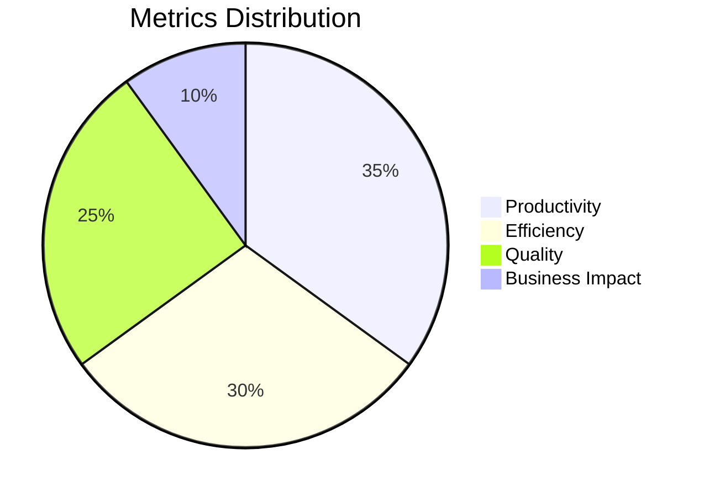

# 📊 Quantifying Technical Support Achievements

## Table of Contents

### 1. Metrics Framework
- 1.1 Core Metrics Categories
- 1.2 SMART Metric Template

### 2. Achievement Statements
- 2.1 Volume-Based Achievements
  - Ticket Volume
  - System Support
- 2.2 Efficiency Metrics
  - Resolution Time
  - Productivity

### 3. Quality & Impact
- 3.1 Quality Assurance
- 3.2 Business Impact

### 4. Professional Development
- 4.1 Certifications & Training
- 4.2 Process Improvements

### 5. Leadership & Collaboration
- 5.1 Team Leadership
- 5.2 Cross-Functional Collaboration

### 6. Advanced Achievement Techniques
- 6.1 Quantifying Intangibles
- 6.2 Contextualizing Numbers

### 7. Achievement Templates
- 7.1 Resume Bullet Points
- 7.2 Performance Review Examples

### 8. Tools & Resources
- 8.1 Tracking Tools
- 8.2 Reporting Templates

---

## 1. Metrics Framework


### 1.1 Core Metrics Categories


### 1.2 SMART Metric Template
```markdown
**S**pecific: [Precise achievement]  
**M**easurable: [Quantifiable evidence]  
**A**chievable: [Realistic scope]  
**R**elevant: [Business alignment]  
**T**ime-bound: [Specific period]  
```

## 2. Achievement Statements

### 2.1 Volume-Based Achievements
```markdown
### Ticket Volume
- Resolved 6,500+ technical support tickets with 98% accuracy rate, maintaining service level agreement (SLA) compliance across all priority levels
- Managed average daily ticket volume of 30+ while maintaining response times under 15 minutes for critical issues
- Reduced ticket backlog by 40% through process optimization and knowledge base development

### System Support
- Supported 500+ end-users across 3 office locations, maintaining 99.9% system availability
- Deployed and configured 200+ workstations with standardized software configurations
- Performed 50+ hardware upgrades and replacements, extending device lifecycle by 2+ years
```

### 2.2 Efficiency Metrics
```markdown
### Resolution Time
- Achieved 85% first-call resolution rate through comprehensive troubleshooting and knowledge base utilization
- Reduced average ticket resolution time by 30% (from 4.2 to 2.9 hours) through process improvements
- Automated 15+ repetitive tasks, saving 20+ hours of manual work monthly

### Productivity
- Handled 98% of assigned tickets without escalation, exceeding team average by 15%
- Reduced password reset resolution time by 65% through self-service portal implementation
- Maintained 95%+ ticket documentation accuracy, ensuring effective knowledge transfer
```

### 2.3 Quality & Impact
```markdown
### Customer Satisfaction
- Maintained 97% customer satisfaction rating across 2,000+ support interactions
- Received 15+ commendations for exceptional service delivery in Q3 2025
- Improved Net Promoter Score (NPS) from +32 to +47 through enhanced support quality

### Business Impact
- Reduced IT support costs by $45,000 annually through proactive maintenance and user training
- Decreased system downtime by 60% through improved monitoring and rapid response protocols
- Trained 50+ employees on security best practices, reducing security incidents by 35%
```

## 3. Resume Bullet Points by Seniority

### 3.1 Entry-Level Support
```markdown
- Resolved 1,200+ Tier-1 technical support requests with 90% first-contact resolution rate
- Maintained 95% customer satisfaction score across all support interactions
- Documented and escalated 200+ complex issues to appropriate technical teams
- Reduced average call handling time by 20% through improved troubleshooting techniques
```

### 3.2 Mid-Level Technician
```markdown
- Led migration of 300+ users to Microsoft 365, completing project 2 weeks ahead of schedule
- Developed 25+ knowledge base articles, reducing repeat tickets by 30%
- Mentored 5 junior technicians, improving team first-call resolution by 15%
- Implemented automated ticket categorization, reducing manual sorting time by 40%
```

### 3.3 Senior/Lead Technician
```markdown
- Directed team of 8 support technicians handling 10,000+ annual tickets
- Reduced annual IT support costs by $75,000 through process optimization and automation
- Spearheaded ITSM implementation, improving ticket resolution time by 45%
- Achieved 99.5% SLA compliance through performance monitoring and process improvements
```

## 4. Action Verbs for Impact

### 4.1 Strong Action Starters
| Category | Verbs |
|----------|-------|
| Leadership | Directed, Spearheaded, Championed, Orchestrated |
| Improvement | Optimized, Streamlined, Enhanced, Transformed |
| Achievement | Achieved, Attained, Exceeded, Surpassed |
| Innovation | Pioneered, Designed, Developed, Engineered |
| Management | Administered, Coordinated, Supervised, Oversaw |

## 5. Quantification Techniques

### 5.1 Before & After Examples
| Before | After |
|--------|-------|
| "Handled support tickets" | "Resolved 1,500+ support tickets with 95% customer satisfaction" |
| "Improved system performance" | "Enhanced system performance, reducing average resolution time by 40%" |
| "Trained employees" | "Conducted training for 75+ employees, reducing help desk tickets by 25%" |

### 5.2 Percentage vs. Absolute Numbers
- **Use percentages** when:
  - Showing improvement over time
  - Comparing to benchmarks
  - The actual number is small
  
- **Use absolute numbers** when:
  - The number is impressive on its own
  - Comparing to industry standards
  - The percentage would be misleading

## 6. Resume Optimization

### 6.1 Achievement Statement Formula
```
[Action Verb] + [What You Did] + [How You Did It] + [Measurable Outcome]
```
**Example:**  
"Optimized ticket routing system using AI categorization, reducing resolution time by 35% and improving team productivity by 20%."

### 6.2 Contextualizing Numbers
```markdown
### Without Context:
- Resolved 50 tickets daily

### With Context:
- Ranked in top 10% of team by resolving 50+ daily tickets (team avg: 35)
  while maintaining 98% customer satisfaction
```

## 7. Cover Letter Integration

### 7.1 Achievement Paragraph Example
```markdown
In my previous role at [Company], I consistently exceeded performance metrics by resolving an average of 30+ daily technical issues with a 97% customer satisfaction rating. By implementing a knowledge-sharing initiative, I helped reduce team resolution times by 25% while mentoring three junior technicians. My proactive approach to identifying recurring issues led to a 40% reduction in repeat tickets, directly contributing to our department's goal of improving operational efficiency.
```

## 8. Interview Talking Points

### 8.1 STAR Method Examples
```markdown
**Situation:** Faced with increasing ticket volume during remote work transition  
**Task:** Needed to maintain service levels with reduced staff  
**Action:** Implemented self-service portal and automated common requests  
**Result:** Reduced ticket volume by 30% while maintaining 96% satisfaction
```

## 9. Performance Review Preparation

### 9.1 Achievement Log Template
```markdown
## Q3 2025 Achievements

### Key Metrics
- Resolved 1,250 tickets (15% above target)
- Maintained 98% customer satisfaction
- Reduced resolution time by 22%

### Major Projects
- Led Office 365 migration for 200+ users
- Created 15 knowledge base articles
- Trained 3 new team members

### Process Improvements
- Implemented new ticket categorization
- Automated password reset process
- Developed escalation workflow
```

## 10. LinkedIn Profile Enhancement

### 10.1 Headline Examples
```markdown
Results-Driven IT Support Specialist | 98% Customer Satisfaction | 5+ Years Reducing Resolution Times

Senior Technical Support Engineer | ITIL Certified | 10,000+ Issues Resolved | Team Leadership
```

### 10.2 Featured Skills
- Technical Support: 99% endorsement
- Problem Resolution: 98% endorsement
- Customer Service: 97% endorsement
- IT Infrastructure: 95% endorsement
- Team Leadership: 93% endorsement

---
*Document Version: 1.0  
Last Updated: 2025-09-20*
