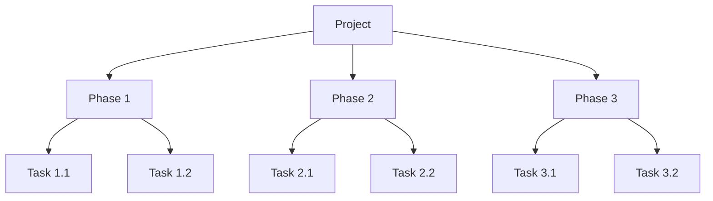
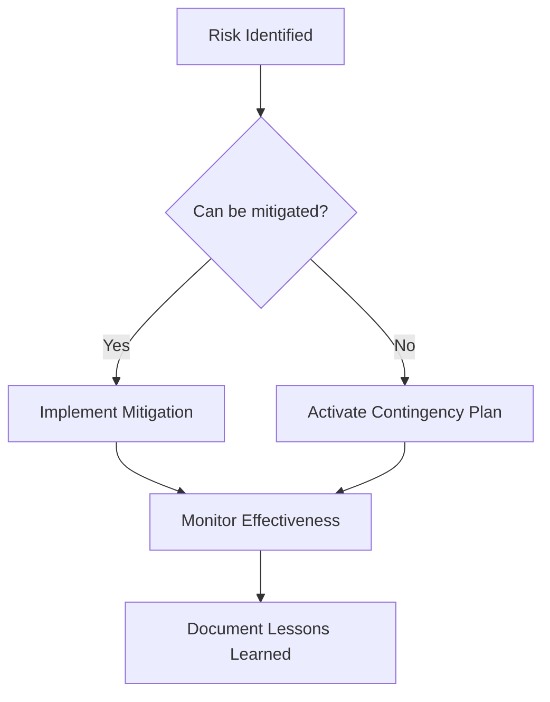

# 🛠️ Complex Task Execution Framework

## Table of Contents

### 1. Task Assessment & Planning
- [1.1 Task Analysis Matrix](#11-task-analysis-matrix)
- [1.2 Work Breakdown Structure (WBS)](#12-work-breakdown-structure-wbs)

### 2. Execution Methodologies
- [2.1 Agile Task Management](#21-agile-task-management)
- [2.2 Critical Path Method (CPM)](#22-critical-path-method-cpm)

### 3. Documentation Standards
- [3.1 Task Documentation Template](#31-task-documentation-template)
- [3.2 Code Review Checklist](#32-code-review-checklist)
- [3.3 Knowledge Transfer Guide](#33-knowledge-transfer-guide)

### 4. Quality Assurance
- [4.1 Testing Strategy](#41-testing-strategy)
- [4.2 Quality Gates](#42-quality-gates)

### 5. Monitoring & Reporting
- [5.1 Progress Tracking](#51-progress-tracking)
- [5.2 Performance Metrics](#52-performance-metrics)
- [5.3 Status Reporting](#53-status-reporting)

### 6. Risk Management
- [6.1 Risk Register](#61-risk-register)
- [6.2 Contingency Planning](#62-contingency-planning)

### 7. Continuous Improvement
- [7.1 Retrospective Template](#71-retrospective-template)
- [7.2 Lessons Learned](#72-lessons-learned)

### 8. Professional Development
- [8.1 Skill Development Plan](#81-skill-development-plan)
- [8.2 Career Growth Path](#82-career-growth-path)

---

# 🛠️ Complex Task Execution Framework

## 1. Task Assessment & Planning

### 1.1 Task Analysis Matrix
```markdown
| Dimension          | Assessment                                                                 |
|--------------------|----------------------------------------------------------------------------|
| **Complexity**     | [Low/Medium/High] - Based on technical depth and interdependencies        |
| **Effort**         | [S/M/L/XL] - Estimated person-hours required                              |
| **Urgency**        | [1-5] - Business impact and deadlines                                     |
| **Dependencies**   | List of prerequisite tasks or systems                                     |
| **Stakeholders**   | Key people who need to be informed or involved                            |
| **Risks**          | Potential challenges and mitigation strategies                            |
```

### 1.2 Work Breakdown Structure (WBS)


## 2. Execution Methodologies

### 2.1 Agile Task Management
**Sprint Planning Template**
```markdown
## Sprint [Number]: [Dates]
**Goal**: [Clear objective]

### Backlog
- [ ] [Task] ([Points]) - [Owner]
- [ ] [Task] ([Points]) - [Owner]

### Daily Standup Template
1. What I did yesterday
2. What I'm doing today
3. Blockers/Impediments
```

### 2.2 Critical Path Method (CPM)
```python
def identify_critical_path(tasks):
    # Calculate earliest start/finish
    for task in topological_sort(tasks):
        task.earliest_start = max([t.earliest_finish for t in task.dependencies] or [0])
        task.earliest_finish = task.earliest_start + task.duration
    
    # Calculate latest start/finish
    for task in reversed(topological_sort(tasks)):
        if not task.successors:
            task.latest_finish = task.earliest_finish
        else:
            task.latest_finish = min([t.latest_start for t in task.successors])
        task.latest_start = task.latest_finish - task.duration
    
    # Identify critical path
    return [t for t in tasks if t.earliest_start == t.latest_start 
            and t.earliest_finish == t.latest_finish]
```

## 3. Documentation Standards

### 3.1 Task Documentation Template
```markdown
# Task: [Task Name]
**ID**: [Unique Identifier]  
**Status**: [Not Started/In Progress/Blocked/Completed]  
**Priority**: [P0-P4]  
**Assigned To**: [Owner]  
**Due Date**: [YYYY-MM-DD]  

## Description
[Detailed task description]

## Requirements
- [ ] Requirement 1
- [ ] Requirement 2

## Dependencies
- [ ] Dependency 1
- [ ] Dependency 2

## Progress Log
| Date       | Update                     | Owner   |
|------------|----------------------------|---------|
| YYYY-MM-DD | Initial creation           | [Name]  |
| YYYY-MM-DD | Started implementation     | [Name]  |

## Attachments
- [Documentation.pdf]
- [Design_diagram.png]
```

## 4. Quality Assurance

### 4.1 Testing Checklist
```markdown
## Functional Testing
- [ ] Unit tests written/passed
- [ ] Integration tests completed
- [ ] User acceptance testing (UAT)
- [ ] Performance testing

## Documentation
- [ ] Technical documentation updated
- [ ] User guide updated
- [ ] API documentation complete

## Security
- [ ] Vulnerability scan completed
- [ ] Penetration testing done
- [ ] Compliance requirements met
```

## 5. Risk Management

### 5.1 Risk Register
| Risk | Probability | Impact | Mitigation Strategy | Owner |
|------|-------------|--------|---------------------|-------|
| [Risk Description] | [H/M/L] | [H/M/L] | [Action Plan] | [Name] |

### 5.2 Contingency Planning


## 6. Advanced Tools & Automation

### 6.1 Task Automation Scripts
```python
# task_automation.py
import subprocess
from datetime import datetime

def execute_task(task_config):
    """Execute a task based on configuration."""
    try:
        log(f"Starting task: {task_config['name']}")
        
        # Execute commands
        for cmd in task_config['commands']:
            result = subprocess.run(
                cmd['command'],
                shell=True,
                check=cmd.get('check', True),
                capture_output=True,
                text=True
            )
            log(f"Command executed: {cmd['command']}")
            
            # Process output if callback provided
            if 'callback' in cmd:
                cmd['callback'](result.stdout)
                
    except subprocess.CalledProcessError as e:
        log(f"Error executing task: {e}", level="ERROR")
        if task_config.get('notify_on_failure'):
            send_notification(
                f"Task failed: {task_config['name']}",
                f"Error: {e}\n\nOutput: {e.output}"
            )
        raise
    
    log(f"Completed task: {task_config['name']}")
```

### 6.2 Monitoring Dashboard
```python
# monitoring_dashboard.py
import dash
from dash import dcc, html
import plotly.express as px
import pandas as pd

app = dash.Dash(__name__)

def create_dashboard(tasks):
    # Create sample data
    df = pd.DataFrame([
        {'Task': task.name, 'Status': task.status, 
         'Progress': task.progress, 'Due': task.due_date}
        for task in tasks
    ])
    
    # Create layout
    app.layout = html.Div([
        html.H1('Task Dashboard'),
        
        dcc.Graph(
            id='task-status',
            figure=px.pie(df, names='Status', title='Task Status')
        ),
        
        dcc.Graph(
            id='progress-chart',
            figure=px.bar(df, x='Task', y='Progress', 
                         title='Task Progress')
        )
    ])
    
    return app
```

## 7. Communication Protocols

### 7.1 Status Update Template
```markdown
# Status Update: [Task/Project Name]
**Date**: [YYYY-MM-DD]  
**Owner**: [Name]  

## Current Status
- **Overall Progress**: [X]%
- **Current Phase**: [Phase Name]
- **Next Milestone**: [Milestone], Due: [Date]

## Key Accomplishments
1. [Accomplishment 1]
2. [Accomplishment 2]

## Upcoming Tasks
1. [Task 1] (Owner: [Name], Due: [Date])
2. [Task 2] (Owner: [Name], Due: [Date])

## Risks/Issues
| Issue | Impact | Owner | Status |
|-------|--------|-------|--------|
| [Issue] | [High/Med/Low] | [Name] | [Status] |

## Decisions Needed
1. [Decision 1]
   - Options:
     - [Option 1]
     - [Option 2]
   - Recommendation: [Your recommendation]
```

## 8. Time Management

### 8.1 Time Blocking Template
```
┌─────────────────────────────────────────────────────────┐
│                     DAILY SCHEDULE                      │
├─────────────┬───────────────────────────────────────────┤
│  8:00-9:00  │ Deep Work: [Task 1]                      │
│  9:00-9:30  │ Team Sync                               │
│  9:30-10:30 │ Project Work: [Task 2]                  │
│ 10:30-11:00 │ Break                                   │
│ 11:00-12:30 │ Meetings                                │
│ 12:30-13:30 │ Lunch                                   │
│ 13:30-15:00 │ Focus Time: [Task 3]                    │
│ 15:00-16:00 │ Collaborative Work                      │
│ 16:00-17:00 │ Planning & Admin                        │
└─────────────┴───────────────────────────────────────────┘
```

## 9. Quality Control

### 9.1 Peer Review Checklist
```markdown
## Code Review
- [ ] Code follows style guide
- [ ] Adequate test coverage
- [ ] No commented-out code
- [ ] Error handling in place

## Documentation
- [ ] Function/method documentation
- [ ] Updated README if needed
- [ ] Changelog updated

## Security
- [ ] No hardcoded credentials
- [ ] Input validation in place
- [ ] Dependencies up to date
```

## 10. Continuous Improvement

### 10.1 Retrospective Template
```markdown
# Retrospective: [Task/Project]
**Date**: [YYYY-MM-DD]
**Participants**: [Names]

## What Went Well
1. [Positive 1]
2. [Positive 2]

## What Could Be Improved
1. [Area 1]
   - Suggestion: [Idea]
   - Owner: [Name]
   
2. [Area 2]
   - Suggestion: [Idea]
   - Owner: [Name]

## Action Items
| Task | Owner | Due Date | Status |
|------|-------|----------|--------|
| [Task] | [Name] | [Date] | [Status] |
```

### 10.2 Skills Development Plan
```markdown
## Technical Skills
- [ ] [Skill 1] - [Target Level] - [Resources]
- [ ] [Skill 2] - [Target Level] - [Resources]

## Soft Skills
- [ ] [Skill 1] - [Development Activity]
- [ ] [Skill 2] - [Development Activity]

## Certifications
- [ ] [Certification Name] - [Target Date]
```

---
*Document Version: 1.0  
Last Updated: 2025-09-20*
