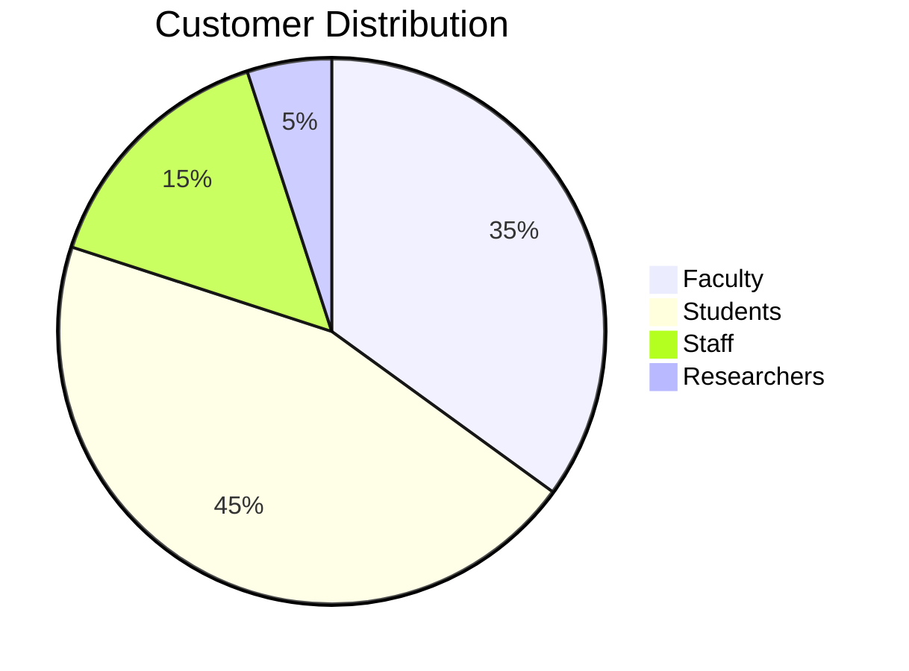
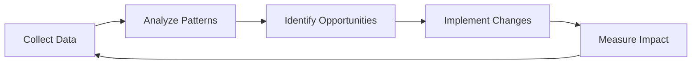

# 💼 Customer Satisfaction & Relationship Management Guide

## Table of Contents

### 1. Customer Interaction Framework
- 1.1 Communication Protocol
- 1.2 Response Time SLAs

### 2. Customer Segmentation
- 2.1 User Personas
- 2.2 Customized Support Approach

### 3. Proactive Support
- 3.1 Anticipatory Service
- 3.2 Knowledge Base Structure

### 4. Feedback Management
- 4.1 Survey Strategy
- 4.2 Feedback Analysis

### 5. Relationship Building
- 5.1 Customer Success Framework
- 5.2 Regular Business Reviews

### 6. Continuous Improvement
- 6.1 Service Gap Analysis
- 6.2 Process Optimization

### 7. Metrics & Reporting
- 7.1 Key Performance Indicators
- 7.2 Executive Dashboard

### 8. Tools & Resources
- 8.1 Recommended Software
- 8.2 Training Materials

---

# Customer Satisfaction & Relationship Management Guide

## 1. Customer Interaction Framework

### 1.1 Communication Protocol
**HEART Framework**:
- **H**ear: Active listening without interruption
- **E**mpathize: Acknowledge emotions and concerns
- **A**nalyze: Understand the root cause
- **R**espond: Provide clear, actionable solutions
- **T**ransact: Confirm resolution and follow up

### 1.2 Response Time SLAs
| Priority | Initial Response | Resolution Time | Update Frequency |
|----------|------------------|-----------------|------------------|
| Critical | 15 minutes | 2 hours | 30 minutes |
| High | 1 hour | 4 hours | 2 hours |
| Medium | 4 hours | 24 hours | 4 hours |
| Low | 8 hours | 72 hours | Daily |

## 2. Customer Segmentation

### 2.1 User Personas


### 2.2 Customized Support Approach
| Persona | Key Needs | Preferred Channels | Communication Style |
|---------|-----------|-------------------|---------------------|
| **Faculty** | Research support, Classroom tech | Email, Scheduled calls | Formal, detailed |
| **Students** | 24/7 access, Quick fixes | Chat, Self-service | Concise, visual |
| **Staff** | Business applications | Phone, Email | Efficient, solution-focused |
| **Researchers** | High-performance computing | In-person, Video calls | Technical, in-depth |

## 3. Proactive Support

### 3.1 Anticipatory Service
- Monitor usage patterns
- Send preemptive notifications
- Provide self-help resources
- Schedule maintenance during low-usage periods

### 3.2 Knowledge Base Structure
```
knowledge_base/
├── Getting_Started/
│   ├── Account_Setup
│   └── First_Login
├── How_To_Guides/
│   ├── Software_Installation
│   └── Device_Configuration
├── Troubleshooting/
│   ├── Common_Issues
│   └── Error_Codes
└── Best_Practices/
    ├── Security_Tips
    └── Productivity_Hacks
```

## 4. Feedback Management

### 4.1 Survey Strategy
**Timing**:
- Post-resolution
- Quarterly relationship surveys
- Annual satisfaction surveys

**Sample Questions**:
1. How would you rate your support experience? (1-5)
2. Was your issue resolved to your satisfaction? (Y/N)
3. How likely are you to recommend our services? (NPS 0-10)
4. What could we improve?

### 4.2 Feedback Analysis
```python
# feedback_analyzer.py
import pandas as pd
from textblob import TextBlob

def analyze_feedback(responses):
    df = pd.DataFrame(responses)
    
    # Sentiment Analysis
    df['sentiment'] = df['comments'].apply(
        lambda x: TextBlob(str(x)).sentiment.polarity
    )
    
    # Categorize feedback
    df['category'] = df['comments'].apply(categorize_feedback)
    
    return {
        'avg_satisfaction': df['rating'].mean(),
        'nps': calculate_nps(df['nps_rating']),
        'common_themes': df['category'].value_counts().to_dict(),
        'sentiment_score': df['sentiment'].mean()
    }
```

## 5. Relationship Building

### 5.1 Customer Success Program
**Tiers**:
1. **Basic**: Standard support, knowledge base access
2. **Enhanced**: Dedicated account manager, priority support
3. **Premium**: Quarterly business reviews, customized training

### 5.2 Engagement Calendar
| Month | Activity | Target Group |
|-------|----------|--------------|
| Jan | New Year Tech Refresh | All Users |
| Apr | Faculty Research Support | Faculty |
| Aug | Back-to-School Prep | Students |
| Nov | Year-End Review | Department Heads |

## 6. Service Recovery

### 6.1 Recovery Framework
1. **Apologize** - Acknowledge the issue
2. **Listen** - Understand the impact
3. **Resolve** - Fix the immediate problem
4. **Compensate** - Offer appropriate amends
5. **Follow-up** - Ensure satisfaction

### 6.2 Service Recovery Toolkit
- **Small Issues**: Extended service, training session
- **Medium Issues**: Service credit, priority support
- **Major Issues**: Executive apology, custom recovery plan

## 7. Customer Education

### 7.1 Training Programs
| Program | Format | Frequency | Audience |
|---------|--------|-----------|----------|
| Tech Tuesdays | Webinar | Monthly | All Users |
| Faculty Fridays | Workshop | Quarterly | Faculty |
| Student Success | Video Series | On-demand | Students |
| Admin Academy | Certification | Biannual | Staff |

### 7.2 Resource Library
- Video tutorials
- Step-by-step guides
- FAQ database
- Interactive demos

## 8. Metrics & Reporting

### 8.1 Key Performance Indicators
| Metric | Target | Calculation |
|--------|--------|-------------|
| CSAT | ≥90% | (Positive Responses / Total Responses) × 100 |
| NPS | ≥50 | % Promoters - % Detractors |
| First Contact Resolution | ≥75% | (Issues Resolved on First Contact / Total Issues) × 100 |
| Average Resolution Time | <4 hours | Total Resolution Time / Number of Resolved Tickets |

### 8.2 Executive Dashboard
```mermaid
gauge
    title Customer Satisfaction (CSAT)
    value 87
    min 0
    max 100
    "Poor" : 0, 50
    "Good" : 50, 80
    "Excellent" : 80, 100
```

## 9. Continuous Improvement

### 9.1 Quality Assurance Program
1. **Ticket Audits**: Random review of 10% of tickets
2. **Call Monitoring**: Monthly review of support calls
3. **Mystery Shopping**: Quarterly secret shopper program
4. **Team Calibration**: Weekly team reviews

### 9.2 Improvement Framework


## 10. Tools & Resources

### 10.1 Recommended Software
| Tool | Purpose | Integration |
|------|---------|-------------|
| Zendesk | Ticketing & Support | CRM, Slack |
| Qualtrics | Surveys & Feedback | CRM, Analytics |
| ChurnZero | Customer Success | CRM, Billing |
| Pendo | User Analytics | Product, Support |

### 10.2 Templates

#### Service Recovery Email
```markdown
Subject: Our Apologies & Resolution for [Issue]

Dear [Customer Name],

I want to personally apologize for [specific issue]. This doesn't meet the high standards we set for ourselves.

What Happened:
[Brief explanation]

What We've Done:
- [Action 1]
- [Action 2]
- [Action 3]

As a token of our apology, [compensation].

We value your business and would appreciate the opportunity to discuss this further. Please don't hesitate to contact me directly.

Sincerely,
[Your Name]
[Your Position]
[Contact Information]
```

#### Customer Check-in Email
```markdown
Subject: Quick Check-in from [Your Company]

Hi [First Name],

I hope this message finds you well! I wanted to personally check in to see how things are going with [specific product/service].

Is there anything we could be doing better to support your [specific goal/need]?

We truly value your partnership and want to ensure you're getting the most from our services.

Best regards,
[Your Name]
[Your Position]
[Company Name]
```

---
*Document Version: 1.0  
Last Updated: 2025-09-20*
