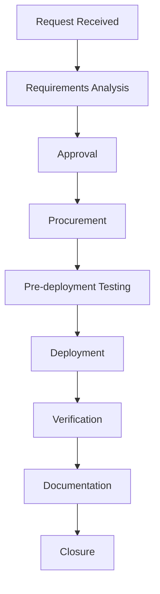

# 🚀 Hardware & Software Deployment Guide

## Table of Contents

### 1. Standard Operating Procedures (SOP)
- 1.1 Deployment Workflow
- 1.2 Change Management Process
  - 1.2.1 Request Submission
  - 1.2.2 Review & Approval
  - 1.2.3 Implementation
  - 1.2.4 Post-Implementation

### 2. Hardware Deployment
- 2.1 New Workstation Setup
- 2.2 Hardware Standards

### 3. Software Deployment
- 3.1 Standard Software Stack
- 3.2 Deployment Tools

### 4. Maintenance Procedures
- 4.1 Patch Management
- 4.2 Automated Maintenance Scripts

### 5. Documentation Requirements
- 5.1 Deployment Documentation

### 6. Quality Assurance
- 6.1 Post-Deployment Checklist
- 6.2 Validation Tests

### 7. Security Compliance
- 7.1 Hardening Standards
- 7.2 Compliance Checks

### 8. Software Packaging
- 8.1 Package Creation
- 8.2 Example Package (PowerShell)

### 9. Remote Management
- 9.1 Tools & Methods

---

# 🚀 Hardware & Software Deployment Guide

## 1. Standard Operating Procedures (SOP)

### 1.1 Deployment Workflow


### 1.2 Change Management Process
1. **Request Submission**
   - Complete change request form
   - Attach impact analysis
   - Submit to CAB (Change Advisory Board)

2. **Review & Approval**
   - Risk assessment
   - Backout plan review
   - Schedule approval

3. **Implementation**
   - Pre-implementation testing
   - Execute change during maintenance window
   - Verify functionality

4. **Post-Implementation**
   - Documentation update
   - User notification
   - Review meeting

## 2. Hardware Deployment

### 2.1 New Workstation Setup
**Checklist**:
- [ ] Unbox and inventory
- [ ] Apply asset tag
- [ ] Update BIOS/firmware
- [ ] Install base OS image
- [ ] Join to domain
- [ ] Install standard software
- [ ] Configure user profile
- [ ] Verify network connectivity
- [ ] Test all peripherals
- [ ] Document configuration

### 2.2 Hardware Standards
| Component | Standard | Notes |
|-----------|----------|-------|
| Laptop | Dell Latitude 54XX | 16GB RAM, 512GB SSD |
| Desktop | HP EliteDesk 800 | 32GB RAM, 1TB NVMe |
| Monitor | 24" 1080p | Dual monitor standard |
| Docking Station | Dell WD19 | For laptop users |

## 3. Software Deployment

### 3.1 Standard Software Stack
| Category | Software | Version | Deployment Method |
|----------|----------|---------|-------------------|
| OS | Windows 10/11 | 22H2 | WDS/MDT |
| Office | Microsoft 365 | Current | Intune |
| Browser | Chrome/Edge | Latest | WSUS |
| Security | CrowdStrike | 7.x | SCCM |
| VPN | GlobalProtect | 6.x | Manual |

### 3.2 Deployment Tools
- **Windows**: Microsoft Endpoint Manager (Intune + SCCM)
- **macOS**: Jamf Pro
- **Linux**: Ansible/Puppet
- **Mobile**: Microsoft Intune

## 4. Maintenance Procedures

### 4.1 Patch Management
**Monthly Cycle**:
1. **Week 1**: Test patches in DEV
2. **Week 2**: Deploy to TEST
3. **Week 3**: Deploy to PILOT (10% prod)
4. **Week 4**: Full production deployment

### 4.2 Automated Maintenance Scripts
```powershell
# Windows Update Automation
Install-Module PSWindowsUpdate -Force
Get-WindowsUpdate -Install -AcceptAll -AutoReboot

# Disk Cleanup
cleanmgr /sagerun:1

# System Health Check
Get-PhysicalDisk | Select-Object FriendlyName, HealthStatus
```

## 5. Documentation Requirements

### 5.1 Deployment Documentation
```markdown
## Deployment Record: [Asset ID]

### Hardware Details
- **Model**: [Make/Model]
- **Serial #**: [Number]
- **Asset Tag**: [TAG-XXX]
- **Purchase Date**: [YYYY-MM-DD]
- **Warranty**: [End Date]

### Software Configuration
- **OS**: [Version]
- **Key Software**:
  - [Software] v[Version]
  - [Software] v[Version]

### Network Configuration
- **Hostname**: [COMPUTER-NAME]
- **IP Address**: [Static/DHCP]
- **VLAN**: [Number]
- **MAC Address**: [XX:XX:XX:XX:XX:XX]

### User Assignment
- **Assigned To**: [Name]
- **Department**: [Dept]
- **Date Deployed**: [YYYY-MM-DD]
- **Deployed By**: [Technician]
```

## 6. Quality Assurance

### 6.1 Post-Deployment Checklist
- [ ] All applications launch
- [ ] Network drives mapped
- [ ] Printers installed
- [ ] Security policies applied
- [ ] Backup configured
- [ ] User training completed

### 6.2 Validation Tests
1. **Basic Functionality**
   - Login/logout
   - Internet access
   - Network shares
   - Printing

2. **Application Testing**
   - Launch all standard apps
   - Verify licensing
   - Test file associations

## 7. Security Compliance

### 7.1 Hardening Standards
- **Windows**:
  - BitLocker encryption
  - Windows Defender ATP
  - Local admin rights removed
  - Auto-lock enabled (5 min)

- **macOS**:
  - FileVault enabled
  - Gatekeeper configured
  - Automatic updates enabled

### 7.2 Compliance Checks
```powershell
# Verify BitLocker status
Manage-bde -status C:

# Check Windows Defender
Get-MpComputerStatus | Select-Object RealTimeProtectionEnabled

# Verify Firewall
Get-NetFirewallProfile | Select-Object Name,Enabled
```

## 8. Software Packaging

### 8.1 Package Creation
**Tools**:
- Microsoft MSIX Packaging Tool
- AdminStudio
- PACE Suite

**Requirements**:
- Silent installation
- Proper detection method
- Rollback capability
- Logging enabled

### 8.2 Example Package (PowerShell)
```powershell
# Package.ps1
$installer = "setup.msi"
$logFile = "$env:TEMP\install.log"

# Install with logging
Start-Process msiexec.exe -Wait -ArgumentList "/i `"$installer`" /qn /l*v `"$logFile`""

# Verify installation
if (Test-Path "C:\Program Files\AppName") {
    Write-Host "Installation successful"
    exit 0
} else {
    Write-Host "Installation failed"
    exit 1
}
```

## 9. Remote Deployment

### 9.1 Tools & Methods
| Tool | Purpose | Command Example |
|------|---------|-----------------|
| PDQ Deploy | Software deployment | `pdqdeploy.exe -Deploy "Package" -Targets @("PC1","PC2")` |
| PSExec | Remote command execution | `psexec \\computer cmd /c "command"` |
| Microsoft Intune | Cloud-based management | [Azure Portal](https://intune.microsoft.com) |

### 9.2 Remote Troubleshooting
1. **Connect**:
   ```
   mstsc /v:computer /admin
   ```
2. **Gather Info**:
   ```
   systeminfo > system.txt
   ipconfig /all > network.txt
   ```
3. **Resolve**:
   - Check event logs
   - Verify services
   - Test connectivity

## 10. Decommissioning

### 10.1 Hardware Retirement
1. **Data Sanitization**
   - Use DBAN for HDDs
   - Physical destruction for SSDs
   - Certificate of destruction

2. **Asset Update**
   - Update inventory
   - Remove from monitoring
   - Archive documentation

### 10.2 Software Decommissioning
- Revoke licenses
- Remove from deployment systems
- Update documentation
- Notify stakeholders

## 11. Automation Scripts

### 11.1 Windows Deployment
```powershell
# Deploy-Software.ps1
param(
    [Parameter(Mandatory=$true)]
    [string]$ComputerName,
    [string]$SoftwareName
)

$session = New-PSSession -ComputerName $ComputerName

switch ($SoftwareName) {
    "Chrome" {
        Invoke-Command -Session $session -ScriptBlock {
            $url = "https://dl.google.com/chrome/install/latest/chrome_installer.exe"
            $output = "$env:TEMP\chrome_installer.exe"
            Invoke-WebRequest -Uri $url -OutFile $output
            Start-Process -FilePath $output -Args "/silent /install" -Wait
        }
    }
    # Add more applications as needed
}

Remove-PSSession $session
```

### 11.2 macOS Deployment
```bash
#!/bin/bash
# install_software.sh

software=$1

case $software in
    "chrome")
        # Download and install Chrome
        curl -L -o /tmp/googlechrome.dmg https://dl.google.com/chrome/mac/universal/stable/GGRO/googlechrome.dmg
        hdiutil attach /tmp/googlechrome.dmg
        sudo cp -r "/Volumes/Google Chrome/Google Chrome.app" "/Applications/"
        hdiutil detach "/Volumes/Google Chrome"
        ;;
    *)
        echo "Unknown software: $software"
        exit 1
        ;;
esac
```

## 12. Monitoring & Reporting

### 12.1 Key Metrics
- Deployment success rate
- Time to deploy
- Number of rollbacks
- User-reported issues
- System performance impact

### 12.2 Reporting Tools
- Microsoft Power BI
- Grafana dashboards
- Custom PowerShell scripts
- SQL queries against deployment database

---
*Document Version: 1.0  
Last Updated: 2025-09-20*
