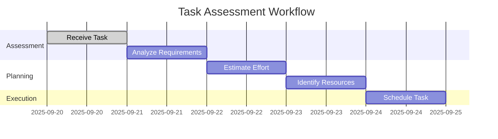
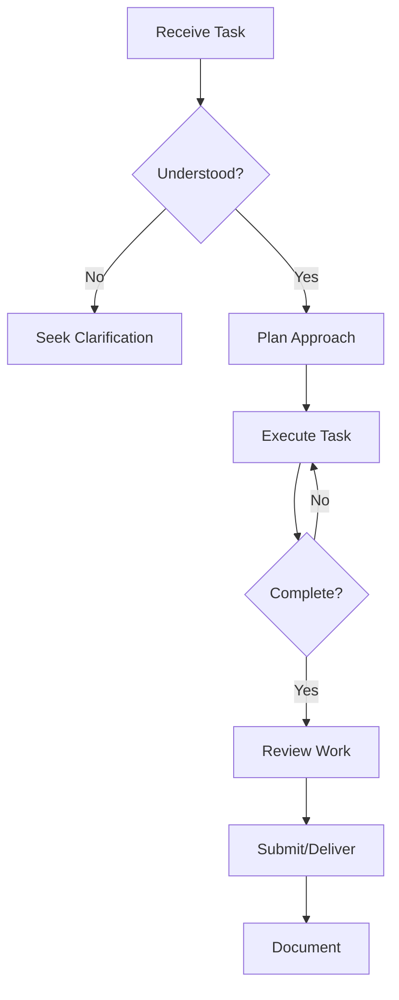

# 📋 Duty Management Framework

## Table of Contents

1. [Task Intake & Assessment](#1-task-intake--assessment)
   1.1 [Task Assessment Matrix](#11-task-assessment-matrix)  
   1.2 [Priority Matrix](#12-priority-matrix)

2. [Documentation Standards](#2-documentation-standards)
   2.1 [Task Documentation Template](#21-task-documentation-template)

3. [Time Management](#3-time-management)
   3.1 [Time Blocking Template](#31-time-blocking-template)  
   3.2 [Time Tracking Log](#32-time-tracking-log)

4. [Communication Protocols](#4-communication-protocols)
   4.1 [Status Update Template](#41-status-update-template)  
   4.2 [Meeting Agenda Template](#42-meeting-agenda-template)

5. [Task Execution](#5-task-execution)
   5.1 [Workflow Process](#51-workflow-process)  
   5.2 [Quality Checklist](#52-quality-checklist)

6. [Problem-Solving Framework](#6-problem-solving-framework)
   6.1 [Root Cause Analysis](#61-root-cause-analysis)  
   6.2 [Decision Matrix](#62-decision-matrix)

7. [Professional Development](#7-professional-development)
   7.1 [Skills Inventory](#71-skills-inventory)

---

# 📋 Duty Management Framework

## 1. Task Intake & Assessment

### 1.1 Task Assessment Matrix


### 1.2 Priority Matrix
| Urgency \ Impact | High | Medium | Low |
|------------------|------|--------|-----|
| **High**         | P1   | P2     | P3  |
| **Medium**       | P2   | P3     | P4  |
| **Low**          | P3   | P4     | P5  |

## 2. Documentation Standards

### 2.1 Task Documentation Template
```markdown
# Task: [Task Name]
**Assigned To**: [Your Name]  
**Date Assigned**: [YYYY-MM-DD]  
**Due Date**: [YYYY-MM-DD]  
**Priority**: [P1-P5]  
**Status**: [Not Started/In Progress/On Hold/Completed]  

## Task Description
[Detailed description of the task]

## Requirements
- [ ] Requirement 1
- [ ] Requirement 2

## Resources
- [Resource 1]
- [Resource 2]

## Progress Notes
| Date       | Update                     | Time Spent |
|------------|----------------------------|------------|
| YYYY-MM-DD | Initial assessment         | 0.5h       |
| YYYY-MM-DD | Started implementation     | 2.0h       |

## Completion Criteria
- [ ] Criteria 1
- [ ] Criteria 2
```

## 3. Time Management

### 3.1 Time Blocking Template
```
┌─────────────────────────────────────────────────────────┐
│                     DAILY SCHEDULE                      │
├─────────────┬───────────────────────────────────────────┤
│  08:00-09:00 │ Priority Tasks                           │
│  09:00-10:00 │ Email & Communications                   │
│  10:00-12:00 │ Focused Work                             │
│  12:00-13:00 │ Lunch Break                              │
│  13:00-15:00 │ Meetings & Collaboration                 │
│  15:00-16:00 │ Administrative Tasks                     │
│  16:00-17:00 │ Planning & Next Steps                    │
└─────────────┴───────────────────────────────────────────┘
```

### 3.2 Time Tracking Log
```markdown
## Time Log: [Task/Project]

### Week of YYYY-MM-DD
| Date       | Task                | Time Spent | Notes                     |
|------------|---------------------|------------|---------------------------|
| YYYY-MM-DD | [Task Description]  | 1.5h       | Initial research complete |
| YYYY-MM-DD | [Task Description]  | 2.0h       | Drafted report            |

**Total Time**: 3.5 hours
```

## 4. Communication Protocols

### 4.1 Status Update Template
```markdown
# Status Update: [Task/Project]
**Date**: [YYYY-MM-DD]  
**Prepared By**: [Your Name]  

## Current Status
- **Progress**: [%] Complete
- **Current Phase**: [Phase Name]
- **Next Milestone**: [Milestone], Due: [Date]

## Accomplishments
1. [Accomplishment 1]
2. [Accomplishment 2]

## Upcoming Tasks
1. [Task 1] (Due: [Date])
2. [Task 2] (Due: [Date])

## Issues/Blockers
- [ ] [Issue] - [Impact] - [Action Needed]

## Support Needed
- [ ] [Support Item] - [From Whom] - [By When]
```

### 4.2 Meeting Agenda Template
```markdown
# Meeting: [Topic]
**Date**: [YYYY-MM-DD]  
**Time**: [HH:MM - HH:MM]  
**Location**: [Location/Video Link]  

## Agenda
1. **Welcome & Introductions** (5 min)
2. **Review of Previous Actions** (10 min)
3. **Discussion Topics**
   - [Topic 1] (15 min)
   - [Topic 2] (15 min)
4. **Action Items & Next Steps** (10 min)
5. **Wrap-up** (5 min)

## Pre-Read Materials
- [Document 1]
- [Document 2]

## Attendees
- [Name] - [Role]
- [Name] - [Role]
```

## 5. Task Execution

### 5.1 Workflow Process


### 5.2 Quality Checklist
- [ ] Requirements met
- [ ] Work reviewed
- [ ] Documentation complete
- [ ] Deliverables verified
- [ ] Feedback incorporated

## 6. Problem-Solving Framework

### 6.1 Root Cause Analysis
1. **Define the Problem**
   - What is happening?
   - Where is it happening?
   - When did it start?
   - What is the impact?

2. **Collect Data**
   - What evidence do we have?
   - What patterns can be identified?
   - What's the frequency/severity?

3. **Identify Causes**
   - Use 5 Whys
   - Fishbone diagram
   - Process mapping

4. **Develop Solutions**
   - Brainstorm options
   - Evaluate alternatives
   - Select best approach

### 6.2 Decision Matrix
| Option | Pros | Cons | Risk | Ease | Total |
|--------|------|------|------|------|-------|
| [Option 1] | ... | ... | ... | ... | ... |
| [Option 2] | ... | ... | ... | ... | ... |

## 7. Professional Development

### 7.1 Skills Inventory
| Skill | Current Level | Target Level | Development Plan |
|-------|---------------|--------------|------------------|
| [Skill 1] | [1-5] | [1-5] | [Plan] |
| [Skill 2] | [1-5] | [1-5] | [Plan] |

### 7.2 Learning Log
```markdown
## Learning Log: [Your Name]

### [Month] YYYY
**Focus Area**: [Skill/Subject]

#### Week 1
- [Date]: [What you learned]
- [Date]: [Resources used]

#### Week 2
- [Date]: [What you learned]
- [Date]: [Resources used]
```

## 8. Resource Management

### 8.1 Resource Request Template
```markdown
# Resource Request
**Requestor**: [Your Name]  
**Date**: [YYYY-MM-DD]  
**Priority**: [High/Medium/Low]  

## Request Details
- **Resource Type**: [Software/Hardware/Personnel/Other]
- **Quantity**: [Number]
- **Needed By**: [Date]
- **Duration**: [Time Period]

## Justification
[Explain why this resource is needed]

## Impact of Not Having
[Consequences of not getting this resource]

## Alternative Solutions Considered
1. [Alternative 1]
2. [Alternative 2]
```

## 9. Performance Tracking

### 9.1 Weekly Review Template
```markdown
# Weekly Review: [Your Name]
**Week of**: [YYYY-MM-DD]  
**Hours Worked**: [Total]  

## Key Accomplishments
1. [Accomplishment 1]
2. [Accomplishment 2]

## Challenges Faced
- [Challenge 1]
- [Challenge 2]

## Goals for Next Week
1. [Goal 1]
2. [Goal 2]

## Professional Development
- [What you learned]
- [Areas for improvement]
```

## 10. Templates & Tools

### 10.1 Email Templates
**Request for Information**
```
Subject: Information Request: [Topic]

Dear [Recipient's Name],

I hope this message finds you well. I'm reaching out to request information regarding [specific information needed] for [reason/purpose].

Could you please provide:
1. [Specific detail 1]
2. [Specific detail 2]
3. [Specific detail 3]

I would appreciate your response by [deadline, if applicable]. Please let me know if you need any clarification.

Thank you for your assistance.

Best regards,
[Your Full Name]
[Your Position]
[Your Contact Information]
```

**Status Update**
```
Subject: Status Update: [Project/Task Name] - [Date]

Dear [Recipient's Name],

Here's an update on [Project/Task Name] as of [date]:

Current Status:
- Progress: [X]% complete
- Key Accomplishments:
  * [Accomplishment 1]
  * [Accomplishment 2]

Next Steps:
1. [Next step 1] (Due: [date])
2. [Next step 2] (Due: [date])

Issues/Blockers:
- [Issue] - [Impact] - [Action Needed]

Please let me know if you have any questions or need additional information.

Best regards,
[Your Name]
```

### 10.2 Quick Reference Guides
**5 Whys Template**
1. Why did [problem] happen? [Answer]
2. Why did [answer to Q1] happen? [Answer]
3. Why did [answer to Q2] happen? [Answer]
4. Why did [answer to Q3] happen? [Answer]
5. Why did [answer to Q4] happen? [Root Cause]

**SMART Goals**
- **S**pecific: Clear and well-defined
- **M**easurable: With specific criteria
- **A**chievable: Realistic and attainable
- **R**elevant: Aligns with objectives
- **T**ime-bound: With a deadline

---
*Document Version: 1.0  
Last Updated: 2025-09-20*
