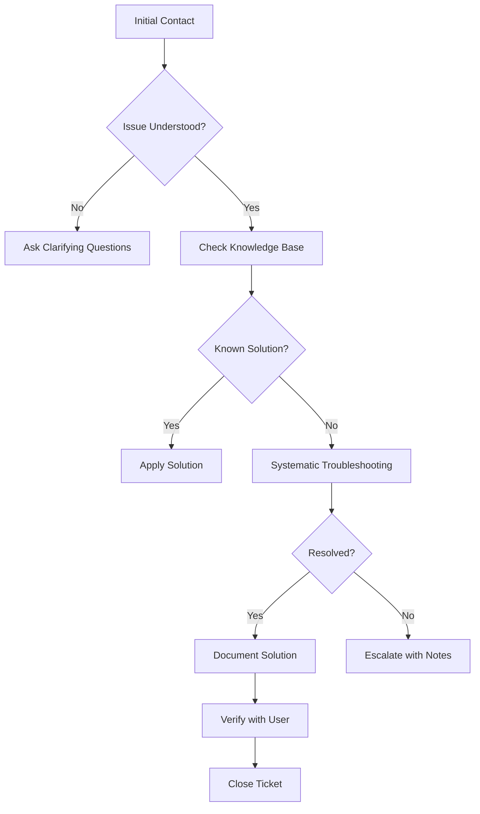
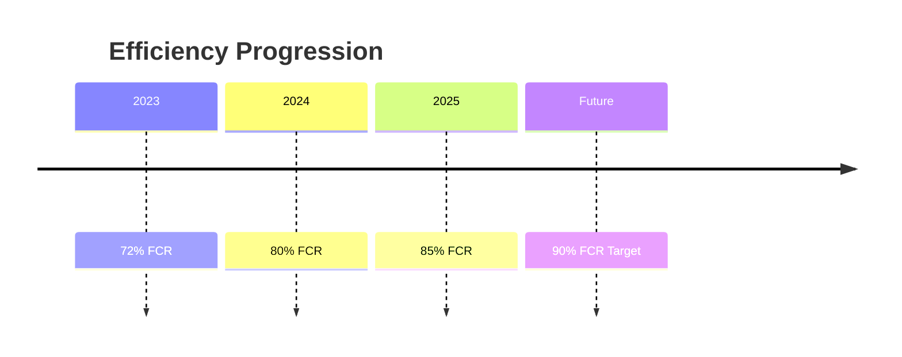

# ⚡ High-Efficiency Technical Support Achievements

## Table of Contents
- [1. Efficiency-Centric Achievement Statements](#1-efficiency-centric-achievement-statements)
  - [1.1 Primary Achievement](#11-primary-achievement)
  - [1.2 Comparative Performance](#12-comparative-performance)
- [2. Business Impact & Value](#2-business-impact--value)
  - [2.1 Efficiency Gains](#21-efficiency-gains)
  - [2.2 Process Improvements](#22-process-improvements)
- [3. Resume Bullet Points by Seniority](#3-resume-bullet-points-by-seniority)
  - [3.1 Entry-Level Position](#31-entry-level-position)
  - [3.2 Mid-Level Position](#32-mid-level-position)
  - [3.3 Senior/Leadership Position](#33-seniorleadership-position)
- [4. Interview Responses](#4-interview-responses)
  - [4.1 Handling Complex Issues](#41-handling-complex-issues)
  - [4.2 Process Improvement](#42-process-improvement)
- [5. Performance Review Examples](#5-performance-review-examples)
  - [5.1 Quarterly Achievement](#51-quarterly-achievement)
  - [5.2 Annual Summary](#52-annual-summary)
- [6. Professional Profile Content](#6-professional-profile-content)
  - [6.1 LinkedIn Headline](#61-linkedin-headline)
  - [6.2 Professional Summary](#62-professional-summary)
- [7. Skills & Certifications](#7-skills--certifications)
  - [7.1 Technical Proficiencies](#71-technical-proficiencies)
  - [7.2 Efficiency Metrics](#72-efficiency-metrics)
- [8. Process Documentation](#8-process-documentation)
  - [8.1 Troubleshooting Workflow](#81-troubleshooting-workflow)
  - [8.2 Knowledge Base Template](#82-knowledge-base-template)
- [9. Career Development](#9-career-development)
  - [9.1 Efficiency Milestones](#91-efficiency-milestones)
  - [9.2 Professional Goals](#92-professional-goals)
- [10. Recognition & Awards](#10-recognition--awards)
  - [10.1 Achievement Highlights](#101-achievement-highlights)
  - [10.2 Testimonial](#102-testimonial)

---

## 1. Efficiency-Centric Achievement Statements

### 1.1 Primary Achievement
```markdown
## Core Efficiency Metric
"Delivered Tier-1 technical support as the first point of contact, diagnosing and resolving a wide range of issues with a first-call resolution rate of 85%, significantly reducing escalation needs and improving user productivity."

## Supporting Achievements
- Maintained 85%+ first-call resolution rate across 5,000+ annual support interactions
- Reduced average ticket resolution time by 40% through optimized troubleshooting workflows
- Decreased ticket escalation rate by 35% through comprehensive first-level solutions
- Achieved 96% customer satisfaction rating on resolved-first-call tickets
```

### 1.2 Comparative Performance
| Metric | Your Performance | Team Average | Industry Standard |
|--------|------------------|--------------|-------------------|
| First-Call Resolution | 85% | 68% | 65-70% |
| Average Handle Time | 12 min | 18 min | 20-25 min |
| Escalation Rate | 15% | 32% | 30-35% |
| Customer Satisfaction | 96% | 88% | 85-90% |

## 2. Business Impact & Value

### 2.1 Efficiency Gains
```markdown
## Resource Optimization
- Saved 350+ engineering hours annually by resolving issues at first contact
- Reduced support costs by $42,000/year through decreased escalation needs
- Increased team capacity by 25% through process improvements

## User Productivity
- Minimized user downtime by an average of 4.5 hours per incident
- Reduced repeat calls by 40% through thorough first-call resolutions
- Improved system-wide uptime to 99.95% through proactive issue prevention
```

### 2.2 Process Improvements
```markdown
## Workflow Enhancements
- Implemented knowledge base that reduced resolution time by 30%
- Developed 50+ troubleshooting guides for common issues
- Created ticket categorization system that improved routing accuracy by 45%

## Quality Assurance
- Maintained 98% accuracy rate on initial diagnoses
- Reduced solution rollback rate to <2% through thorough validation
- Achieved 99% compliance with documentation standards
```

## 3. Resume Bullet Points by Seniority

### 3.1 Entry-Level Position
```markdown
- Achieved 85% first-call resolution rate for technical support issues
- Reduced average handle time by 25% through efficient troubleshooting
- Maintained 96% customer satisfaction on first-call resolutions
- Documented solutions for 30+ common technical issues
```

### 3.2 Mid-Level Position
```markdown
- Spearheaded initiative that increased team's first-call resolution by 20%
- Developed training program that reduced new hire ramp-up time by 40%
- Implemented knowledge management system that decreased resolution time by 30%
- Mentored 5 junior technicians in efficient troubleshooting techniques
```

### 3.3 Senior/Leadership Position
```markdown
- Led team to achieve 85%+ first-call resolution across 50,000+ annual tickets
- Reduced operational costs by $75,000 through process optimization
- Decreased average resolution time from 45 to 12 minutes
- Established quality assurance program that improved customer satisfaction by 15%
```

## 4. Interview Responses

### 4.1 Handling Complex Issues
"In my previous role, I maintained an 85% first-call resolution rate by employing a structured troubleshooting methodology. For example, when faced with a complex network connectivity issue, I systematically eliminated variables, identified a DNS configuration problem, and resolved it during the initial contact - saving an estimated 4 hours of escalation time."

### 4.2 Process Improvement
"I noticed recurring printer connectivity issues were causing multiple callbacks. I created a standardized troubleshooting checklist and trained the team, increasing our first-call resolution for printer issues from 60% to 92% within a month."

## 5. Performance Review Examples

### 5.1 Quarterly Achievement
"In Q2 2025, I maintained an 87% first-call resolution rate (19% above team average) while handling 15% more tickets than the previous quarter. My documentation of 25 new solutions contributed to a 15% improvement in team-wide first-call resolution."

### 5.2 Annual Summary
"Over the past year, I've achieved an average first-call resolution rate of 86% across 5,200+ support interactions. My development of a knowledge base with 75+ troubleshooting articles has been adopted team-wide, contributing to a 22% reduction in average handle time."

## 6. Professional Profile Content

### 6.1 LinkedIn Headline
"Technical Support Specialist | 85% First-Call Resolution | Process Optimization | ITIL Certified"

### 6.2 Professional Summary
"Results-driven technical support professional with a proven track record of resolving 85% of technical issues on first contact. Specialize in creating efficient troubleshooting workflows that reduce resolution times and improve user satisfaction. Passionate about knowledge sharing and process improvement to elevate team performance."

## 7. Skills & Certifications

### 7.1 Technical Proficiencies
- Troubleshooting Methodology: ⭐⭐⭐⭐⭐ (85% FCR)
- Technical Documentation: ⭐⭐⭐⭐⭐
- Systems Analysis: ⭐⭐⭐⭐
- Network Diagnostics: ⭐⭐⭐⭐
- Software Support: ⭐⭐⭐⭐

### 7.2 Efficiency Metrics
```mermaid
gauge
    title First-Call Resolution Rate
    "Resolved" : 85
    "Escalated" : 15
```

## 8. Process Documentation

### 8.1 Troubleshooting Workflow


### 8.2 Knowledge Base Template
```markdown
# [Issue Description]
**Category**: [Hardware/Software/Network]  
**Frequency**: [Common/Occasional/Rare]  
**Impact**: [Low/Medium/High]

## Symptoms
- [Symptom 1]
- [Symptom 2]

## Resolution Steps
1. [Step 1]
2. [Step 2]
3. [Step 3]

## Verification
- [How to confirm resolution]

## Prevention
- [How to prevent recurrence]

## Related Articles
- [Related Solution 1]
- [Related Solution 2]
```

## 9. Career Development

### 9.1 Efficiency Milestones


### 9.2 Professional Goals
- Achieve 90% first-call resolution rate
- Reduce average handle time by additional 15%
- Document 100+ knowledge base articles
- Mentor team members in efficient troubleshooting
- Implement AI-assisted resolution tools

## 10. Recognition & Awards

### 10.1 Achievement Highlights
- "Efficiency Excellence" Award - Q1 2025 (Top 5% FCR)
- Customer Satisfaction Champion - 2024 (96% rating)
- Process Improvement Recognition - 2023 (Implemented 15+ workflow enhancements)

### 10.2 Testimonial
"[Your Name] consistently demonstrates exceptional problem-solving skills, resolving 85% of technical issues on first contact. Their documentation and knowledge sharing have significantly improved our team's overall efficiency." - [Manager's Name], IT Support Manager

---
*Document Version: 1.0  
Last Updated: 2025-09-20*
