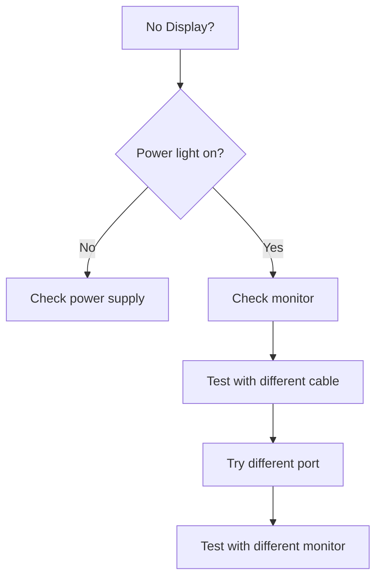

# 🖥️ Hardware & Software Troubleshooting Guide

## Table of Contents

### 1. Quick Diagnostic Tools
   - 1.1 Built-in Windows Diagnostics
   - 1.2 macOS Diagnostics

### 2. Common Hardware Issues
   - 2.1 Computer Won't Start
   - 2.2 Overheating
   - 2.3 No Display

### 3. Common Software Issues
   - 3.1 Application Crashes
   - 3.2 Slow Performance

### 4. Peripheral Problems
   - 4.1 Printer Issues
   - 4.2 External Devices Not Recognized

### 5. Network Troubleshooting
   - 5.1 Can't Connect to WiFi

### 6. Common Error Messages
   - 6.1 Windows Blue Screen (BSOD)
   - 6.2 macOS Kernel Panic

### 7. Data Recovery
   - 7.1 Accidental Deletion

### 8. Driver Management
   - 8.1 Update Drivers

### 9. System Maintenance
   - 9.1 Windows
   - 9.2 macOS

### 10. Hardware Testing Tools
   - 10.1 Recommended Software

### 11. Quick Fixes for Common Problems
   - 11.1 Windows Updates Stuck
   - 11.2 Application Won't Open
   - 11.3 Sound Not Working

### 12. Remote Troubleshooting
   - 12.1 Windows Remote Assistance
   - 12.2 macOS Screen Sharing

### 13. Preventive Maintenance
   - 13.1 Monthly Tasks
   - 13.2 Quarterly Tasks

### 14. Common Hardware Fixes
   - 14.1 Laptop Battery Not Charging
   - 14.2 Noisy Hard Drive

### 15. Software Repair Tools
   - 15.1 Windows
   - 15.2 macOS

---

# 🖥️ Hardware & Software Troubleshooting Guide

## 1. Quick Diagnostic Tools

### 1.1 Built-in Windows Diagnostics
```batch
# System File Checker
sfc /scannow

# DISM (Deployment Image Servicing and Management)
dism /online /cleanup-image /restorehealth

# Check Disk
chkdsk C: /f /r

# Memory Diagnostic
mdsched.exe
```

### 1.2 macOS Diagnostics
```bash
# Disk Utility First Aid
diskutil verifyVolume /

# Check Disk Permissions
diskutil resetUserPermissions / `id -u`

# System Diagnostics
sudo sysdiagnose
```

## 2. Common Hardware Issues

### 2.1 Computer Won't Start
**Troubleshooting Steps**:
1. Check power connections
2. Test power outlet
3. Remove peripherals
4. Listen for beep codes
5. Try safe mode

### 2.2 Overheating
**Symptoms**:
- Random shutdowns
- Loud fan noise
- Slow performance

**Solutions**:
1. Clean vents and fans
2. Check thermal paste
3. Improve ventilation
4. Use cooling pad

### 2.3 No Display
**Troubleshooting Flow**:


## 3. Common Software Issues

### 3.1 Application Crashes
**Troubleshooting Steps**:
1. Restart application
2. Update to latest version
3. Clear cache/temp files
4. Reinstall application

### 3.2 Slow Performance
**Quick Fixes**:
1. Check Task Manager (Ctrl+Shift+Esc)
2. Disable startup programs
3. Run disk cleanup
4. Check for malware

## 4. Peripheral Problems

### 4.1 Printer Issues
**Checklist**:
- [ ] Printer powered on
- [ ] Paper loaded
- [ ] No paper jams
- [ ] Correct driver installed
- [ ] Default printer set

### 4.2 External Devices Not Recognized
**Troubleshooting**:
1. Try different USB port
2. Test on another computer
3. Update drivers
4. Check Device Manager for errors

## 5. Network Troubleshooting

### 5.1 Can't Connect to WiFi
**Windows**:
1. Run Network Troubleshooter
2. Reset network stack:
   ```
   netsh winsock reset
   netsh int ip reset
   ```
3. Update WiFi drivers

**macOS**:
1. Delete WiFi preference file
2. Create new network location
3. Reset PRAM/NVRAM

## 6. Common Error Messages

### 6.1 Windows Blue Screen (BSOD)
**Common Causes**:
- Driver conflicts
- Hardware failure
- Memory issues
- Overheating

**Action**:
1. Note error code
2. Check Event Viewer
3. Run memory diagnostics
4. Update drivers

### 6.2 macOS Kernel Panic
**Troubleshooting**:
1. Note error message
2. Boot in Safe Mode (Shift on startup)
3. Check Console logs
4. Reset NVRAM/PRAM

## 7. Data Recovery

### 7.1 Accidental Deletion
**Windows**:
1. Check Recycle Bin
2. Use File History
3. Try `recuva` (free tool)

**macOS**:
1. Check Trash
2. Use Time Machine
3. Try `testdisk` (command line)

## 8. Driver Management

### 8.1 Update Drivers
**Windows**:
1. Device Manager > Right-click device > Update driver
2. Manufacturer's website

**macOS**:
1. App Store > Updates
2. Manufacturer's website

## 9. System Maintenance

### 9.1 Windows
```batch
# Clear temp files
cleanmgr

# Defragment disk
defrag C: /U /V

# Check startup impact
taskmgr > Startup
```

### 9.2 macOS
```bash
# Clear system cache
sudo rm -rf /Library/Caches/*

# Clear user cache
rm -rf ~/Library/Caches/*

# Verify disk
sudo fsck -fy
```

## 10. Hardware Testing Tools

### 10.1 Recommended Software
| Tool | Purpose | Platform |
|------|---------|----------|
| MemTest86 | Memory testing | Bootable USB |
| CrystalDiskInfo | HDD/SSD health | Windows |
| HWMonitor | Temperature monitoring | Windows/macOS |
| Apple Diagnostics | Hardware test | Mac |

## 11. Quick Fixes for Common Problems

### 11.1 Windows Updates Stuck
1. Stop Windows Update service
2. Delete `C:\Windows\SoftwareDistribution`
3. Restart service

### 11.2 Application Won't Open
1. Right-click > Run as Administrator
2. Check compatibility mode
3. Reinstall redistributables

### 11.3 Sound Not Working
1. Check volume/mute
2. Verify output device
3. Update audio drivers
4. Test with headphones

## 12. Remote Troubleshooting

### 12.1 Windows Remote Assistance
1. Type "Quick Assist" in Start
2. Choose "Give assistance"
3. Share security code

### 12.2 macOS Screen Sharing
1. System Preferences > Sharing
2. Enable Screen Sharing
3. Connect via VNC

## 13. Preventive Maintenance

### 13.1 Monthly Tasks
- Update operating system
- Update antivirus definitions
- Backup important data
- Clean dust from hardware

### 13.2 Quarterly Tasks
- Check drive health
- Test backup restoration
- Review installed software
- Clean up temporary files

## 14. Common Hardware Fixes

### 14.1 Laptop Battery Not Charging
1. Check power adapter
2. Remove battery (if possible)
3. Reset power management
4. Update BIOS/UEFI

### 14.2 Noisy Hard Drive
1. Backup data immediately
2. Run S.M.A.R.T. test
3. Replace if failing

## 15. Software Repair Tools

### 15.1 Windows
- `DISM` - Repair Windows image
- `SFC` - System File Checker
- `CHKDSK` - Disk error checking
- `Windows Recovery Environment` - Advanced repair

### 15.2 macOS
- `Disk Utility` - First Aid
- `Safe Mode` - Isolate issues
- `Recovery Mode` - Reinstall OS
- `Single User Mode` - Advanced repair

---
*Document Version: 1.0  
Last Updated: 2025-09-20*
