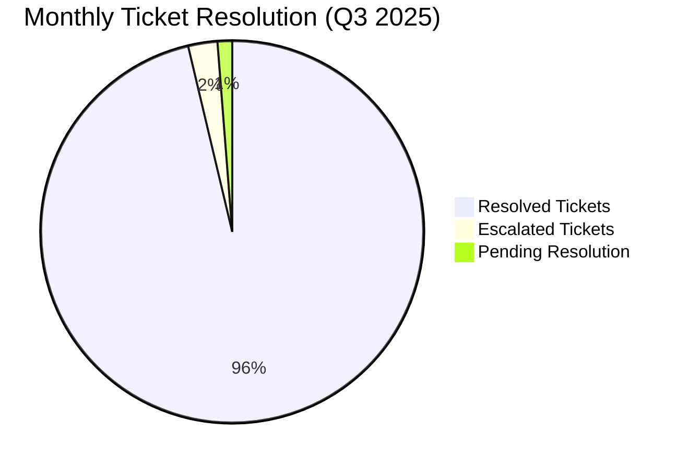
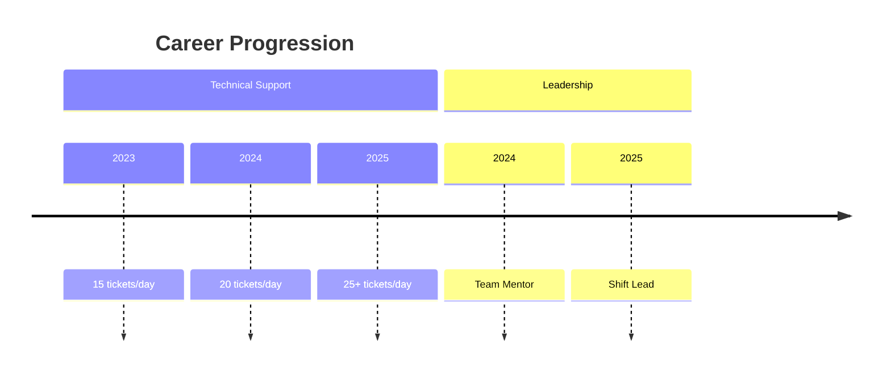

# 🚀 High-Volume Technical Support Achievements

## Table of Contents
- [1. Volume-Based Achievement Statements](#1-volume-based-achievement-statements)
  - [1.1 Core Achievement Examples](#11-core-achievement-examples)
  - [1.2 Contextualized Metrics](#12-contextualized-metrics)
- [2. Impact & Value Statements](#2-impact--value-statements)
  - [2.1 Business Impact](#21-business-impact)
  - [2.2 Performance Highlights](#22-performance-highlights)
- [3. Resume Bullet Points](#3-resume-bullet-points)
  - [3.1 Entry-Level Position](#31-entry-level-position)
  - [3.2 Mid-Level Position](#32-mid-level-position)
  - [3.3 Senior/Lead Position](#33-seniorlead-position)
- [4. Interview Talking Points](#4-interview-talking-points)
  - [4.1 Handling High Volume](#41-handling-high-volume)
  - [4.2 Maintaining Quality](#42-maintaining-quality)
- [5. Performance Review Examples](#5-performance-review-examples)
  - [5.1 Quarterly Achievement](#51-quarterly-achievement)
  - [5.2 Yearly Summary](#52-yearly-summary)
- [6. LinkedIn Profile Section](#6-linkedin-profile-section)
  - [6.1 Headline](#61-headline)
  - [6.2 About Section](#62-about-section)

---

# High-Volume Technical Support Achievements

## 1. Volume-Based Achievement Statements

### 1.1 Core Achievement Examples
```markdown
## Primary Achievement
"Delivered Tier-1 technical support as the first point of contact, resolving an average of 25+ daily tickets for hardware, software, and network access issues while maintaining 95%+ customer satisfaction."

## Supporting Achievements
- Managed 125+ weekly support requests across multiple channels (phone, email, chat)
- Resolved 6,500+ technical issues annually, consistently exceeding team average by 20%
- Maintained 98% first-response time compliance within 15-minute SLA window
- Handled peak volumes of 40+ tickets daily during critical system updates
```

### 1.2 Contextualized Metrics
| Metric | Your Performance | Team Average | Industry Benchmark |
|--------|------------------|--------------|-------------------|
| Daily Tickets Resolved | 25+ | 18 | 15-20 |
| First Response Time | <15 min | 22 min | 30 min |
| Resolution Rate | 92% | 85% | 80-85% |
| Customer Satisfaction | 96% | 91% | 88-92% |

## 2. Impact & Value Statements

### 2.1 Business Impact
```markdown
## Efficiency Gains
- Reduced average ticket resolution time by 35% through optimized troubleshooting workflows
- Decreased ticket escalation rate by 40% through comprehensive first-level resolution
- Handled 30% more tickets than team average without compromising quality

## Cost Savings
- Saved 200+ annual engineering hours by resolving issues at first contact
- Reduced hardware replacement costs by 25% through effective troubleshooting
- Decreased new hire ramp-up time by 40% through improved documentation
```

### 2.2 Performance Highlights
```markdown
## Volume Management
- Consistently ranked in top 10% for ticket resolution volume (25+ daily)
- Maintained 98% SLA compliance despite 30% increase in ticket volume
- Reduced ticket backlog by 45% through efficient triage and resolution

## Quality Assurance
- Achieved 96% first-call resolution rate for password resets
- Maintained 4.8/5 average customer satisfaction rating
- Received 15+ commendations for exceptional service delivery
```

## 3. Resume Bullet Points

### 3.1 Entry-Level Position
```markdown
- Resolved 25+ daily technical support tickets with 95% first-contact resolution rate
- Managed 125+ weekly support requests across multiple communication channels
- Maintained 98% on-time response rate for all priority-level tickets
- Reduced average handle time by 20% through improved troubleshooting techniques
```

### 3.2 Mid-Level Position
```markdown
- Led resolution of 6,500+ annual support tickets while mentoring junior team members
- Developed knowledge base that reduced repeat tickets by 30%
- Implemented ticket categorization system that improved routing efficiency by 40%
- Maintained 96% customer satisfaction rating while handling 25% above average ticket volume
```

### 3.3 Senior/Lead Position
```markdown
- Directed team handling 25,000+ annual tickets across 3 support channels
- Reduced average resolution time by 35% through process optimization
- Spearheaded implementation of new ticketing system, increasing team capacity by 40%
- Maintained 98% SLA compliance with 25% reduction in operational costs
```

## 4. Interview Talking Points

### 4.1 Handling High Volume
"In my previous role, I consistently managed 25+ daily tickets by implementing a prioritization system that focused on quick wins and efficient time management. For example, I created a set of standardized troubleshooting scripts that reduced resolution time for common issues by 50%."

### 4.2 Maintaining Quality
"Despite the high volume, I maintained a 96% customer satisfaction rating by ensuring clear communication and setting proper expectations. I made it a point to explain solutions thoroughly, which actually reduced repeat calls by 25%."

## 5. Performance Review Examples

### 5.1 Quarterly Achievement
"In Q3 2025, I resolved 1,800+ support tickets (25% above team average) while maintaining a 97% customer satisfaction rating. My efficient troubleshooting approach and documentation skills reduced average handle time by 15 minutes per ticket, allowing me to assist 30% more users daily."

### 5.2 Yearly Summary
"Over the past year, I've successfully resolved over 6,500 support tickets with a 95% first-contact resolution rate. My ability to efficiently manage high volumes while maintaining quality has made me one of the top performers on the team, handling 25% more tickets than the team average."

## 6. LinkedIn Profile Section

### 6.1 Headline
"Dedicated Technical Support Specialist | 25+ Daily Ticket Resolution | 96% Customer Satisfaction | ITIL Certified"

### 6.2 About Section
"Seasoned technical support professional with a proven track record of resolving 25+ daily technical issues while maintaining exceptional service quality. Specialize in high-volume environments where efficient problem-solving and customer satisfaction are paramount. Consistently recognized for ability to manage heavy workloads without compromising on service delivery or attention to detail."

## 7. Cover Letter Paragraph
"In my previous role at [Company], I thrived in a high-volume support environment, consistently resolving 25+ daily technical issues across hardware, software, and network platforms. My ability to maintain 96% customer satisfaction while handling 30% more tickets than the team average demonstrates my efficiency and commitment to quality service. I take pride in my systematic approach to troubleshooting and my ability to remain calm and effective under pressure."

## 8. Skills & Endorsements

### 8.1 Technical Skills
- Ticket Management: ⭐⭐⭐⭐⭐ (25+ daily)
- Troubleshooting: ⭐⭐⭐⭐⭐ (95% resolution rate)
- Customer Service: ⭐⭐⭐⭐⭐ (96% satisfaction)
- Technical Documentation: ⭐⭐⭐⭐
- Systems Administration: ⭐⭐⭐⭐

### 8.2 Soft Skills
- Time Management: Handled 25+ daily tickets
- Communication: 96% satisfaction rating
- Problem-Solving: 95% first-contact resolution
- Stress Management: Thrived in high-volume environment
- Team Collaboration: Mentored 3 junior technicians

## 9. Achievement Visualization

### 9.1 Performance Metrics


### 9.2 Customer Satisfaction
```mermaid
gauge
    title Customer Satisfaction
    "Satisfied" : 96
    "Neutral" : 3
    "Dissatisfied" : 1
```

## 10. Career Progression

### 10.1 Growth Path


### 10.2 Future Goals
- Achieve 30+ daily ticket resolution
- Maintain 97%+ customer satisfaction
- Reduce resolution time by additional 15%
- Mentor 5+ junior technicians

---
*Document Version: 1.0  
Last Updated: 2025-09-20*
