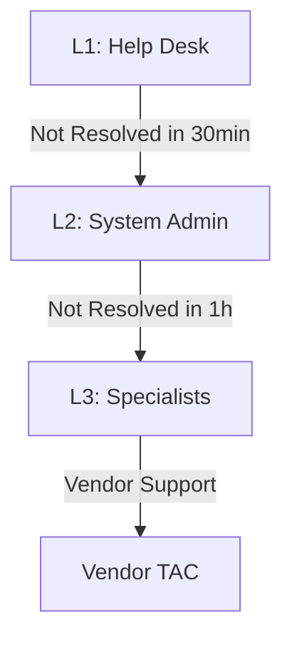
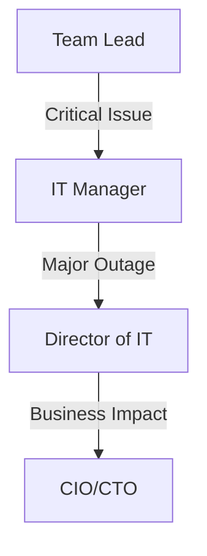

# 🚨 Incident Escalation Guide

## Table of Contents
- [1. Escalation Matrix](#1-escalation-matrix)
  - [Technical Escalation Path](#technical-escalation-path)
  - [Management Escalation Path](#management-escalation-path)
- [2. Escalation Criteria](#2-escalation-criteria)
  - [Technical Triggers](#technical-triggers)
- [3. Escalation Templates](#3-escalation-templates)
  - [Internal Escalation Email](#internal-escalation-email)
  - [Vendor Escalation Template](#vendor-escalation-template)

## 1. Escalation Matrix

### Technical Escalation Path


### Management Escalation Path


## 2. Escalation Criteria

### Technical Triggers
- **Immediate Escalation (P1)**
  - Complete system outage
  - Security breach
  - Data loss/corruption

- **1-Hour Escalation (P2)**
  - Major functionality down
  - Multiple users affected
  - Work stoppage

- **4-Hour Escalation (P3/P4)**
  - Minor issues with workarounds
  - Single user affected
  - Non-critical systems

## 3. Escalation Templates

### Internal Escalation Email
```markdown
Subject: ⚠️ ESCALATED: [PRIORITY] [INC-XXX] - [Brief Description]

Team,

Escalating the following incident for immediate attention:

**Incident**: [INC-XXX]  
**Priority**: [P1/P2/P3]  
**Reported By**: [Name]  
**Current Status**: [Status]  
**Business Impact**:  
- [ ] Revenue Impact: $[Amount]/hour  
- [ ] Users Affected: [Number]  
- [ ] Systems Down: [List]  

**Actions Taken**:
1. [Troubleshooting Step 1]
2. [Troubleshooting Step 2]

**Requested Action**:
- [ ] Immediate resolution required
- [ ] Additional resources needed
- [ ] Management decision required

**Next Update**: [Time/Date]

Attachments: [Screenshots/Logs]
```

### Vendor Escalation Template
```markdown
## Vendor Escalation Request

**Case ID**: [Vendor Ticket #]  
**Priority**: [1-Critical/2-High/3-Medium]  
**Customer Impact**: [Description]  

### Issue Details
- **First Occurrence**: [Date/Time]  
- **Frequency**: [Constant/Intermittent]  
- **Error Messages**: [List]  

### Environment
- **Product Version**: [Version]  
- **OS/Platform**: [Details]  
- **Configuration**: [Relevant Settings]  

### Troubleshooting Performed
1. [Step 1] - [Result]
2. [Step 2] - [Result]

### Required Information
- [ ] Log files attached
- [ ] Screenshots provided
- [ ] Network traces included

### Business Justification
[Explain criticality and impact]
```

## 4. Contact Directory

### Internal Teams
| Team | Contact | Hours | Escalation Path |
|------|---------|-------|-----------------|
| Network Ops | netops@example.com | 24/7 | On-call rotation |
| Security | soc@example.com | 24/7 | PagerDuty #123 |
| Database | dba@example.com | 7x24 | Team rotation |

### Vendor Support
| Vendor | Product | Support # | Case Portal |
|--------|---------|-----------|-------------|
| Cisco | Network | 1-800-XXX | [URL] |
| Microsoft | Windows | 1-800-XXX | [URL] |
| VMware | vSphere | 1-800-XXX | [URL] |

## 5. Escalation Workflow

### Step 1: Initial Assessment
- [ ] Verify issue details
- [ ] Check known errors
- [ ] Attempt basic resolution

### Step 2: Technical Escalation
- [ ] Gather relevant logs
- [ ] Document troubleshooting
- [ ] Contact support team

### Step 3: Management Escalation
- [ ] Notify team lead
- [ ] Update stakeholders
- [ ] Initiate bridge line if needed

### Step 4: Vendor Escalation
- [ ] Open support case
- [ ] Provide all details
- [ ] Set severity level

## 6. Escalation SLA

| Level | Response Time | Resolution Time | Notification |
|-------|---------------|-----------------|--------------|
| Critical | 15 min | 2 hours | SMS, Email, Call |
| High | 1 hour | 4 hours | Email, Call |
| Medium | 4 hours | 1 business day | Email |
| Low | 8 hours | 3 business days | Email |

## 7. Post-Escalation Process

### Resolution Documentation
```markdown
## Resolution Summary - [INC-XXX]

### Root Cause
[Detailed explanation]

### Resolution Steps
1. [Action 1]
2. [Action 2]

### Preventative Measures
- [ ] Update documentation
- [ ] Schedule training
- [ ] Implement monitoring

### Follow-up Actions
| Task | Owner | Due Date | Status |
|------|-------|----------|--------|
| [ ]  |       |          |        |
```

## 8. Escalation Best Practices

### Do's
- Verify all information before escalating
- Include complete error messages
- Attach relevant logs/screenshots
- Set clear expectations
- Follow up regularly

### Don'ts
- Don't skip support levels
- Avoid vague descriptions
- Don't forget to document
- Never ignore SLAs

## 9. Emergency Contacts

### After-Hours Support
- **Primary**: [Name] - [Phone]
- **Secondary**: [Name] - [Phone]
- **Management**: [Name] - [Phone]

### Holiday Coverage
- **Dec 25-Jan 1**: [Schedule]
- **Summer Rotation**: [Schedule]

---
*Document Version: 1.0  
Last Updated: 2025-09-20*
