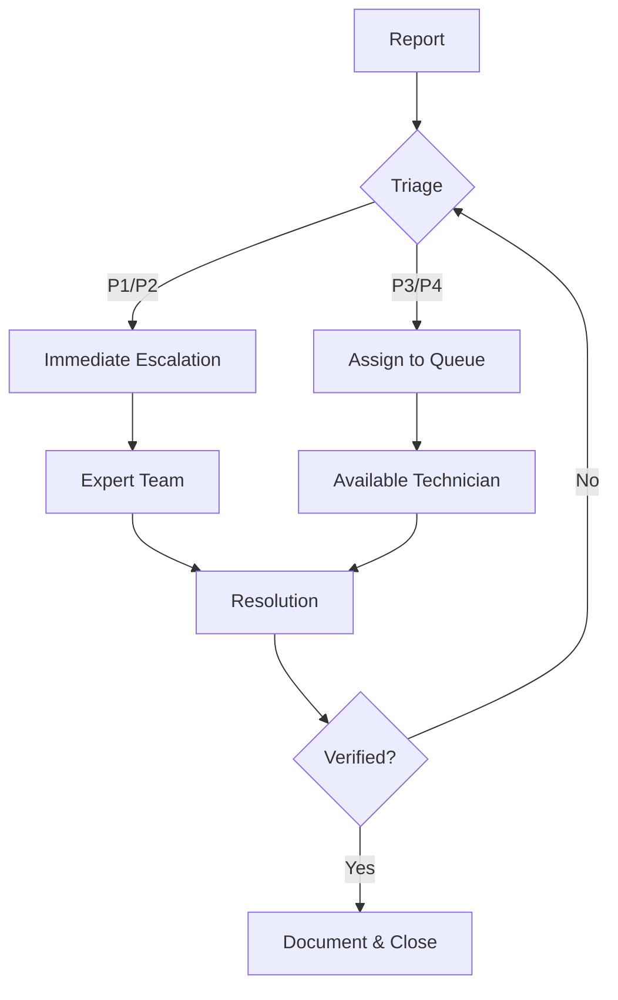

# 📋 IT Incident Management Guide

## Table of Contents
1. [🚨 Incident Severity Levels](#1--incident-severity-levels)
2. [📝 Incident Log Template](#2--incident-log-template)
3. [🔄 Workflow](#3--workflow)
4. [📞 Escalation Path](#4--escalation-path)
   - [Technical Escalation](#technical-escalation)
   - [Management Escalation](#management-escalation)
5. [📊 Common Solutions](#5--common-solutions)
6. [📈 Performance Metrics](#6--performance-metrics)
7. [📋 Templates](#7--templates)
   - [Status Update Email](#-status-update-email)
   - [Handoff Template](#-handoff-template)
8. [🔍 Post-Incident Review](#8--post-incident-review)
9. [🔗 Quick Reference](#9--quick-reference)
10. [📚 Knowledge Base](#10--knowledge-base)

---


## 1. 🚨 Incident Severity Levels

| Level | Impact | Example | Response Time | Resolution Time |
|-------|--------|---------|---------------|-----------------|
| **P1 - Critical** | Business operations completely halted | Network outage, Email down | 15 min | 2 hours |
| **P2 - High** | Major function impaired | CRM system down | 1 hour | 4 hours |
| **P3 - Medium** | Partial non-critical impact | Printer offline | 4 hours | 1 business day |
| **P4 - Low** | Minor issue with workaround | Desktop icon missing | 8 hours | 3 business days |

## 2. 📝 Incident Log Template

```markdown
### 🆔 [INC-YYYYMMDD-XXX]
**Status**: 🟡 In Progress  
**Priority**: P[1-4]  
**Reported**: [Date] @ [Time] by [Name]  
**Category**: [Hardware/Software/Network/Security]  
**Assigned To**: [Technician]  

#### 📋 Description
[Clear description of the issue]

#### 📊 Impact
- Systems: [List affected systems]
- Users: [Number/Departments]
- Business Impact: [High/Medium/Low]

#### ⏱️ Timeline
| Time | Action | Technician | Notes |
|------|--------|------------|-------|
| [HH:MM] | Incident created | System | - |
| [HH:MM] | [Action taken] | [Initials] | [Details] |

#### ✅ Resolution
- **Root Cause**: [Identified cause]
- **Steps Taken**:
  1. [Step 1]
  2. [Step 2]
- **Resolution Time**: [HH:MM]
- **Verified By**: [Name] @ [Time]
```

## 3. 🔄 Workflow



## 4. 📞 Escalation Path

### Technical Escalation
1. **Level 1**: Help Desk (24/7)
   - Basic troubleshooting
   - Password resets
   - Known issues

2. **Level 2**: System Administrators
   - Server/network issues
   - Application support

3. **Level 3**: Specialists/Vendors
   - Critical system failures
   - Vendor-specific issues

### Management Escalation
- **30 min unresolved**: Team Lead
- **2 hours unresolved**: IT Manager
- **4+ hours unresolved**: Director/CTO

## 5. 📊 Common Solutions

### 💻 Common Issues
1. **Can't connect to network**
   - 🔌 Check physical connections
   - 🔄 Restart network adapter
   - 📶 Verify Wi-Fi/Ethernet status

2. **Application crashing**
   - 🔄 Restart application
   - 🔄 Restart computer
   - 🔄 Reinstall application

3. **Slow performance**
   - 💾 Check disk space
   - 🖥️ Review running processes
   - 🔄 Restart system

## 6. 📈 Performance Metrics

### Monthly Report
```markdown
# 📅 Monthly Incident Report - [Month] [Year]

## 📊 Metrics
- Total Incidents: [Number]
- Average Resolution Time: [HH:MM]
- First Call Resolution: XX%
- SLA Compliance: XX%

## 🏆 Top Performers
1. [Technician] - [X] resolved
2. [Technician] - [X] resolved

## 📌 Improvement Areas
1. [Area 1]
2. [Area 2]
```

## 7. 📋 Templates

### 📧 Status Update Email
```markdown
Subject: [UPDATE] Incident [INC-XXX]: [Brief Description]

Hello [Team/Recipient],

Status Update:
- Current Status: [In Progress/Resolved]
- Impact: [Description]
- Next Update: [Time/Date]

Thank you for your patience.

Best regards,
[Your Name]
[Your Position]
[Contact]
```

### 🔄 Handoff Template
```markdown
# Handoff - [INC-XXX]

## Current Status
- [ ] Initial assessment complete
- [ ] Impact verified
- [ ] Workarounds implemented

## Next Steps
1. [Action Item 1]
2. [Action Item 2]

## Notes
[Additional information]
```

## 8. 🔍 Post-Incident Review

### RCA Template
```markdown
# Root Cause Analysis: [INC-XXX]

## Incident Details
- Duration: [Start] to [End]
- Downtime: [Duration]
- Impact: [High/Medium/Low]

## Timeline
1. [Time] - [Event]
2. [Time] - [Action Taken]

## Root Cause
[Detailed analysis]

## Action Items
| Task | Owner | Due Date | Status |
|------|-------|----------|--------|
| [ ]  |       |          |        |
```

## 9. 🔗 Quick Reference

### Emergency Contacts
- **Network Team**: [Phone/Email]
- **Security Team**: [Phone/Email]
- **Vendor Support**: [Contact Info]

### Useful Commands
```bash
# Check network connectivity
ping [hostname]
tracert [IP]

# Check system status
systeminfo
tasklist

# Check logs
eventvwr
Get-EventLog -LogName System -Newest 20
```

## 10. 📚 Knowledge Base

### Common Resolutions
- [How to reset passwords]
- [VPN connection issues]
- [Email setup guides]

### Documentation
- [Network diagrams]
- [System configurations]
- [Vendor contacts]
```

## 📝 Usage Instructions

1. **Customize** with your organization's details
2. **Print** the severity matrix and escalation paths
3. **Share** with your IT team
4. **Update** regularly with new solutions

## 🔄 Version History
- v1.0 (2025-09-20): Initial version

---
*Document generated on 2025-09-20*
