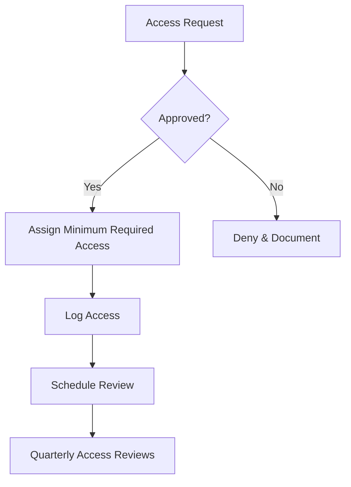
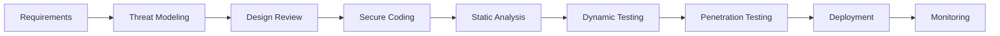

# 🔒 Information Security Handbook

## Table of Contents

### 1. Access Control Policies
- 1.1 [User Access Management](#11-user-access-management)
- 1.2 [Password Requirements](#12-password-requirements)

### 2. Data Protection
- 2.1 [Data Classification](#21-data-classification)
- 2.2 [Encryption Standards](#22-encryption-standards)

### 3. Incident Response
- 3.1 [Security Incident Classification](#31-security-incident-classification)
- 3.2 [Incident Response Plan](#32-incident-response-plan)

### 4. Secure Development
- 4.1 [SDLC Security Checkpoints](#41-sdlc-security-checkpoints)
- 4.2 [OWASP Top 10 Mitigations](#42-owasp-top-10-mitigations)

### 5. Physical Security
- 5.1 [Data Center Access](#51-data-center-access)

### 6. Remote Work Security
- 6.1 [Secure Remote Access](#61-secure-remote-access)

### 7. Compliance Requirements
- 7.1 [Regulatory Frameworks](#71-regulatory-frameworks)
- 7.2 [Audit Preparation](#72-audit-preparation)

### 8. Security Awareness
- 8.1 [Phishing Red Flags](#81-phishing-red-flags)

---

# 🔒 Information Security Handbook

## 1. Access Control Policies

### 1.1 User Access Management


### 1.2 Password Requirements
```markdown
## Password Policy
- **Length**: Minimum 12 characters
- **Complexity**: Upper + Lower + Numbers + Special Characters
- **History**: Last 24 passwords remembered
- **Expiration**: 90 days
- **MFA**: Required for all external access
- **Storage**: Encrypted at rest and in transit

## Example Strong Password
`W3lcome@2025!Secure#`
```

## 2. Data Protection

### 2.1 Data Classification
| Level | Description | Examples | Protection Required |
|-------|-------------|----------|---------------------|
| **Public** | Non-sensitive information | Marketing materials | Standard |
| **Internal** | Company internal | Policies, procedures | Access control |
| **Confidential** | Sensitive business data | Financials, roadmaps | Encryption, access logs |
| **Restricted** | Regulated data | PII, PHI, payment info | Strictest controls |

### 2.2 Encryption Standards
```markdown
## Data Encryption
- **At Rest**: AES-256
- **In Transit**: TLS 1.3
- **Email**: S/MIME or PGP
- **Mobile Devices**: FIPS 140-2 validated encryption

## Key Management
- Rotation: 90 days or after compromise
- Storage: HSM or key management service
- Access: Dual control, split knowledge
```

## 3. Incident Response

### 3.1 Security Incident Classification
| Level | Impact | Response Time | Escalation Path |
|-------|--------|---------------|-----------------|
| **Critical** | System compromise, data breach | Immediate | CISO, Legal, PR |
| **High** | Unauthorized access attempt | 1 hour | IT Director |
| **Medium** | Policy violation | 4 hours | Security Team |
| **Low** | Minor policy issues | 24 hours | Department Head |

### 3.2 Incident Response Plan
```markdown
1. **Identification**
   - Detect and log incident
   - Classify severity
   - Notify security team

2. **Containment**
   - Short-term: Isolate affected systems
   - Long-term: Remove threats, close vulnerabilities

3. **Eradication**
   - Remove malware/unauthorized access
   - Patch vulnerabilities
   - Change compromised credentials

4. **Recovery**
   - Restore systems from clean backups
   - Verify system integrity
   - Monitor for recurrence

5. **Lessons Learned**
   - Document incident
   - Update policies/procedures
   - Conduct training
```

## 4. Secure Development

### 4.1 SDLC Security Checkpoints


### 4.2 OWASP Top 10 Mitigations
```markdown
1. **Injection**
   - Use prepared statements
   - Input validation
   - Least privilege DB accounts

2. **Broken Authentication**
   - MFA implementation
   - Secure password storage (bcrypt/Argon2)
   - Session timeout

3. **Sensitive Data Exposure**
   - Encryption at rest/transit
   - Key management
   - Data minimization
```

## 5. Physical Security

### 5.1 Data Center Access
```markdown
## Access Control
- Biometric authentication
- Tailgating prevention
- Visitor logs
- 24/7 surveillance

## Environmental Controls
- Temperature: 18-27°C (64-81°F)
- Humidity: 40-60%
- Fire suppression: Clean agent systems
- UPS: N+1 redundancy
```

## 6. Remote Work Security

### 6.1 Secure Remote Access
```markdown
## VPN Requirements
- Always-on VPN for company resources
- Split tunneling disabled
- Certificate-based authentication
- Session timeout: 12 hours

## Endpoint Security
- EDR solution required
- Full disk encryption
- Automatic screen lock: 5 minutes
- USB device control
```

## 7. Compliance Requirements

### 7.1 Regulatory Frameworks
| Framework | Scope | Key Requirements |
|-----------|-------|------------------|
| **GDPR** | EU data subjects | Right to erasure, DPO |
| **HIPAA** | Healthcare data | PHI protection, BAAs |
| **PCI DSS** | Payment data | Network segmentation, encryption |
| **SOC 2** | Service orgs | Security controls, audits |

### 7.2 Audit Preparation
```markdown
## Pre-Audit Checklist
- [ ] Document inventory updated
- [ ] Access reviews completed
- [ ] Vulnerability scans current
- [ ] Incident reports organized
- [ ] Policy documentation ready

## Common Findings
- Missing patches
- Excessive permissions
- Weak password policies
- Incomplete logging
```

## 8. Security Awareness

### 8.1 Phishing Red Flags
```markdown
## How to Spot Phishing
- Generic greetings
- Urgent/Threatening language
- Mismatched URLs
- Unexpected attachments
- Requests for credentials

## Reporting Process
1. Do not click any links
2. Forward to phishing@company.com
3. Delete the message
4. Report in security portal
```

## 9. Vendor Security

### 9.1 Third-Party Assessment
```markdown
## Vendor Questionnaire
1. **Security Certifications**
   - SOC 2 Type II
   - ISO 27001
   - Penetration test results

2. **Data Handling**
   - Data encryption standards
   - Data retention policies
   - Subprocessor list

3. **Incident Response**
   - Breach notification timeline
   - Response procedures
   - Liability coverage
```

## 10. Secure Disposal

### 10.1 Media Sanitization
| Media Type | Method | Standard |
|------------|--------|----------|
| HDD/SSD | Degauss + Physical destruction | NIST 800-88 |
| Paper | Cross-cut shredding | DIN 66399 Level 3 |
| Mobile Devices | Factory reset + Encryption wipe | NIST 800-88 |
| Optical Media | Physical destruction | NSA/CSS 9-12 |

### 10.2 Data Retention Schedule
```markdown
## Retention Periods
- Financial Records: 7 years
- Employee Records: 7 years post-employment
- System Logs: 1 year
- Backup Tapes: 3 months
- Email: 3 years

## Disposal Methods
- Digital: Secure erase (DoD 5220.22-M)
- Physical: Cross-cut shredding
- Hardware: Certified e-waste recycler
```

## 11. Security Monitoring

### 11.1 SIEM Alerts
```markdown
## Critical Alerts
1. Multiple failed logins
2. Unusual data transfers
3. Privilege escalation
4. Malware detection
5. Data exfiltration attempts

## Response Times
- Critical: 15 minutes
- High: 1 hour
- Medium: 4 hours
- Low: 24 hours
```

## 12. Business Continuity

### 12.1 RTO/RPO Requirements
| System | RTO | RPO | Backup Frequency |
|--------|-----|-----|------------------|
| Email | 4h | 15m | 15 minutes |
| CRM | 8h | 1h | Hourly |
| File Server | 24h | 24h | Daily |
| HR System | 72h | 24h | Daily |

---
*Document Version: 1.0  
Last Updated: 2025-09-20*
