# 🖥️ IT Service Desk Operations Guide

## Table of Contents
1. [Introduction to IT Service Desk](#1-introduction-to-it-service-desk)
2. [Service Desk Structure](#2-service-desk-structure)
3. [Core Processes](#3-core-processes)
4. [Tools and Technologies](#4-tools-and-technologies)
5. [Best Practices](#5-best-practices)
6. [Common Issues and Solutions](#6-common-issues-and-solutions)
7. [Documentation and Knowledge Base](#7-documentation-and-knowledge-base)
8. [Performance Metrics](#8-performance-metrics)
9. [Security and Compliance](#9-security-and-compliance)
10. [Continuous Improvement](#10-continuous-improvement)

## 1. Introduction to IT Service Desk

### 1.1 What is an IT Service Desk?
The IT Service Desk is the single point of contact between the service provider and users for day-to-day activities. It handles incidents, service requests, and provides users with information about IT services.

### 1.2 Key Objectives
- Provide a single point of contact for IT support
- Restore normal service operation as quickly as possible
- Minimize the impact of service disruptions
- Improve user satisfaction
- Maintain IT service quality

## 2. Service Desk Structure

### 2.1 Support Tiers

#### 2.1.1 Tier 0: Self-Service & Knowledge Base
- **Purpose**: Enable users to resolve common issues independently
- **Components**:
  - Knowledge base articles
  - FAQs and how-to guides
  - Password reset portals
  - Automated chatbot assistance
- **Benefits**:
  - 24/7 availability
  - Reduces ticket volume by 20-30%
  - Empowers users with self-help options

#### 2.1.2 Tier 1: First-Line Support
- **Responsibilities**:
  - Initial contact point for all IT issues
  - Basic troubleshooting and triage
  - Ticket logging, categorization, and prioritization
  - Resolution of common issues (password resets, account unlocks, basic software questions)
  - Escalation to higher tiers when necessary
- **Key Metrics**:
  - First Contact Resolution (FCR) Target: 70-80%
  - Average Handle Time (AHT): 5-15 minutes
  - Customer Satisfaction (CSAT) Target: >90%
- **Skills Required**:
  - Excellent communication and customer service skills
  - Basic technical troubleshooting abilities
  - Proficiency with ticketing systems (ServiceNow, Jira, etc.)
  - Active listening and problem-solving
  - Time management and multitasking

#### 2.1.3 Tier 2: Technical Support
- **Responsibilities**:
  - Advanced troubleshooting and problem resolution
  - In-depth analysis of complex issues
  - Remote desktop and application support
  - Software installation and configuration
  - Hardware diagnostics and basic repairs
  - User account and access management
  - Documentation of solutions for knowledge base
- **Key Metrics**:
  - Resolution Rate: >85%
  - Average Handle Time: 15-60 minutes
  - Escalation Rate: <15%
  - Knowledge Base Contributions: 2-4 articles/month
- **Skills Required**:
  - Strong technical background in relevant technologies
  - Experience with enterprise IT environments
  - Proficiency in remote support tools (TeamViewer, SCCM, etc.)
  - Understanding of networking concepts
  - Scripting and automation skills (PowerShell, Python, etc.)

#### 2.1.4 Tier 3: Subject Matter Experts (SMEs)
- **Responsibilities**:
  - Resolution of highly complex technical issues
  - System architecture design and implementation
  - Enterprise application support and maintenance
  - Network infrastructure management
  - Security and compliance oversight
  - Major incident management
  - Mentoring junior staff
- **Key Metrics**:
  - Complex Issue Resolution: >90%
  - Mean Time to Resolve (MTTR): <4 hours
  - System Availability: 99.9%
  - Knowledge Transfer: 1-2 training sessions/month
- **Skills Required**:
  - Expert-level knowledge in specific domains
  - Experience with enterprise architecture
  - Project and vendor management
  - Advanced scripting and automation
  - ITIL or similar certification

#### 2.1.5 Tier 4: Vendor and External Support
- **Responsibilities**:
  - Primary liaison with third-party vendors
  - Management of vendor relationships and SLAs
  - Coordination of warranty and maintenance services
  - Firmware/software patch management
  - Escalation management for critical issues
  - Contract and license management
- **Key Metrics**:
  - Vendor Response Time: <2 hours for P1 issues
  - SLA Compliance: >95%
  - Cost Savings from Vendor Management: 10-15%
  - Patch Compliance: >98%
- **Skills Required**:
  - Vendor-specific certifications (as required)
  - Strong negotiation and relationship management
  - Contract and license management expertise
  - Project management skills
  - Technical understanding of supported products

### 2.2 Staffing Models

#### 2.2.1 Local Service Desk
- **Description**: Dedicated support staff physically present at each business location
- **Best For**:
  - Organizations with multiple large offices (>500 users per site)
  - Companies requiring frequent hands-on hardware support
  - Businesses with strict data residency or compliance requirements
  - Industries with specialized on-site needs (manufacturing, healthcare, etc.)
- **Pros**:
  - Local presence builds trust
  - Better understanding of local issues
  - Immediate on-site support
- **Cons**:
  - Higher operational costs
  - Inconsistent service quality across locations
  - Resource duplication

#### 2.2.2 Centralized Service Desk
- **Description**: Single, unified support team serving the entire organization from one or more locations
- **Best For**:
  - Small to medium-sized businesses (50-1,000 users)
  - Organizations with a single office location
  - Companies with standardized IT environments
  - Businesses with cloud-based infrastructure
- **Key Metrics**:
  - Cost per Ticket: 20-30% lower than distributed models
  - First Contact Resolution: 65-75%
  - Average Speed to Answer: <60 seconds
  - Staff Utilization: 70-80%
- **Pros**:
  - Economies of scale reduce operational costs
  - Standardized processes and knowledge sharing
  - Easier to implement and maintain SLAs
  - Better resource allocation and load balancing
  - Simplified management and reporting
- **Cons**:
  - Limited understanding of local/regional nuances
  - Time zone coverage challenges for global operations
  - Single point of failure if not properly designed
  - Potential for longer resolution times for on-site issues
  - Less personalized service experience

#### 2.2.3 Follow-the-Sun Model
- **Description**: Global support coverage with handoffs between teams in different time zones
- **Best For**:
  - Multinational organizations with distributed operations
  - 24/7 support requirements with follow-the-business-hours approach
  - Businesses with global customer base across multiple time zones
- **Key Metrics**:
  - Coverage Hours: 24/5 or 24/7
  - Handoff Success Rate: >95%
  - Knowledge Base Updates: Real-time synchronization
  - Customer Satisfaction: Consistent across regions
- **Implementation**:
  - **Hub Locations**: Typically 3 hubs (Americas, EMEA, APAC)
  - **Shift Handovers**: 1-2 hour overlap between regions
  - **Tools**: Shared ticketing system, knowledge base, and communication platforms
  - **Processes**: Standardized documentation and escalation paths
- **Pros**:
  - True 24/7 coverage without night shifts
  - Follows normal business hours in each region
  - Reduces support fatigue and burnout
  - Leverages global talent pool
  - Provides follow-the-sun development opportunities
- **Cons**:
  - Complex knowledge management and transfer
  - Cultural and language considerations
  - Requires robust documentation standards
  - Potential for communication gaps during handoffs
  - Higher coordination overhead

#### 2.2.4 Virtual Support Team
- **Description**: Distributed support staff working remotely from various locations
- **Best For**:
  - Organizations with distributed or remote workforces
  - Companies with established work-from-home policies
  - Businesses looking to optimize real estate and operational costs
  - Startups and tech companies with cloud-first strategies
- **Key Metrics**:
  - Remote Work Readiness Score: >85%
  - Support Availability: 99.9% uptime
  - Employee Satisfaction: >4.0/5.0
  - Cost per Ticket: 30-40% lower than traditional models
- **Technology Requirements**:
  - Cloud-based ticketing and knowledge management
  - Secure remote access solutions (VPN, Zero Trust)
  - Unified communication platforms (Teams, Slack, Zoom)
  - Endpoint security and monitoring
  - Virtual desktop infrastructure (VDI) if needed
- **Pros**:
  - Access to broader talent pool regardless of location
  - Significant reduction in overhead costs
  - Enhanced business continuity and disaster recovery
  - Improved employee satisfaction and retention
  - Environmental benefits from reduced commuting
- **Cons**:
  - Requires robust IT infrastructure and security
  - Potential challenges in team building and culture
  - Dependence on reliable internet connectivity
  - Need for strong performance monitoring
  - Onboarding and training complexities

#### Hybrid Models
### 2.3 Hybrid Models

Many organizations implement hybrid approaches to balance cost, coverage, and service quality:

#### 2.3.1 Hub-and-Spoke Model
- **Structure**:
  - Centralized Tier 1 support (Hub)
  - Local/regional Tier 2/3 support (Spokes)
  - Shared knowledge base and tools
- **Best For**:
  - Large enterprises with multiple locations
  - Organizations with both centralized and decentralized IT
  - Businesses with specialized local needs
- **Implementation Example**:
  ```
  Global Hub (24/7)
  ├── Regional Hub EMEA
  ├── Regional Hub Americas
  └── Regional Hub APAC
      ├── Local Support Site 1
      └── Local Support Site 2
  ```

#### 2.3.2 Follow-the-Moon Model
- **Structure**:
  - Follow-the-sun coverage during business hours
  - Centralized overnight support
  - Seamless handoffs between teams
- **Best For**:
  - Global organizations needing 24/7 support
  - Businesses with critical overnight operations
  - Companies with distributed development teams
- **Shift Pattern Example**:
  - APAC: 00:00-09:00 UTC
  - EMEA: 08:00-17:00 UTC
  - AMER: 16:00-01:00 UTC
  - Night Shift: 22:00-06:00 UTC (covering gaps)

#### 2.3.3 Hybrid Virtual Model
- **Structure**:
  - Mix of in-house and outsourced support
  - Core team handles complex issues
  - External partners provide overflow/specialty support
- **Best For**:
  - Organizations with fluctuating support needs
  - Companies needing specialized skills occasionally
  - Businesses optimizing cost structures
- **Implementation Options**:
  - **Tier-based**: Internal handles T1-T2, external T3
  - **Time-based**: Internal during business hours, external after hours
  - **Skill-based**: Internal for core apps, external for specialized systems

### 2.4 Implementation Considerations

#### 2.4.1 Choosing the Right Model
- **Assessment Factors**:
  - Organizational size and structure
  - User base distribution
  - Technical complexity
  - Budget constraints
  - Compliance requirements
  - Business criticality of IT services

#### 2.4.2 Transition Planning
1. **Assessment Phase**:
   - Current state analysis
   - Gap identification
   - Stakeholder interviews

2. **Design Phase**:
   - Target operating model
   - Technology requirements
   - Process documentation

3. **Implementation Phase**:
   - Phased rollout
   - Change management
   - User training

4. **Optimization Phase**:
   - Performance monitoring
   - Continuous improvement
   - Regular reviews

#### 2.4.3 Success Metrics
- **Operational Metrics**:
  - Ticket volume and trends
  - First contact resolution rate
  - Average handle time
  - Service level agreement (SLA) compliance

- **Financial Metrics**:
  - Cost per ticket
  - Cost per user
  - ROI on support tools
  - Cost avoidance through self-service

- **Quality Metrics**:
  - Customer satisfaction (CSAT)
  - Net Promoter Score (NPS)
  - First call resolution (FCR)
  - Knowledge base effectiveness

### 2.3 Staffing Considerations

#### Staffing Ratios
| Company Size | Tier 1 | Tier 2 | Tier 3 |
|-------------|--------|--------|--------|
| Small (<500) | 1:100  | 1:200  | 1:500  |
| Medium (500-5000) | 1:150 | 1:300 | 1:750 |
| Large (>5000) | 1:200 | 1:400 | 1:1000 |

#### Shift Patterns
- **Standard Business Hours**: 8x5 coverage
- **Extended Hours**: 12x5 or 16x5 coverage
- **24/7 Support**: 3 shifts (morning, evening, night)
- **On-Call Rotation**: For after-hours critical support

#### Skill Development Path
1. **Entry Level**: Tier 1 Support → Tier 2 Support
2. **Mid-Level**: Tier 2 Support → Team Lead
3. **Senior Level**: Team Lead → Service Desk Manager
4. **Expert Level**: Specialization in specific technologies or applications

## 3. Core Processes

### 3.1 Incident Management

#### 3.1.1 Process Overview
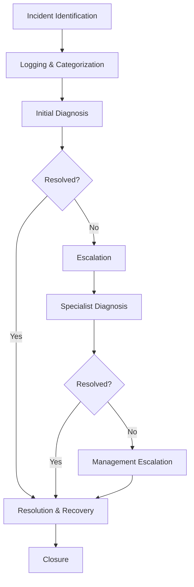

#### 3.1.2 Detailed Workflow
1. **Incident Identification**
   - **User-Reported**: Via phone, email, portal, chat
   - **Automated Detection**: Monitoring tools, system alerts
   - **Self-Service**: Failed knowledge base searches

2. **Logging & Categorization**
   - **Required Fields**:
     - Contact information
     - Incident description
     - Business impact (High/Medium/Low)
     - Urgency (1-Critical to 4-Low)
     - Category/Subcategory
     - Assignment group

3. **Initial Diagnosis**
   - **Quick Fixes**:
     - Password resets
     - Account unlocks
     - Basic troubleshooting
   - **Knowledge Base Check**:
     - Known errors
     - Workarounds
     - Documentation

4. **Escalation Procedures**
   - **Functional Escalation**:
     - Tier 1 → Tier 2: After 15 minutes without resolution
     - Tier 2 → Tier 3: After 1 hour without resolution
   - **Hierarchical Escalation**:
     - Team Lead: After 4 hours
     - Manager: After 8 hours
     - Director: After 24 hours

5. **Resolution & Recovery**
   - Implement solution
   - Test functionality
   - Document steps taken
   - Update knowledge base

6. **Closure**
   - User verification
   - Satisfaction survey
   - Ticket closure with proper categorization

#### 3.1.3 Key Performance Indicators (KPIs)

| KPI | Target | Measurement Frequency | Owner |
|-----|--------|----------------------|-------|
| **First Response Time** | <15 minutes | Real-time | T1 Support |
| **Resolution Time** | 80% within SLA | Daily | Team Leads |
| **First Contact Resolution** | >65% | Weekly | T1/T2 Support |
| **User Satisfaction** | >90% | Per ticket | Service Desk Manager |
| **Reopen Rate** | <5% | Monthly | Quality Assurance |
| **Average Handle Time** | <20 minutes | Weekly | Team Leads |
| **SLA Compliance** | >95% | Monthly | Service Desk Manager |
| **Abandonment Rate** | <5% | Daily | T1 Support |

#### 3.1.4 Priority Matrix
| Impact \ Urgency | Low | Medium | High | Critical |
|------------------|-----|--------|------|-----------|
| **Organization** | P4  | P3     | P2   | P1        |
| **Department**   | P4  | P3     | P2   | P2        |
| **Individual**   | P4  | P4     | P3   | P2        |

#### 3.1.5 Major Incident Process
1. **Identification**
   - Automatic detection via monitoring
   - Multiple similar incidents
   - Executive/VIP reports

2. **Communication Plan**
   - Immediate stakeholder notification
   - Regular status updates (every 30 mins for P1)
   - Post-incident review within 24 hours

3. **Resolution Team**
   - Dedicated bridge line
   - Cross-functional team
   - Executive sponsor

### 3.2 Request Fulfillment

#### 3.2.1 Process Flow
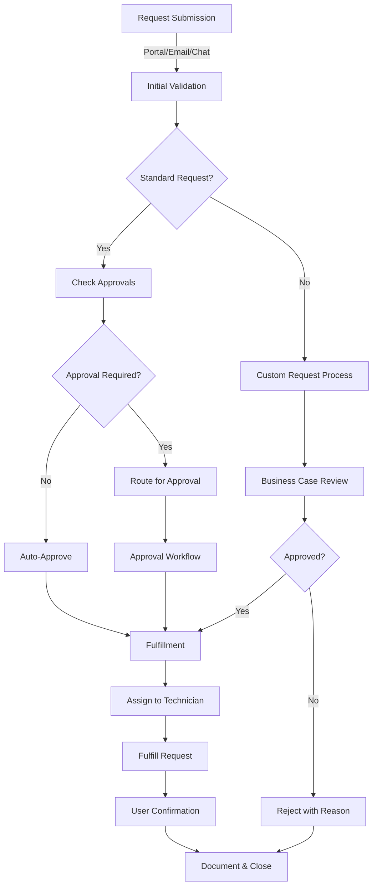

#### 3.2.2 Standard Request Catalog

| Category | Subcategory | Fulfillment Time | Approval Required |
|----------|-------------|------------------|-------------------|
| **Access** | New User Setup | 4 hours | Manager |
|  | Application Access | 2 hours | Data Owner |
|  | Folder Permissions | 4 hours | Folder Owner |
| **Hardware** | New Laptop | 1 business day | Department Head |
|  | Peripherals | 4 hours | Manager |
|  | Mobile Device | 1 business day | IT Security |
| **Software** | Standard App | 4 hours | N/A |
|  | Specialized App | 1 business day | Department Budget |
|  | License Upgrade | 8 hours | Manager |
| **Facilities** | Workspace Setup | 2 business days | Facilities |
|  | Access Badge | 24 hours | Security |

#### 3.2.3 Fulfillment Workflow
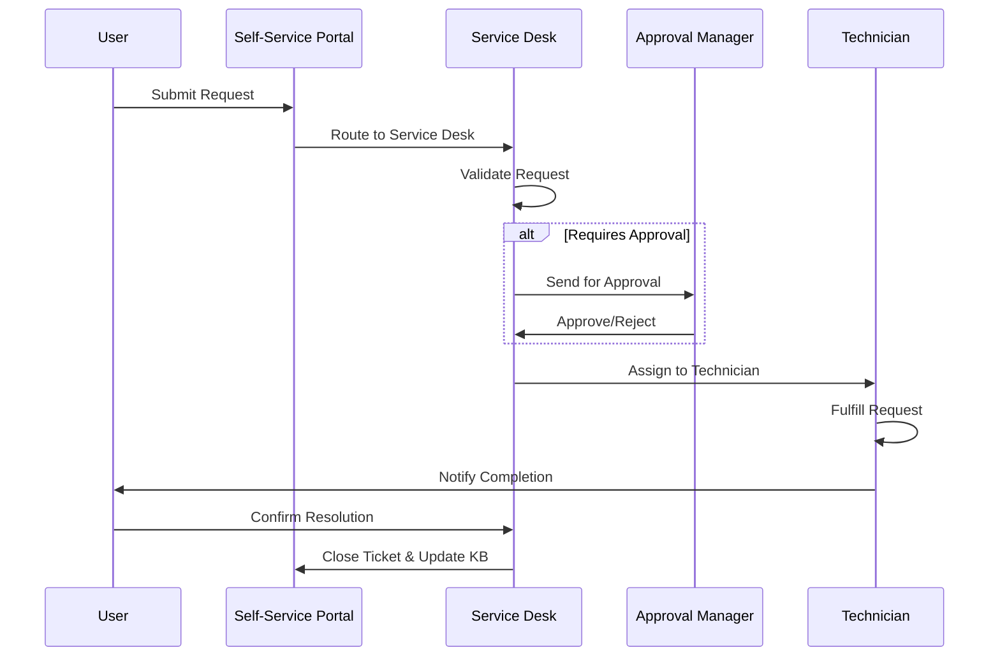

#### 3.2.4 Automation Opportunities
- **Self-Service Portal**: User-driven requests with guided workflows
- **Automated Approvals**: Based on predefined rules and policies
- **Automated Provisioning**: For standard software and access requests
- **Status Notifications**: Real-time updates via email/mobile

### 3.3 Problem Management

#### 3.3.1 Process Overview
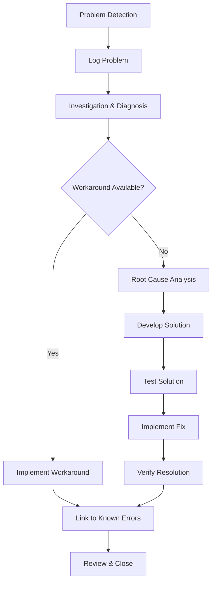

#### 3.3.2 Problem Categorization
| Category | Subcategory | Example |
|----------|-------------|---------|
| **Hardware** | Server | Hardware failure, Performance degradation |
| | Network | Connectivity issues, Bandwidth saturation |
| | End-User Devices | Laptop failures, Peripheral issues |
| **Software** | Operating System | Crashes, Compatibility issues |
| | Applications | Bugs, Performance problems |
| | Security | Vulnerabilities, Unauthorized access |
| **Procedural** | Documentation | Incomplete/Incorrect procedures |
| | Training | User errors, Lack of knowledge |

#### 3.3.3 Root Cause Analysis Techniques

**1. 5 Whys Analysis**
```
Problem: Email server is down
1. Why? - Disk space is full
2. Why? - Log files weren't rotated
3. Why? - Log rotation script failed
4. Why? - Script had incorrect permissions
5. Why? - Deployment process doesn't set execute bit
```

**2. Fishbone (Ishikawa) Diagram**
```
          +------------------+
          | Email Server Down |
          +--------+---------+
                   |
    +--------------+--------------+
    |       |       |       |     |
Methods    People  Machine  Materials
    |         |       |         |
    |         |       |         |
Log Rot.  Training  Storage   Disk
Script    Gaps      Capacity  Space
```

#### 3.3.4 Known Error Database (KEDB)
| Error Code | Description | Workaround | Permanent Fix | Status |
|------------|-------------|------------|---------------|---------|
| EMAIL-1001 | Authentication failures after password reset | Clear credential cache | Update auth module | Resolved |
| NET-2004 | Intermittent VPN drops | Reconnect VPN | Update client software | In Progress |
| APP-3007 | App crashes when printing specific docs | Use PDF export first | Patch v2.1.3 | Pending |

#### 3.3.5 Problem Management Metrics
- **Mean Time to Resolve (MTTR)**: < 5 business days
- **Recurring Incidents**: < 5% of total incidents
- **Workaround Effectiveness**: > 90% success rate
- **Root Cause Analysis Completion**: 100% for P1/P2 incidents

### 3.4 Change Management

#### 3.4.1 Change Types
| Type | Risk | Approval Required | Example |
|------|------|-------------------|----------|
| **Standard** | Low | Pre-approved | Password reset, Account unlocks |
| **Normal** | Medium | CAB | Software updates, Configuration changes |
| **Emergency** | High | ECAB | Critical security patches, Major outages |

#### 3.4.2 Change Advisory Board (CAB)
- **Members**: IT leads, Business stakeholders, Security, Compliance
- **Meeting Cadence**: Weekly/Bi-weekly
- **Agenda Items**:
  1. Review pending changes
  2. Assess risk and business impact
  3. Approve/Reject/Defer decisions
  4. Review implemented changes
  5. Review failed/rolled back changes

#### 3.4.3 Change Success Metrics
| Metric | Target | Measurement |
|--------|--------|-------------|
| **Change Success Rate** | > 95% | (Successful Changes / Total Changes) × 100 |
| **Emergency Changes** | < 5% | (Emergency Changes / Total Changes) × 100 |
| **Failed Changes** | < 3% | (Failed Changes / Total Changes) × 100 |
| **Rollback Rate** | < 2% | (Rolled Back Changes / Total Changes) × 100 |
| **Change Lead Time** | < 3 days | Time from request to implementation |

### 3.5 Knowledge Management

#### 3.5.1 Knowledge Article Lifecycle
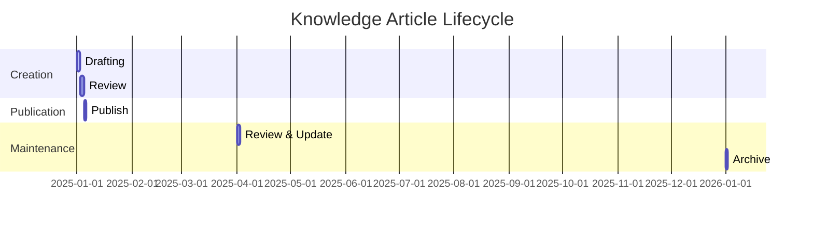

#### 3.5.2 Knowledge Base Structure
1. **How-To Guides**
   - Step-by-step instructions
   - Screenshots/videos
   - Prerequisites
   
2. **Troubleshooting**
   - Symptoms
   - Root causes
   - Resolution steps
   
3. **FAQs**
   - Common questions
   - Quick answers
   - Related articles
   
4. **Policies & Procedures**
   - IT policies
   - Compliance requirements
   - Standard operating procedures

#### 3.5.3 Knowledge Quality Metrics
- **Article Views**: Track most accessed content
- **Helpfulness Rating**: User feedback on article usefulness
- **Search Success Rate**: % of successful knowledge base searches
- **Deflection Rate**: % of incidents prevented by self-service

#### 3.2.3 Approval Workflows
- **Standard Access**: Auto-approved
- **Sensitive Systems**: Manager + Security approval
- **Financial Approval**: Cost center manager for expenses >$500

#### 3.2.4 Fulfillment SLAs
| Request Type | Target Resolution |
|--------------|-------------------|
| Password Reset | 15 minutes |
| Standard Access | 4 hours |
| New Equipment | 24-48 hours |
| Software Install | 4 hours |
| Custom Request | 72 hours |

### 3.3 Problem Management

#### 3.3.1 Problem Management Lifecycle
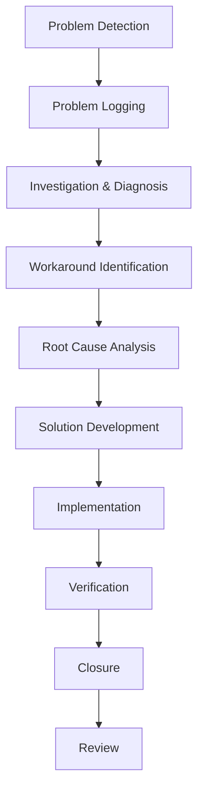

#### 3.3.2 Problem Detection Methods
- **Reactive**:
  - Incident trend analysis
  - Major incident review
  - User feedback
- **Proactive**:
  - System monitoring
  - Risk assessments
  - Vendor notifications

#### 3.3.3 Root Cause Analysis Techniques
1. **5 Whys**
   - Iterative questioning to determine root cause
   - Example: Why did the server crash? → Why was the CPU at 100%? → etc.

2. **Ishikawa (Fishbone) Diagram**
   - Categories: Methods, Machines, People, Materials, Environment
   - Visual representation of potential causes

3. **Kepner-Tregoe Analysis**
   - Problem analysis
   - Decision analysis
   - Potential problem analysis

#### 3.3.4 Known Error Database (KEDB)
- **Contents**:
  - Error description
  - Workarounds
  - Permanent solutions
  - Related incidents
  - Resolution time

- **Integration**:
  - Linked to incident management
  - Searchable by support staff
  - Regular review and updates

#### 3.3.5 Problem Management Metrics
- Number of problems logged
- Average time to resolve
- Percentage of recurring incidents
- Cost savings from permanent fixes
- Reduction in incident volume

### 3.4 Integration Between Processes

#### 3.4.1 Incident-Problem Relationship
- Multiple similar incidents → Problem record
- Problem resolution → Update KEDB → Faster incident resolution
- Workarounds documented in both systems

#### 3.4.2 Change Management Interface
- Problem resolutions often require changes
- Standard change vs. normal change
- Emergency change procedures

#### 3.4.3 Continuous Improvement Loop
- Regular process reviews
- Trend analysis
- Service improvement plans
- Lessons learned sessions

## 4. Tools and Technologies

### 4.1 Ticketing Systems

#### 4.1.1 Enterprise Solutions Comparison

| Feature | ServiceNow | Jira Service Management | Zendesk | Freshservice | BMC Helix |
|---------|------------|-------------------------|---------|--------------|-----------|
| **Best For** | Large enterprises | Tech/Dev teams | Customer support | Mid-market | Enterprise IT |
| **Pricing Model** | Per user, per year | Per agent, per month | Per agent, per month | Per agent, per month | Per user, per year |
| **Starting Price** | $100/user/mo | $20/agent/mo | $49/agent/mo | $19/agent/mo | Custom |
| **ITIL Certification** | Yes | Yes | No | Yes | Yes |
| **Customization** | High | High | Medium | Medium | High |
| **Mobile App** | Yes | Yes | Yes | Yes | Yes |
| **API Access** | Full REST API | REST API | REST API | REST API | REST API |
| **SLA Management** | Advanced | Basic | Basic | Advanced | Advanced |
| **Reporting** | Advanced | Basic | Basic | Advanced | Advanced |
| **AI/ML Features** | Virtual Agent, Predictive Intelligence | Automation, AI-powered responses | Answer Bot, AI suggestions | Freddy AI | AI/ML operations |
| **Key Differentiator** | Enterprise-scale automation | DevOps integration | Omnichannel support | Intuitive UI | AI-driven operations |
| **Implementation Time** | 3-6 months | 1-3 months | 2-4 weeks | 2-4 weeks | 2-4 months |

#### 4.1.2 Implementation Roadmap

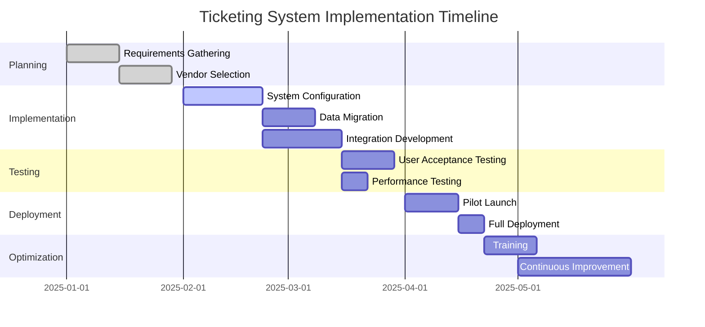

#### 4.1.3 Best Practices & Configuration

**1. Ticket Categorization**
```yaml
categories:
  - Hardware:
      - Laptop/Desktop
      - Mobile Devices
      - Peripherals
  - Software:
      - Installation
      - Licensing
      - Updates
  - Access:
      - Account Creation
      - Password Reset
      - Permissions
  - Network:
      - Connectivity
      - VPN
      - Wireless
```

**2. SLA Configuration**
- **Response Time**: Time to first response
- **Resolution Time**: Time to resolve the ticket
- **Business Hours**: Define working hours for SLAs
- **Holiday Calendar**: Account for non-working days
- **Pause Conditions**: When SLAs should be paused

**3. Automation Rules**
- **Auto-assignment**: Based on category/queue
- **Auto-escalation**: For aging tickets
- **Auto-closure**: For resolved tickets after X days
- **Notifications**: Automated status updates

**4. Integration Points**
- **Identity Management**: AD, Azure AD, Okta
- **Monitoring Tools**: Connect to alerting systems
- **Communication**: Email, Chat, SMS gateways
- **Asset Management**: CMDB integration
- **HR Systems**: For user lifecycle management

#### 4.1.4 Metrics & Reporting

**Key Reports**
1. **Volume Analysis**
   - Tickets by category/priority
   - Ticket trends over time
   - Peak hours/days

2. **Performance**
   - First response time
   - Resolution time
   - SLA compliance
   - Reopen rate

3. **Agent Performance**
   - Tickets resolved
   - Average handle time
   - Customer satisfaction
   - First contact resolution

**Dashboard Example**
```
┌─────────────────────┬─────────────────────┐
│  Open Tickets      │  SLA Compliance     │
│  ──────────────    │  ──────────────     │
│  P1: 2             │  Current: 92%       │
│  P2: 15            │  Target: 95%        │
│  P3: 42            │  Trend: ▲ 2%        │
│  P4: 87            │                     │
└────────────────────┴─────────────────────┘
┌─────────────────────┬─────────────────────┐
│  Top Categories     │  Agent Performance  │
│  ──────────────    │  ──────────────     │
│  1. Password Reset  │  Resolved: 45       │
│  2. Network Issues  │  FCR: 78%           │
│  3. Software Access │  CSAT: 4.2/5.0      │
│  4. Hardware        │  AHT: 12:34         │
└────────────────────┴─────────────────────┘
```

### 4.2 Remote Support Tools

#### 4.2.1 Feature Comparison Matrix

| Feature | TeamViewer | AnyDesk | Microsoft Remote Desktop | ScreenConnect | BeyondTrust |
|---------|------------|---------|--------------------------|---------------|-------------|
| **Pricing (Starter Plan)** | $50.90/mo | $10.99/mo | Free | $31/tech/mo | $31/tech/mo |
| **Max Resolution** | 4K | 4K | 4K | 4K | 4K |
| **Session Recording** | ✓ (Business) | ✓ (Pro) | ✗ | ✓ | ✓ |
| **File Transfer** | ✓ | ✓ | ✓ | ✓ | ✓ |
| **Unattended Access** | ✓ | ✓ | ✓ | ✓ | ✓ |
| **Mobile Support** | ✓ | ✓ | ✓ | ✓ | ✓ |
| **Multi-Monitor** | ✓ | ✓ | ✓ | ✓ | ✓ |
| **Chat** | ✓ | ✓ | ✗ | ✓ | ✓ |
| **Session Transfer** | ✓ | ✓ | ✗ | ✓ | ✓ |
| **Remote Reboot** | ✓ | ✓ | ✓ | ✓ | ✓ |
| **UAC Elevation** | ✓ | ✓ | ✓ | ✓ | ✓ |
| **Custom Branding** | ✓ (Premium) | ✓ (Pro) | ✗ | ✓ | ✓ |
| **API Access** | ✓ | ✓ | Limited | ✓ | ✓ |
| **Compliance** | GDPR, HIPAA | GDPR | Varies | SOC 2, HIPAA | FedRAMP, HIPAA |
| **Best For** | Small to Enterprise | Small to Mid-size | Windows Shops | MSPs, Enterprise | Enterprise Security |

#### 4.2.2 Security Implementation Guide

**1. Access Control**
```yaml
access_control:
  two_factor_auth: required
  ip_restrictions:
    enabled: true
    allowed_networks:
      - 192.168.1.0/24
      - 10.0.0.0/8
  session_timeout: 15m
  failed_attempts: 5
  account_lockout: 30m
```

**2. Session Security**
- **Encryption**: Enforce TLS 1.3 for all connections
- **Recording**: Mandatory recording for all remote sessions
- **Approval**: Require user approval before taking control
- **Watermarking**: Display technician info during session
- **Audit Logs**: Detailed logs of all remote sessions

**3. Compliance Requirements**
- **GDPR**: Data processing agreements with vendors
- **HIPAA**: BAA required for healthcare data
- **PCI DSS**: Session recording and monitoring
- **SOX**: Access controls and audit trails

#### 4.2.3 Deployment Models

**1. Cloud-Based**
- **Pros**: Quick setup, no infrastructure needed, automatic updates
- **Cons**: Monthly costs, internet dependency
- **Best For**: Distributed teams, SMBs

**2. On-Premises**
- **Pros**: Full control, data residency, one-time cost
- **Cons**: Higher upfront cost, maintenance required
- **Best For**: Regulated industries, large enterprises

**3. Hybrid**
- **Pros**: Balance of control and convenience
- **Cons**: Complex setup
- **Best For**: Organizations with mixed needs

#### 4.2.4 Advanced Features & Automation

**1. Integration with Ticketing Systems**
- Auto-launch remote sessions from tickets
- Log session details back to tickets
- Update ticket status based on resolution

**2. Scripting & Automation**
- Predefined scripts for common fixes
- Batch operations across multiple endpoints
- Automated remediation workflows

**3. Mobile Device Management**
- Remote wipe capability
- App deployment
- Policy enforcement
- Location tracking

**4. Remote Support KPIs**
- **Average Resolution Time**: < 15 minutes
- **First Contact Resolution**: > 85%
- **Customer Satisfaction**: > 90%
- **Session Duration**: < 20 minutes
- **Utilization Rate**: 60-70%

### 4.3 Monitoring Solutions

#### 4.3.1 Comprehensive Tool Comparison

| Solution | Type | Key Strengths | Ideal For | Starting Price |
|----------|------|---------------|-----------|----------------|
| **SolarWinds** | Commercial | Comprehensive monitoring, Scalable | Large enterprises | $2,995+ |
| **PRTG** | Commercial | Easy setup, Network focus | SMBs | $1,750 (500 sensors) |
| **Zabbix** | Open-source | Highly customizable | Technical teams | Free |
| **Nagios** | Open-source | Extensive plugins | Linux environments | Free |
| **Datadog** | SaaS | Cloud-native, APM | DevOps, Cloud | $15/host/mo |
| **New Relic** | SaaS | Application Performance | Developers | $0.30/GB |
| **Dynatrace** | Commercial | AI-powered, Full-stack | Enterprise | Custom |

#### 4.3.2 Monitoring Strategy Framework

**1. Infrastructure Monitoring**
```yaml
servers:
  - metrics: [cpu, memory, disk, network]
    thresholds:
      cpu: 90%
      memory: 85%
      disk: 90%
    alerts:
      email: [admin@example.com]
      sms: [+1234567890]
      slack: #alerts
```

**2. Application Performance Monitoring (APM)**
- **Key Metrics**:
  - Response time
  - Error rates
  - Throughput
  - Resource utilization
- **Distributed Tracing**:
  - End-to-end transaction tracking
  - Service dependencies
  - Performance bottlenecks

**3. Synthetic Monitoring**
- **Web Checks**:
  - Uptime monitoring
  - Transaction testing
  - Content verification
- **API Monitoring**:
  - Endpoint availability
  - Response validation
  - Performance baselining

#### 4.3.3 Alert Management

**Alert Routing Matrix**
| Severity | Notification Channel | Escalation Path | Timeout |
|----------|----------------------|-----------------|---------|
| Critical | Phone, SMS, Email | Team → Manager → Director | 15m |
| High | SMS, Email | Team → Manager | 1h |
| Medium | Email | Team Only | 4h |
| Low | Dashboard Only | None | N/A |

**Alert Fatigue Reduction**
- **Deduplication**: Group related alerts
- **Throttling**: Limit alert frequency
- **Business Hours**: Respect working hours
- **Maintenance Windows**: Schedule downtime
- **Dependency Mapping**: Suppress downstream alerts

### 4.4 Knowledge Management Platforms

#### 4.4.1 Platform Feature Matrix

| Feature | Confluence | IT Glue | Guru | SharePoint | ServiceNow KB |
|---------|------------|---------|------|------------|---------------|
| **Best For** | General docs | IT documentation | Company knowledge | Enterprise content | IT Service Management |
| **AI Features** | Basic search | ✗ | AI suggestions | Basic search | Virtual Agent |
| **Version Control** | ✓ | ✓ | ✓ | ✓ | ✓ |
| **Templates** | ✓ | ✓ | ✓ | ✓ | ✓ |
| **Mobile Access** | ✓ | ✓ | ✓ | ✓ | ✓ |
| **Approval Workflow** | ✓ | ✓ | ✓ | ✓ | ✓ |
| **Analytics** | Basic | Advanced | Basic | Advanced | Advanced |
| **Integration** | Jira, many | PSA, RMM | Slack, Teams | Microsoft 365 | ITSM tools |
| **Pricing** | $5.75/user | $29/user | $10/user | $5/user | Part of ITSM |
| **Strengths** | Collaboration | IT focus | Knowledge sharing | Office integration | ITIL alignment |

#### 4.4.2 Knowledge Base Best Practices

**1. Content Structure**
```
/Knowledge Base
  ├── /00 - Getting Started
  ├── /10 - How-To Guides
  │   ├── /Software
  │   ├── /Hardware
  │   └── /Account Management
  ├── /20 - Troubleshooting
  │   ├── /Error Messages
  │   └── /Common Issues
  ├── /30 - Policies
  └── /40 - Training
```

**2. Article Template**
```markdown
# [Article Title]

## Description
Brief overview of the article's purpose and scope

## Prerequisites
- Required access/permissions
- Necessary tools/software
- Pre-requisite knowledge

## Procedure
1. Step 1
   - Sub-step
   - Important note
2. Step 2
   ```bash
   # Example code block
   command --parameter value
   ```
3. Step 3
   > **Note**: Important information
   > **Warning**: Potential issues

## Troubleshooting
| Issue | Solution |
|-------|----------|
| Common error 1 | Step-by-step fix |
| Common error 2 | Step-by-step fix |

## Related Articles
- [Related Article 1](#)
- [Related Article 2](#)

## Metadata
- **Last Updated**: YYYY-MM-DD
- **Owner**: [Team/Person]
- **Review Cycle**: 90 days
```

**3. Knowledge Management Metrics**
- **Content Health**:
  - Stale content (< 6 months old): > 90%
  - Articles with owner: 100%
  - Articles with review date: 100%
- **Usage**:
  - Search success rate: > 70%
  - Article views per user: > 5/month
  - Deflection rate: > 30%
- **Quality**:
  - Average rating: > 4/5
  - Helpful votes: > 80%
  - Comments/feedback: > 10% of articles

### 4.3 Monitoring Solutions

#### 4.3.1 Feature Comparison

| Tool | Type | Key Features | Best For |
|------|------|--------------|----------|
| **Nagios** | Open-source | Plugin-based, Extensive monitoring | Technical teams, Custom monitoring |
| **PRTG** | Commercial | Easy setup, Network monitoring | SMBs, Network teams |
| **SolarWinds** | Commercial | Comprehensive, Scalable | Large enterprises |
| **Zabbix** | Open-source | Highly customizable, Agent-based | Technical teams, Cost-sensitive |
| **Datadog** | SaaS | Cloud-native, APM | DevOps, Cloud-native |

#### 4.3.2 Monitoring Strategy
1. **Infrastructure Monitoring**:
   - Server health (CPU, memory, disk)
   - Network devices
   - Virtualization platforms

2. **Application Monitoring**:
   - Application performance (APM)
   - Database performance
   - Web application availability

3. **User Experience**:
   - Real user monitoring (RUM)
   - Synthetic transactions
   - Business transaction monitoring

### 4.4 Knowledge Management Platforms

#### 4.4.1 Platform Comparison

| Feature | Confluence | IT Glue | Guru | SharePoint |
|---------|------------|---------|------|------------|
| **Best For** | General documentation | IT documentation | Company knowledge | Enterprise content |
| **Integration** | Jira, many others | PSA, RMM tools | Slack, Teams | Microsoft 365 |
| **AI Features** | Basic search | ✗ | AI suggestions | Basic search |
| **Version Control** | ✓ | ✓ | ✓ | ✓ |
| **Templates** | ✓ | ✓ | ✓ | ✓ |
| **Mobile Access** | ✓ | ✓ | ✓ | ✓ |

#### 4.4.2 Knowledge Base Best Practices
1. **Content Structure**:
   - Use consistent templates
   - Implement clear categorization
   - Add metadata for better search

2. **Content Quality**:
   - Write clear, concise articles
   - Include screenshots and videos
   - Keep information up-to-date

3. **Governance**:
   - Assign content owners
   - Set review schedules
   - Track usage metrics

### 4.5 Integration Strategies

#### 4.5.1 Common Integration Points
1. **Ticketing + Remote Support**:
   - Launch remote sessions directly from tickets
   - Auto-log support sessions
   - Attach session recordings to tickets

2. **Monitoring + Ticketing**:
   - Auto-create incidents from alerts
   - Update tickets with monitoring data
   - Auto-resolve tickets when issues clear

3. **Knowledge + Ticketing**:
   - Suggest knowledge articles during ticket creation
   - Link related articles to resolved tickets
   - Convert ticket resolutions to knowledge base articles

#### 4.5.2 Automation Opportunities
- **Ticket Routing**: Auto-assign tickets based on category
- **Alert Correlation**: Group related alerts into single incidents
- **Self-Healing**: Automate responses to common issues
- **Knowledge Capture**: Auto-suggest knowledge base updates

### 4.6 Emerging Technologies

#### 4.6.1 AI and Machine Learning
- **Predictive Analytics**: Forecast ticket volumes
- **Automated Triage**: Route tickets using ML
- **Chatbots**: Handle tier-0 support
- **Sentiment Analysis**: Gauge user satisfaction

#### 4.6.2 Automation Tools
- **RPA (Robotic Process Automation)**: Automate repetitive tasks
- **Workflow Automation**: Streamline approval processes
- **Self-Service Portals**: Enable user self-resolution

### 4.7 Implementation Roadmap

1. **Assessment (Weeks 1-2)**:
   - Audit current tools and processes
   - Identify gaps and requirements
   - Define success metrics

2. **Selection (Weeks 3-4)**:
   - Evaluate vendors
   - Conduct proof of concept
   - Finalize vendor selection

3. **Deployment (Weeks 5-10)**:
   - Configure systems
   - Migrate data
   - Train staff

4. **Optimization (Ongoing)**:
   - Monitor performance
   - Gather user feedback
   - Continuous improvement

## 5. Best Practices

### 5.1 Effective Communication

#### 5.1.1 Communication Principles

**1. The 5 Cs of Service Desk Communication**
- **Clarity**: Use simple, jargon-free language
  - Instead of: "The DNS resolution failed due to NXDOMAIN"
  - Say: "The system can't find the website address. Let's check your network settings."

- **Conciseness**: Be brief but thorough
  - Use the BLUF method (Bottom Line Up Front)
  - Include all necessary details without unnecessary information

- **Consistency**: Maintain uniform messaging
  - Use standardized templates for common communications
  - Ensure all team members provide the same information

- **Compassion**: Show understanding and empathy
  - Use empathetic phrases: "I understand how frustrating this must be..."
  - Acknowledge the user's situation before jumping to solutions

- **Confidence**: Speak with authority
  - Use positive language
  - Avoid uncertain phrases like "I think" or "maybe"
  - Provide clear next steps

**2. Communication Style Guide**
```yaml
phone:
  greeting: "Thank you for calling [Company] IT Service Desk, this is [Name]. How may I help you today?"
  active_listening: "I see...", "I understand...", "Let me make sure I have this right..."
  closing: "Is there anything else I can assist you with today?"

email:
  subject_format: "[Priority] Brief Description - Ticket #12345"
  structure:
    - Greeting
    - Summary of issue
    - Actions taken
    - Next steps
    - Expected resolution time
    - Closing

chat:
  response_time: < 2 minutes
  style: "Friendly but professional"
  emoji_use: "Minimal, professional"
```

#### 5.1.2 Communication Channel Matrix

| Channel | Best For | Response Time | Do's | Don'ts |
|---------|----------|---------------|------|---------|
| **Phone**<br>📞 | - Critical outages<br>- Complex issues requiring back-and-forth | Immediate | - Answer within 3 rings<br>- Use the user's name<br>- Paraphrase to confirm understanding | - Put on hold without warning<br>- Use technical jargon<br>- Multitask during call |
| **Email**<br>✉️ | - Non-urgent requests<br>- Detailed documentation<br>- Status updates | <4 hours | - Use clear, specific subject lines<br>- Structure with bullet points<br>- Include ticket # in subject | - Write long paragraphs<br>- Use ALL CAPS<br>- Include unnecessary recipients |
| **Chat/IM**<br>💬 | - Quick questions<br>- Status checks<br>- Internal team coordination | <5 minutes | - Be concise but complete<br>- Use proper grammar<br>- Set appropriate status | - Use for complex issues<br>- Ignore messages<br>- Use excessive abbreviations |
| **Self-Service**<br>🖥️ | - Common how-to's<br>- Password resets<br>- Policy references | N/A | - Keep content searchable<br>- Use screenshots/videos<br>- Include troubleshooting steps | - Use complex navigation<br>- Assume technical knowledge<br>- Let content become outdated |
| **In-Person**<br>👥 | - Sensitive issues<br>- Training sessions<br>- Complex problem-solving | Scheduled/Immediate | - Schedule private space<br>- Prepare materials in advance<br>- Follow up in writing | - Discuss sensitive info in public<br>- Rush the conversation<br>- Forget to document outcomes |
| **Video Call**<br>📹 | - Remote troubleshooting<br>- Team meetings<br>- Training sessions | Scheduled | - Test equipment beforehand<br>- Use professional background<br>- Maintain eye contact | - Multitask during call<br>- Have distracting background<br>- Forget to mute when not speaking |

**Channel Selection Flowchart**
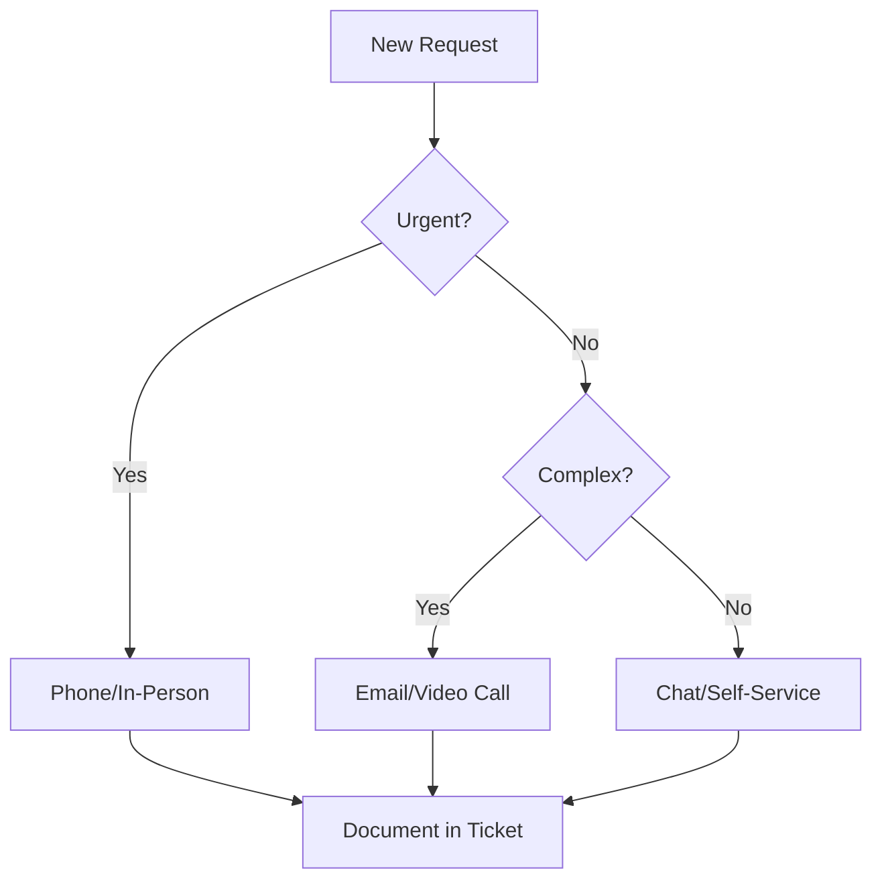

#### 5.1.3 Active Listening & Emotional Intelligence

**1. The L.E.A.R.N. Model**
- **Listen** without interrupting
- **Empathize** with the user's situation
- **Acknowledge** their concerns
- **Respond** appropriately
- **Next Steps** - outline the plan

**2. Advanced Active Listening Techniques**

**Verbal Techniques**
```
Paraphrasing: "So if I understand correctly, you're having trouble accessing the VPN?"
Clarifying: "When you say 'the system is slow,' can you tell me what specifically is slow?"
Summarizing: "Let me recap what we've covered so far..."
Validating: "That sounds frustrating. I'd be concerned too if I couldn't access my files."
```

**Non-Verbal Cues**
- **In-Person/Video**:
  - Nodding to show understanding
  - Leaning slightly forward
  - Maintaining appropriate eye contact (60-70% of the time)
  - Open body posture

- **Phone**:
  - Verbal nods ("I see," "Go on")
  - Occasional verbal confirmations
  - Mirroring the caller's pace and energy

**3. Handling Difficult Emotions**

| Emotion | Signs | Response Strategy |
|---------|-------|-------------------|
| **Frustration** | Sighing, short answers | Acknowledge feelings, focus on solutions |
| **Anger** | Raised voice, rapid speech | Stay calm, don't take it personally, de-escalate |
| **Confusion** | Pauses, asking for repeats | Simplify explanations, use analogies |
| **Impatience** | Interrupting, checking time | Acknowledge urgency, set clear expectations |

**4. The 3F Technique**
- **Facts**: Stick to observable information
- **Feelings**: Acknowledge emotions without judgment
- **Focus**: Guide conversation toward resolution

Example: 
"I understand this issue has been ongoing (Facts), and I can hear how frustrating this must be (Feelings). Let's work together to resolve this (Focus)."

**5. Cultural Sensitivity**
- Be aware of cultural differences in communication styles
- Adjust formality level based on user preference
- Be mindful of time zone differences for global teams
- Use clear, simple language for non-native speakers

### 5.2 Efficient Ticket Handling

#### 5.2.1 Advanced Ticket Lifecycle

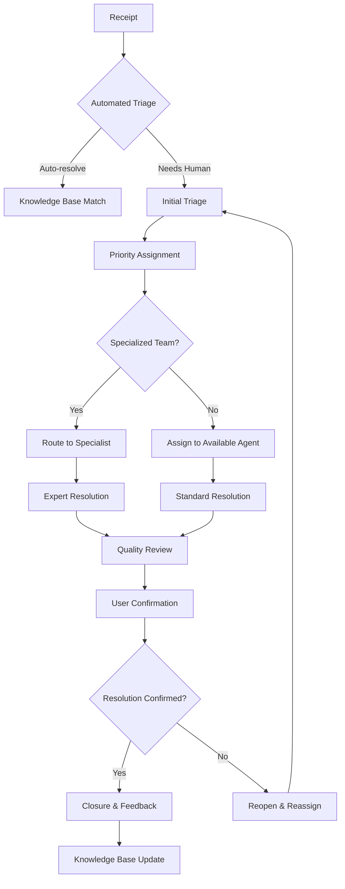

#### 5.2.2 Dynamic Priority Matrix

| Impact \ Urgency | High | Medium | Low |
|------------------|------|--------|-----|
| **High** (Org-wide) | P1: Critical<br>e.g., Network Down | P2: High<br>e.g., Department Outage | P3: Medium<br>e.g., Non-critical System |
| **Medium** (Department) | P2: High<br>e.g., Key Application Down | P3: Medium<br>e.g., Reduced Functionality | P4: Low<br>e.g., Minor Feature |
| **Low** (Individual) | P3: Medium<br>e.g., CEO's Laptop | P4: Low<br>e.g., Standard User Issue | P4: Low<br>e.g., General Questions |

**Priority Factors**:
- Number of users affected
- Business criticality
- Financial impact
- Regulatory/compliance requirements
- Executive/VIP involvement

#### 5.2.3 Comprehensive SLAs & OLAs

**Service Level Agreements (SLAs)**
| Priority | First Response | Resolution Time | Update Frequency | Escalation Path |
|----------|----------------|-----------------|-------------------|-----------------|
| P1: Critical | 15 minutes | 4 hours | 30 minutes | Team Lead → Manager → Director |
| P2: High | 30 minutes | 8 hours | 1 hour | Team Lead → Manager |
| P3: Medium | 2 hours | 24 hours | 4 hours | Senior Analyst |
| P4: Low | 4 hours | 72 hours | 24 hours | Standard Process |

**Operational Level Agreements (OLAs)**
| Supporting Team | Initial Response | Resolution Time | Escalation |
|-----------------|-------------------|-----------------|-------------|
| Network Team | 15 minutes | 2 hours | Net Manager |
| Server Team | 30 minutes | 4 hours | Sr. Engineer |
| Application Support | 1 hour | 8 hours | App Owner |
| Security | 15 minutes | 2 hours | CISO |

#### 5.2.4 Ticket Triage Framework

**1. Initial Assessment (2-5 minutes)**
- Verify user information
- Categorize & prioritize
- Check for duplicates
- Gather initial details

**2. Quick Resolution Check**
```
Is this a known issue? → Apply known solution
Is it a simple fix? → Resolve immediately
Does it require escalation? → Route appropriately
```

**3. Assignment Guidelines**
- Skills-based routing
- Workload balancing
- Follow-the-sun support
- Escalation thresholds

**4. Monitoring & Escalation**
- Automated alerts for approaching SLAs
- Manager notification at 80% of resolution time
- Escalation at 90% of resolution time
- Post-escalation review for process improvement

#### 5.2.5 Comprehensive Documentation Framework

**1. Required Fields (All Tickets)**
```markdown
## Ticket Details
- **User Information**: [Name, Department, Contact]
- **Issue Type**: [Incident/Request/Problem]
- **Category/Subcategory**: [e.g., Hardware/Laptop]
- **Priority**: [P1-P4]
- **Environment**: [OS, Application Version, Device]
- **Business Impact**: [High/Medium/Low]

## Problem Description
- [Clear, concise description]
- [Steps to reproduce]
- [Expected vs. Actual behavior]
- [Error messages/codes]

## Troubleshooting
- [Steps already taken]
- [Results of each step]
- [Screenshots/Logs]

## Resolution
- [Root cause]
- [Steps to resolve]
- [Prevention measures]

## Time Tracking
- Time Opened: 
- First Response: 
- Time Resolved: 
- Total Time Spent:
```

**2. Documentation Best Practices**

**For All Tickets**
- Use the 5W1H method:
  - **What** is the issue?
  - **When** did it start?
  - **Where** is it occurring?
  - **Who** is affected?
  - **Why** is it important?
  - **How** can we reproduce it?

**For Complex Issues**
- Include before/after states
- Document all dependencies
- Note any workarounds
- Add lessons learned

**3. Knowledge Base Articles**
```markdown
# [Article Title]

## Symptoms
- [Clear description]
- [Error messages]
- [Who's affected]

## Resolution
1. Step 1
   - Sub-step
   - Code/Command if applicable
2. Step 2

## Prevention
- [How to avoid recurrence]
- [Monitoring recommendations]

## Related Articles
- [Link to related content]

## Metadata
- Last Updated: [Date]
- Technical Owner: [Team/Person]
- Review Date: [Date]
```

**4. Quality Checklist**
- [ ] All required fields completed
- [ ] Clear, concise language
- [ ] Steps are reproducible
- [ ] Screenshots included if helpful
- [ ] Linked to related tickets
- [ ] Categorized correctly
- [ ] Priority set appropriately
- [ ] Time tracking accurate

**5. Templates & Automation**
- Create templates for common issues
- Use text expanders for frequent responses
- Implement auto-documentation tools
- Integrate with screen recording for complex issues

### 5.3 Customer Service Excellence

#### 5.3.1 Service Excellence Framework

**Service Desk Charter**
```markdown
# Our Service Promise

## To Our Users:
1. **First Contact Resolution**: We'll resolve your issue quickly, the first time
2. **Clear Communication**: We'll explain technical issues in plain language
3. **Proactive Updates**: You'll never wonder about the status of your request
4. **Respect for Time**: We value and protect your time
5. **Continuous Improvement**: We learn from every interaction to serve you better

## Our Service Standards:
- **Availability**: [Support Hours]
- **Response Times**: As per SLA
- **Quality Assurance**: All interactions monitored for quality
- **Feedback Welcome**: We actively seek your input
```

**Service Recovery Process**
1. **Apologize** - Sincerely acknowledge the issue
2. **Listen** - Understand the full impact
3. **Fix** - Resolve the immediate problem
4. **Compensate** - If appropriate, offer something extra
5. **Follow-up** - Ensure complete satisfaction
6. **Improve** - Learn and prevent recurrence

#### 5.3.2 Advanced Scenario Handling

| Scenario | Do | Don't | Script Example |
|----------|----|-------|----------------|
| **Angry User** | - Stay calm<br>- Acknowledge feelings<br>- Focus on solution | - Take it personally<br>- Make excuses<br>- Argue | "I completely understand your frustration. Let me help resolve this for you right away." |
| **Frequent Caller** | - Identify root cause<br>- Provide extra training<br>- Create self-help resources | - Show frustration<br>- Make them feel unwelcome | "I notice we've worked on similar issues before. Would you like me to show you how to handle this yourself next time?" |
| **Technically Challenged** | - Use simple terms<br>- Provide step-by-step guidance<br>- Offer remote assistance | - Use jargon<br>- Rush the user<br>- Sound condescending | "Let me guide you through this step by step. First, let's click on the Start menu..." |
| **VIP/Executive** | - Prioritize appropriately<br>- Provide regular updates<br>- Offer white-glove service | - Overpromise<br>- Share unnecessary details<br>- Keep them waiting | "I understand this is a priority. I'll personally oversee the resolution and update you every 30 minutes." |
| **Unrealistic Demands** | - Set clear expectations<br>- Explain constraints<br>- Offer alternatives | - Say "can't"<br>- Make promises you can't keep | "While we can't do X, here's what we can do to help..." |
| **After-Hours Calls** | - Verify urgency<br>- Follow on-call procedures<br>- Document thoroughly | - Ignore if urgent<br>- Provide incomplete handoff | "I understand this is important. Let me connect you with our on-call technician who can assist you right away." |

#### 5.3.3 Service Quality Metrics

**1. Customer Satisfaction (CSAT)**
- Survey after ticket closure
- Target: >90% satisfaction
- Include open-ended feedback

**2. First Contact Resolution (FCR)**
- Measure % resolved on first interaction
- Target: >75%
- Track reasons for repeat contacts

**3. Net Promoter Score (NPS)**
- "How likely are you to recommend our IT support?"
- Scale: 0-10
- Target: >50

**4. Quality Assurance**
- Random ticket reviews
- Scorecard evaluation
- Calibration sessions

**5. Continuous Improvement**
- Monthly trend analysis
- Root cause of dissatisfaction
- Action plans for improvement

#### 5.3.4 Building Customer Relationships

**1. Personalization**
- Use the user's name
- Reference previous interactions
- Remember preferences

**2. Proactive Communication**
- Send status updates before being asked
- Notify of potential issues
- Follow up after resolution

**3. Value-Added Service**
- Provide tips and shortcuts
- Share relevant knowledge articles
- Offer training opportunities

**4. Feedback Loop**
- Regular user surveys
- Focus groups
- Service review meetings

**5. Service Recovery**
- Acknowledge mistakes
- Take ownership
- Go above and beyond to make it right
| **Unclear Issue** | Ask probing questions, Restate understanding | Make assumptions, Guess at solution |
| **High-Profile User** | Follow standard process, Be extra diligent | Skip steps, Make special exceptions |
| **Repetitive Issues** | Document thoroughly, Suggest training | Show frustration, Blame the user |

#### 5.3.3 Service Recovery Framework
1. **Apologize** - Sincerely acknowledge the issue
2. **Listen** - Understand the full impact
3. **Fix** - Resolve the immediate problem
4. **Compensate** - If appropriate, offer something extra
5. **Follow-up** - Ensure satisfaction after resolution

#### 5.3.4 Continuous Improvement
- **Feedback Collection**:
  - Post-resolution surveys (CSAT, NPS)
  - Regular user group meetings
  - Suggestion box

- **Quality Assurance**:
  - Call monitoring
  - Ticket audits
  - Peer reviews

- **Training & Development**:
  - Regular skills training
  - Cross-training opportunities
  - Certification programs

### 5.4 Performance Metrics

#### 5.4.1 Key Metrics to Track
- **First Contact Resolution (FCR)**: Target >70%
- **Average Handle Time (AHT)**: Industry average 18-20 minutes
- **Customer Satisfaction (CSAT)**: Target >90%
- **Ticket Volume by Type**: Identify trends
- **Resolution Time vs SLA**: Target >95% within SLA

#### 5.4.2 Reporting Cadence
- **Daily**: Ticket backlog, Open critical issues
- **Weekly**: Team performance, SLA compliance
- **Monthly**: Trend analysis, CSAT results
- **Quarterly**: Service improvement plans

### 5.5 Knowledge Management

#### 5.5.1 Knowledge Article Standards
- **Structure**:
  - Problem statement
  - Environment/Prerequisites
  - Step-by-step solution
  - Related articles
  - Last reviewed date

- **Quality Checklist**:
  - [ ] Clear, concise language
  - [ ] Screenshots where helpful
  - [ ] Tested solution
  - [ ] Proper categorization
  - [ ] Review date set

#### 5.5.2 Knowledge Base Maintenance
- Monthly review of top 10% most viewed articles
- Quarterly audit of all articles
- Annual content refresh program
- User feedback integration

## 6. Common Issues and Solutions

### 6.1 Password Resets

#### 6.1.1 Self-Service Password Reset (SSPR)
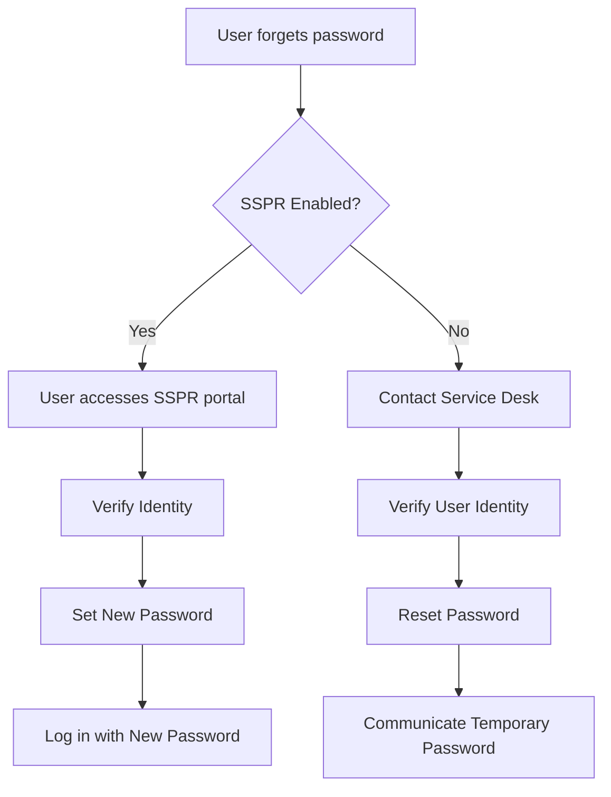

#### 6.1.2 Verification Methods
1. **Knowledge-Based**
   - Security questions
   - Personal information verification
   
2. **Ownership-Based**
   - Email verification
   - SMS code
   - Authenticator app
   - Backup email

3. **In-Person Verification**
   - Photo ID check
   - Manager approval
   - Security badge verification

#### 6.1.3 Best Practices
- Enforce strong password policies
- Implement account lockout policies
- Monitor for suspicious reset attempts
- Provide clear instructions for users
- Maintain audit logs of all resets

### 6.2 Network Connectivity

#### 6.2.1 Troubleshooting Steps
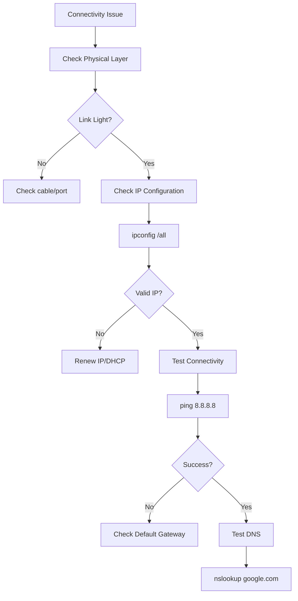

#### 6.2.2 Common Commands
```batch
:: Basic Network Diagnostics
ipconfig /all          # View full IP configuration
ipconfig /release      # Release current IP
ipconfig /renew        # Renew IP address
ipconfig /flushdns     # Clear DNS cache
ping 8.8.8.8          # Test basic connectivity
ping google.com       # Test DNS resolution
tracert google.com    # Trace network path
nslookup google.com   # Test DNS resolution
netstat -ano          # View active connections
```

#### 6.2.3 Wireless Issues
- **Signal Strength**: Check RSSI (should be > -67dBm)
- **Channel Congestion**: Use WiFi analyzer tools
- **Authentication**: Verify security type and credentials
- **Driver Issues**: Update or reinstall wireless drivers

### 6.3 Email Problems

#### 6.3.1 Common Email Issues

| Symptom | Possible Causes | Troubleshooting Steps |
|---------|-----------------|-----------------------|
| **Can't send** | SMTP settings, attachment size, blacklist | Verify SMTP settings, check attachment size, test from webmail |
| **Can't receive** | Mailbox full, filters, forwarding | Check storage, review filters, verify forwarding |
| **Authentication errors** | Incorrect password, MFA, account lock | Reset password, check MFA settings, verify account status |
| **Spam/Junk issues** | Filter settings, sender reputation | Check junk folder, whitelist sender, review spam settings |

#### 6.3.2 Email Client Configuration
1. **Outlook**
   - Run Outlook in safe mode
   - Create new profile
   - Check add-ins
   - Repair PST/OST files

2. **Mobile Devices**
   - Remove and re-add account
   - Check sync settings
   - Verify server settings
   - Update email app

#### 6.3.3 Server-Side Checks
- Check mail server status
- Review mail queue
- Verify DNS records (MX, SPF, DKIM, DMARC)
- Check blacklist status

### 6.4 Printer Troubleshooting

#### 6.4.1 Step-by-Step Guide
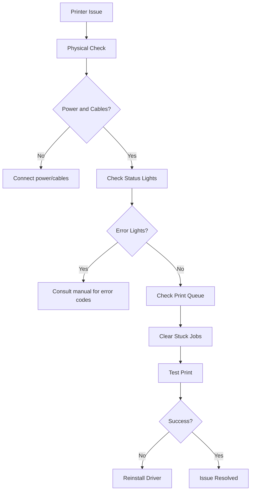

#### 6.4.2 Common Printer Issues

| Issue | Solution |
|-------|----------|
| **Printer Offline** | Check power, connections, set as default |
| **Print Queue Stuck** | Clear print spooler, restart print spooler service |
| **Poor Print Quality** | Run cleaning cycle, check ink/toner, align print heads |
| **Driver Issues** | Update/reinstall drivers, check compatibility |
| **Network Printing** | Verify network connection, check printer IP, re-add printer |

#### 6.4.3 Advanced Troubleshooting
1. **Print Spooler Reset**
   ```batch
   net stop spooler
   del /Q /F /S "%systemroot%\System32\spool\printers\*.*"
   net start spooler
   ```

2. **Driver Reinstallation**
   - Uninstall current driver
   - Download latest from manufacturer
   - Install as administrator
   - Set as default

3. **Permission Issues**
   - Check printer permissions
   - Verify user has print rights
   - Check security policies

### 6.5 Quick Reference: Common Fixes

#### Network Issues
- **No Internet**: Restart router/modem
- **Slow Speeds**: Check for bandwidth hogs, test with wired connection
- **DNS Issues**: Flush DNS, use alternative DNS servers (e.g., 8.8.8.8)

#### Email Issues
- **Not Sending**: Check SMTP settings, attachment size
- **Not Receiving**: Verify mailbox space, check filters
- **Sync Issues**: Remove and re-add account

#### Printer Issues
- **Offline**: Check connections, set as default
- **Poor Quality**: Clean print heads, replace toner
- **Driver Problems**: Update or reinstall drivers

## 7. Documentation and Knowledge Base

### 7.1 Creating Effective Documentation

#### 7.1.1 Documentation Standards
```markdown
# [Article Title]

## Overview
Brief description of what this document covers

## Prerequisites
- Required access levels
- Necessary tools/software
- Pre-requisite knowledge

## Procedure
1. Step-by-step instructions
   - Clear action items
   - Expected outcomes

## Screenshots

*Caption explaining the screenshot*

## Troubleshooting
| Issue | Solution |
|-------|----------|
| Common error | Step-by-step fix |

## Related Articles
- [Related Article 1](#)
- [Related Article 2](#)

## Last Updated
YYYY-MM-DD
```

#### 7.1.2 Writing Guidelines
- **Clarity**:
  - Use active voice
  - Keep sentences short (15-20 words)
  - Define technical terms
  - Use consistent terminology

- **Structure**:
  - Use H2 for main sections
  - Use H3 for subsections
  - Bullet points for lists
  - Numbered lists for sequences

- **Visual Elements**:
  - Screenshots: Highlight relevant areas
  - Diagrams: Use standard symbols
  - Videos: Keep under 3 minutes
  - Icons: Use consistently

#### 7.1.3 Maintenance Process
1. **Review Cycle**:
   - Monthly: Top 10% most viewed articles
   - Quarterly: All articles in a category
   - Annually: Complete knowledge base audit

2. **Update Triggers**:
   - Software version changes
   - Process updates
   - User feedback
   - Support ticket trends

3. **Version Control**:
   - Maintain revision history
   - Track changes
   - Archive old versions

### 7.2 Knowledge Base Structure

#### 7.2.1 Information Architecture
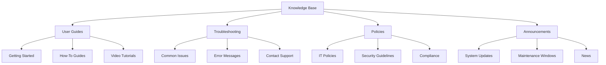

#### 7.2.2 Article Types

| Type | Purpose | Structure | Example |
|------|---------|-----------|---------|
| **How-To** | Step-by-step instructions | Goal, Prerequisites, Steps, Tips | How to Connect to VPN |
| **Troubleshooting** | Fix specific issues | Symptoms, Causes, Solutions | Can't Access Email |
| **FAQ** | Answer common questions | Question, Short Answer, Details | Password Reset Help |
| **Reference** | Technical specifications | Tables, Code Samples, Parameters | Network Settings |
| **Policy** | Organizational rules | Purpose, Scope, Procedures | BYOD Policy |

#### 7.2.3 Metadata Framework

```yaml
article:
  title: "How to Reset Your Password"
  id: KB-1001
  category: Authentication
  subcategory: Password Management
  products: 
    - Active Directory
    - Office 365
  audience: End Users
  experience_level: Beginner
  last_reviewed: 2025-09-20
  next_review: 2026-03-20
  author: IT Support Team
  status: Published
  related_articles:
    - KB-1002: Password Policy
    - KB-1003: Two-Factor Authentication
  tags:
    - password
    - security
    - authentication
```

### 7.3 Knowledge Management Best Practices

#### 7.3.1 Content Creation
- **Templates**: Standardize article formats
- **Style Guide**: Maintain consistent tone and terminology
- **Screenshots**: Use annotation tools to highlight important areas
- **Videos**: Include transcripts for accessibility

#### 7.3.2 Organization
- **Taxonomy**: Create logical categories and subcategories
- **Tagging**: Use consistent tagging strategy
- **Search Optimization**:
  - Include keywords in titles and content
  - Use synonyms and alternate phrasings
  - Implement faceted search

#### 7.3.3 Maintenance
- **Review Schedule**:
  - Monthly: Top 20 articles
  - Quarterly: Category review
  - Bi-annually: Full audit
- **Retirement Policy**:
  - Archive outdated content
  - Redirect to updated articles
  - Maintain change log

### 7.4 Measuring Effectiveness

#### 7.4.1 Key Metrics
- **Usage**:
  - Article views
  - Search terms
  - Time on page
  - Bounce rate

- **Quality**:
  - Article ratings
  - Helpfulness feedback
  - Update frequency

- **Impact**:
  - Deflection rate
  - Support ticket reduction
  - User satisfaction

#### 7.4.2 Continuous Improvement
1. **Analyze**:
   - Search analytics
   - User feedback
   - Support ticket analysis

2. **Optimize**:
   - Update underperforming articles
   - Create missing content
   - Improve search relevance

3. **Test**:
   - A/B test article formats
   - User testing sessions
   - Feedback surveys

### 7.5 Knowledge Base Tools

#### 7.5.1 Platform Options
- **Enterprise**: ServiceNow, Confluence, SharePoint
- **Mid-Market**: Zendesk, Freshdesk, Helpjuice
- **Open Source**: Wiki.js, BookStack, DokuWiki

## 8. Windows Command Prompt Reference

The Windows Command Prompt is a command-line interpreter that allows you to execute text-based commands for system administration, troubleshooting, and automation. This section provides a comprehensive reference for Windows Command Prompt (cmd.exe) commands commonly used in IT support scenarios.

### 8.0 Getting Started with Command Prompt

#### How to Open Command Prompt
1. **Using Run Dialog (Quickest Method):**
   - Press `Windows key + R`
   - Type `cmd` and press `Enter`

2. **Using Start Menu:**
   - Click the Start button
   - Type "Command Prompt" or "cmd"
   - Press `Enter` or click the app

3. **As Administrator (Elevated):**
   - Right-click the Start button
   - Select "Windows Terminal (Admin)" or "Command Prompt (Admin)"
   - Click "Yes" on the UAC prompt

#### Basic Navigation
```
C:\> dir           # List files in current directory
C:\> cd Windows    # Change to Windows directory
C:\Windows> cd ..  # Move up one directory level
C:\> cls          # Clear the screen
C:\> exit         # Close Command Prompt
```

#### Essential Commands for Beginners
| Command | Description | Example |
|---------|-------------|---------|
| `help` | Shows available commands | `help` |
| `cls` | Clears the screen | `cls` |
| `dir` | Lists directory contents | `dir /w` |
| `cd` | Changes directory | `cd C:\Windows` |
| `mkdir` | Creates a new folder | `mkdir NewFolder` |
| `rmdir` | Removes a folder | `rmdir OldFolder` |
| `copy` | Copies files | `copy file.txt backup\` |
| `del` | Deletes files | `del temp.txt` |
| `type` | Displays file contents | `type log.txt` |
| `ipconfig` | Shows network info | `ipconfig /all` |

#### Example: Viewing Network Information
```
C:\> ipconfig        # Basic network info
C:\> ipconfig /all   # Detailed network info
C:\> ping google.com # Test network connectivity
```

### 8.1 Navigation Commands

| Command | Description | Example |
|---------|-------------|---------|
| `cd` | Change directory | `cd C:\Windows` |
| `chdir` | Same as cd | `chdir ..` |
| `dir` | List directory contents | `dir /w` |
| `pushd` | Save current directory | `pushd C:\Temp` |
| `popd` | Return to saved directory | `popd` |
| `tree` | Display directory structure | `tree /F` |

### 8.2 File Operations

| Command | Description | Example |
|---------|-------------|---------|
| `copy` | Copy files | `copy file.txt C:\backup\` |
| `xcopy` | Extended copy | `xcopy /s /e source dest` |
| `robocopy` | Robust file copy | `robocopy source dest /MIR` |
| `move` | Move/rename files | `move old.txt new.txt` |
| `del` | Delete files | `del *.tmp` |
| `ren` | Rename files | `ren old.txt new.txt` |
| `type` | Display file contents | `type file.txt` |
| `find` | Search for text in files | `find "error" log.txt` |
| `findstr` | Advanced text search | `findstr /s /i "error" *.log` |
| `fc` | Compare files | `fc file1.txt file2.txt` |
| `attrib` | Change file attributes | `attrib +h file.txt` |

### 8.3 System Information

| Command | Description | Example |
|---------|-------------|---------|
| `systeminfo` | Display system configuration | `systeminfo` |
| `hostname` | Show computer name | `hostname` |
| `whoami` | Show current user | `whoami` |
| `ver` | Show Windows version | `ver` |
| `wmic` | WMI command-line tool | `wmic cpu get name` |
| `driverquery` | List installed drivers | `driverquery /v` |
| `tasklist` | List running processes | `tasklist /svc` |
| `taskkill` | End process | `taskkill /im notepad.exe` |
| `schtasks` | Schedule tasks | `schtasks /query /fo LIST` |

### 8.4 Network Commands

| Command | Description | Example |
|---------|-------------|---------|
| `ipconfig` | Show IP configuration | `ipconfig /all` |
| `ping` | Test network connectivity | `ping google.com` |
| `tracert` | Trace route to host | `tracert google.com` |
| `pathping` | Advanced ping + traceroute | `pathping google.com` |
| `netstat` | Network statistics | `netstat -ano` |
| `nslookup` | DNS lookup | `nslookup google.com` |
| `arp` | ARP cache | `arp -a` |
| `route` | Routing table | `route print` |
| `netsh` | Network shell | `netsh interface ip show config` |
| `net` | Network services | `net use` |

### 8.5 Disk Management

| Command | Description | Example |
|---------|-------------|---------|
| `chkdsk` | Check disk | `chkdsk C: /f` |
| `diskpart` | Disk partitioning tool | `diskpart` |
| `format` | Format disk | `format D: /FS:NTFS` |
| `defrag` | Defragment disk | `defrag C: /A` |
| `vol` | Display disk volume | `vol C:` |
| `label` | Change volume label | `label C: System` |

### 8.6 User & Permission Commands

| Command | Description | Example |
|---------|-------------|---------|
| `net user` | User account management | `net user` |
| `net localgroup` | Local group management | `net localgroup administrators` |
| `icacls` | File/folder permissions | `icacls file.txt /grant User:(R,W)` |
| `takeown` | Take ownership of files | `takeown /f file.txt` |
| `gpupdate` | Update group policy | `gpupdate /force` |
| `gpresult` | View group policy | `gpresult /r` |

### 8.7 System Maintenance

| Command | Description | Example |
|---------|-------------|---------|
| `sfc` | System File Checker | `sfc /scannow` |
| `dism` | Deployment Image Servicing | `dism /online /cleanup-image /restorehealth` |
| `chkntfs` | Check NTFS volumes | `chkntfs C:` |
| `powercfg` | Power configuration | `powercfg /energy` |
| `shutdown` | Shutdown/restart | `shutdown /r /t 0` |

### 8.8 Advanced Utilities

| Command | Description | Example |
|---------|-------------|---------|
| `reg` | Registry operations | `reg query HKLM\Software` |
| `w32tm` | Windows Time Service | `w32tm /resync` |
| `bcdedit` | Boot configuration | `bcdedit /enum` |
| `wevtutil` | Event logs | `wevtutil qe System /c:10` |
| `certutil` | Certificate utility | `certutil -store MY` |

### 8.9 Batch Scripting Basics

```batch
@echo off
REM This is a comment
setlocal enabledelayedexpansion

:: Display current date and time
echo Current date: %date%
echo Current time: %time%

:: Simple if condition
if exist "C:\file.txt" (
    echo File exists
) else (
    echo File not found
)

:: For loop example
for %%i in (*.txt) do (
    echo Processing: %%i
)

:: User input
set /p name=Enter your name: 
echo Hello, %name%!

:: Pause script
pause
```

### 8.10 Useful Command Prompt Shortcuts
- `F1`: Repeat last command character by character
- `F3`: Repeat last command
- `F5`: Cycle through command history
- `F7`: Show command history
- `Tab`: Auto-complete file/folder names
- `↑/↓`: Navigate command history
- `Ctrl+C`: Stop current command
- `Ctrl+Z`: Mark end of file (EOF)
- `Ctrl+Break`: Stop batch file execution
- `Ctrl+Alt+Del`: Open security options

#### 7.5.2 Essential Features
- **Content Management**:
  - WYSIWYG editor
  - Version control
  - Approval workflows

## 9. Windows 11: Fresh Installation vs Upgrade

This section provides a comprehensive comparison between performing a fresh installation of Windows 11 versus upgrading from a previous version, helping IT professionals make informed decisions.

### 9.1 Key Differences

| Feature | Fresh Installation | In-Place Upgrade |
|---------|-------------------|------------------|
| **Process** | Completely wipes the drive and installs clean OS | Preserves files, apps, and settings |
| **Time Required** | 30-60 minutes | 1-2 hours |
| **Data Handling** | Requires backup/restore of user data | Preserves user data |
| **Application State** | Requires reinstallation of all applications | Maintains installed applications |
| **System Performance** | Optimal (no legacy files or conflicts) | May retain some system bloat |
| **Stability** | Highest (clean system state) | May inherit previous system issues |
| **Driver Support** | May require driver installation | Typically maintains existing drivers |

### 9.2 Fresh Installation: Pros and Cons

#### Advantages of Clean Install
1. **Optimal Performance**
   - No legacy files or registry bloat
   - Maximum available storage space
   - Better system responsiveness

2. **Enhanced Stability**
   - Eliminates accumulated system errors
   - Removes conflicting software/drivers
   - Fresh registry without corruption

3. **Security Benefits**
   - Removes potential malware/rootkits
   - Latest security configurations
   - No residual vulnerabilities from old installations

4. **Clean Environment**
   - No leftover files from previous installations
   - Complete control over installed components
   - Removes manufacturer bloatware

#### Disadvantages of Clean Install
1. **Time-Consuming**
   - Requires full backup of user data
   - Manual reinstallation of all applications
   - Longer setup and configuration time

2. **Data Management**
   - Risk of data loss if backup fails
   - Need to reconfigure all user preferences
   - Must reinstall and reactivate all software

3. **Driver Challenges**
   - May require manual driver installation
   - Potential compatibility issues with older hardware
   - Need to source specific drivers in advance

### 9.3 In-Place Upgrade: Pros and Cons

#### Advantages of Upgrading
1. **Data Preservation**
   - Keeps all personal files intact
   - Maintains application installations
   - Preserves user settings and preferences

2. **Time Efficiency**
   - No need for full system backup/restore
   - Shorter overall process
   - Minimal user reconfiguration needed

3. **License Management**
   - Automatically transfers existing Windows license
   - Maintains digital licenses and activations
   - No need to re-enter product keys for Microsoft products

4. **Application Compatibility**
   - Preserves application configurations
   - Maintains file associations
   - Keeps software activation states

#### Disadvantages of Upgrading
1. **Legacy Issues**
   - Carries forward existing system problems
   - May retain corrupted system files
   - Potential for driver conflicts

2. **Storage Requirements**
   - Windows.old folder consumes significant space
   - Less free space available post-upgrade
   - Requires additional cleanup steps

3. **Compatibility Risks**
   - Some applications may not work correctly
   - Older hardware might have driver issues
   - Potential for software conflicts

4. **Performance Impact**
   - May retain unnecessary background processes
   - System may not be as optimized
   - Could inherit performance bottlenecks

### 9.4 Decision Matrix

| Factor | Clean Install | In-Place Upgrade |
|--------|---------------|------------------|
| **Time Required** | Longer (2-4 hours) | Shorter (1-2 hours) |
| **Data Migration** | Manual backup/restore needed | Automatic preservation |
| **Application State** | Fresh installation required | Maintains installations |
| **System Performance** | Optimal | May have legacy issues |
| **Technical Skill** | Advanced | Beginner-friendly |
| **Risk Level** | Medium (data loss risk) | Low (minimal changes) |
| **Ideal For** | New systems, major issues | Minor upgrades, working systems |

### 9.5 Step-by-Step: Fresh Installation

#### 9.4.1 Preparation
1. **Backup Important Data**
   - Use OneDrive, external drive, or network location
   - Export browser bookmarks and passwords
   - Document installed applications

2. **Create Installation Media**
   - Download Windows 11 Media Creation Tool
   - Prepare USB drive (min. 8GB)
   - Create bootable USB using the tool

3. **Gather Necessary Items**
   - Windows 11 product key
   - Network drivers for your hardware
   - Backup of important files

#### 9.4.2 Installation Process
1. Boot from USB/DVD
2. Select language, time, and keyboard
3. Click "Install Now"
4. Enter product key when prompted
5. Select "Custom: Install Windows only"
6. Delete existing partitions (if any)
7. Select unallocated space and click Next
8. Follow on-screen instructions to complete setup

### 9.6 Step-by-Step: In-Place Upgrade

#### 9.5.1 Preparation
1. **Run PC Health Check**
   - Verify system compatibility
   - Address any compatibility issues

2. **Create System Restore Point**
   - Type "Create a restore point" in Start
   - Click "Create" and follow prompts

3. **Backup Critical Data**
   - Despite being an upgrade, always have a backup
   - Use File History or third-party backup software

#### 9.5.2 Upgrade Process
1. Mount Windows 11 ISO or insert USB
2. Run setup.exe
3. Select "Keep personal files and apps"
4. Follow on-screen instructions
5. System will restart multiple times
6. Complete OOBE (Out of Box Experience)

### 9.7 Post-Installation Tasks

#### For Both Methods:
1. **Windows Update**
   - Install all available updates
   - Check for optional updates

2. **Driver Installation**
   - Install chipset drivers
   - Update graphics drivers
   - Install peripheral drivers

3. **Application Installation**
   - Install essential applications
   - Configure application settings
   - Restore application data from backup

4. **System Configuration**
   - Configure Windows features
   - Set up power plans
   - Configure privacy settings

### 9.8 Troubleshooting Common Issues

#### Upgrade Issues
- **Compatibility Holds**: Use Microsoft's PC Health Check
- **Insufficient Space**: Clean up disk space before upgrading
- **Driver Conflicts**: Update or uninstall problematic drivers

#### Fresh Install Issues
- **Boot Device Not Found**: Check boot order in BIOS/UEFI
- **Missing Drivers**: Have network drivers ready on USB
- **Activation Problems**: Ensure correct Windows edition is installed

### 9.9 Decision Flowchart

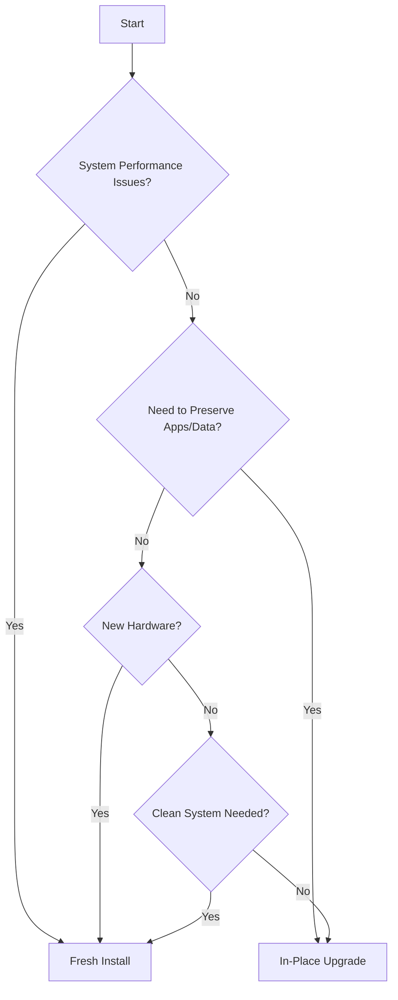

- **User Experience**:
  - Responsive design
  - Advanced search
  - Table of contents

- **Analytics**:
  - Usage reports
  - Search analytics
  - Content gaps

#### 7.5.3 Integration Capabilities
- Ticketing system
- Chatbots/Virtual agents
- Single Sign-On (SSO)
- API access

## 8. Performance Metrics

### 8.1 Key Performance Indicators (KPIs)

#### 8.1.1 Service Desk KPIs

| KPI | Formula | Target | Measurement Frequency |
|-----|---------|--------|------------------------|
| **First Contact Resolution (FCR)** | (Resolved on First Contact / Total Tickets) × 100 | >70% | Daily/Weekly |
| **Average Handle Time (AHT)** | Total Talk Time + Hold Time + After-Call Work / Total Calls | <20 minutes | Weekly |
| **Customer Satisfaction (CSAT)** | (Positive Responses / Total Responses) × 100 | >90% | Per Ticket/Monthly |
| **First Response Time** | Time from ticket creation to first response | <15 minutes (P1) to <4 hours (P4) | Real-time |
| **Resolution Time** | Time from ticket creation to resolution | Varies by priority | Daily |
| **Ticket Volume by Type** | Count of tickets by category | Track trends | Weekly |
| **Agent Utilization** | (Time Spent on Tickets / Total Logged Time) × 100 | 60-70% | Weekly |
| **Abandonment Rate** | (Calls Abandoned / Total Calls) × 100 | <5% | Daily |

#### 8.1.2 Technical KPIs
- **System Availability**: 99.9% uptime for critical systems
- **Incident Recurrence**: <5% of total incidents
- **Change Success Rate**: >95% successful changes
- **Knowledge Base Usage**: >60% of support interactions
- **Self-Service Adoption**: >40% of common issues

### 8.2 Reporting and Analysis

#### 8.2.1 Report Types

| Report | Frequency | Audience | Key Metrics |
|--------|-----------|----------|-------------|
| **Daily Operations** | Daily | Team Leads | Open tickets, SLA breaches, Critical issues |
| **Weekly Performance** | Weekly | Management | KPI trends, Team performance, Backlog |
| **Monthly Service Review** | Monthly | Leadership | Service levels, Improvement areas, Resource needs |
| **Quarterly Business Review** | Quarterly | Executives | Strategic metrics, ROI, Business impact |

#### 8.2.2 Data Visualization
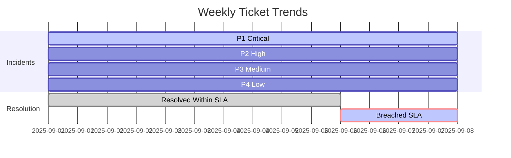

#### 8.2.3 Benchmarking
- **Internal**: Compare against historical performance
- **Industry**: ITIL/HDI benchmarks
- **Competitive**: Similar organizations
- **Stretch Goals**: 10-15% improvement targets

## 9. Security and Compliance

### 9.1 Security Best Practices

#### 9.1.1 Access Control
- **Principle of Least Privilege (PoLP)**
  - Role-based access control (RBAC)
  - Just-in-time access
  - Regular access reviews

- **Authentication**
  - Multi-factor authentication (MFA)
  - Single Sign-On (SSO)
  - Biometric verification

#### 9.1.2 Data Protection
- **Encryption**
  - Data in transit (TLS 1.2+)
  - Data at rest (AES-256)
  - End-to-end encryption for sensitive data

- **Data Handling**
  - Data classification
  - Secure disposal procedures
  - Data loss prevention (DLP)

#### 9.1.3 Incident Response
1. **Preparation**
   - Incident response plan
   - Communication plan
   - Team training

2. **Detection & Analysis**
   - SIEM monitoring
   - Anomaly detection
   - Threat intelligence

3. **Containment & Eradication**
   - Isolation procedures
   - Malware analysis
   - System restoration

4. **Post-Incident**
   - Root cause analysis
   - Lessons learned
   - Plan updates

### 9.2 Regulatory Compliance

#### 9.2.1 Key Regulations

| Regulation | Scope | Key Requirements |
|------------|-------|------------------|
| **GDPR** | EU Data | Right to be forgotten, Data portability, Breach notification |
| **HIPAA** | Healthcare US | PHI protection, Access controls, Audit controls |
| **SOX** | Financial US | Internal controls, Audit trails, Change management |
| **PCI DSS** | Payment Cards | Secure networks, Protect cardholder data, Vulnerability management |

#### 9.2.2 Compliance Framework
1. **Assessment**
   - Gap analysis
   - Risk assessment
   - Control mapping

2. **Implementation**
   - Policy development
   - Control implementation
   - Staff training

3. **Monitoring**
   - Continuous monitoring
   - Regular audits
   - Control testing

4. **Reporting**
   - Compliance reports
   - Executive summaries
   - Regulatory filings

## 10. Continuous Improvement

### 10.1 Feedback Collection

#### 10.1.1 Feedback Channels
- **Customer Surveys**
  - Post-resolution CSAT
  - Periodic NPS surveys
  - Transactional surveys

- **Internal Feedback**
  - Team retrospectives
  - Suggestion programs
  - Employee satisfaction surveys

- **Passive Feedback**
  - Sentiment analysis
  - Interaction analytics
  - System monitoring

#### 10.1.2 Feedback Analysis
1. **Quantitative Analysis**
   - Response rates
   - Score trends
   - Correlation analysis

2. **Qualitative Analysis**
   - Thematic analysis
   - Sentiment analysis
   - Root cause analysis

### 10.2 Process Optimization

#### 10.2.1 Process Mapping
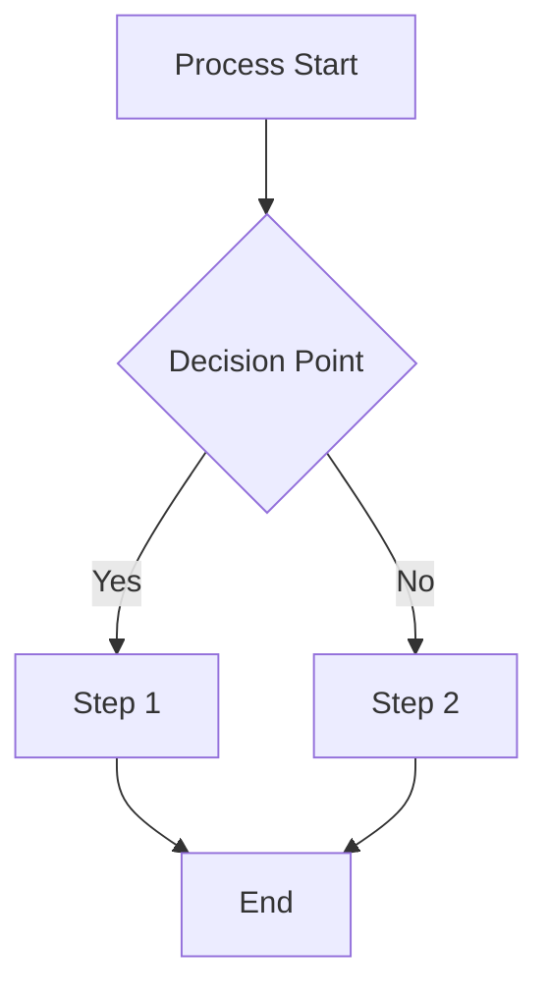

#### 10.2.2 Optimization Techniques
- **Lean Six Sigma**
  - DMAIC methodology
  - Value stream mapping
  - Waste elimination

- **Automation Opportunities**
  - RPA for repetitive tasks
  - AI/ML for ticket routing
  - Self-service automation

- **Agile Practices**
  - Sprint planning
  - Daily standups
  - Retrospectives

### 10.3 Training and Development

#### 10.3.1 Training Programs
- **Onboarding**
  - Company policies
  - Tools and systems
  - Process training

- **Technical Skills**
  - New technologies
  - Certification paths
  - Cross-training

- **Soft Skills**
  - Communication
  - Problem-solving
  - Customer service

#### 10.3.2 Development Framework
1. **Assessment**
   - Skills gap analysis
   - Career aspirations
   - Performance reviews

2. **Planning**
   - Individual Development Plans (IDP)
   - Training calendar
   - Resource allocation

3. **Execution**
   - Blended learning
   - On-the-job training
   - Mentoring/Coaching

4. **Evaluation**
   - Skills assessment
   - Training effectiveness
   - ROI analysis

### 10.4 Continuous Improvement Cycle

#### 10.4.1 PDCA Framework
1. **Plan**
   - Identify improvement opportunities
   - Set objectives
   - Develop action plan

2. **Do**
   - Implement changes
   - Train staff
   - Execute pilot tests

3. **Check**
   - Measure results
   - Analyze outcomes
   - Compare to objectives

4. **Act**
   - Standardize successful changes
   - Address gaps
   - Plan next cycle

#### 10.4.2 Kaizen Approach
- **5S Methodology**
  1. Sort
  2. Set in order
  3. Shine
  4. Standardize
  5. Sustain

- **Gemba Walks**
  - Observe actual work
  - Engage with staff
  - Identify improvements

## Conclusion

An effective IT Service Desk is crucial for maintaining business productivity and user satisfaction. By implementing structured processes, leveraging the right tools, and focusing on continuous improvement, service desks can provide exceptional support while adapting to changing business needs and technologies.

Remember that the most successful service desks combine technical expertise with excellent customer service skills, creating a positive experience for all users.
