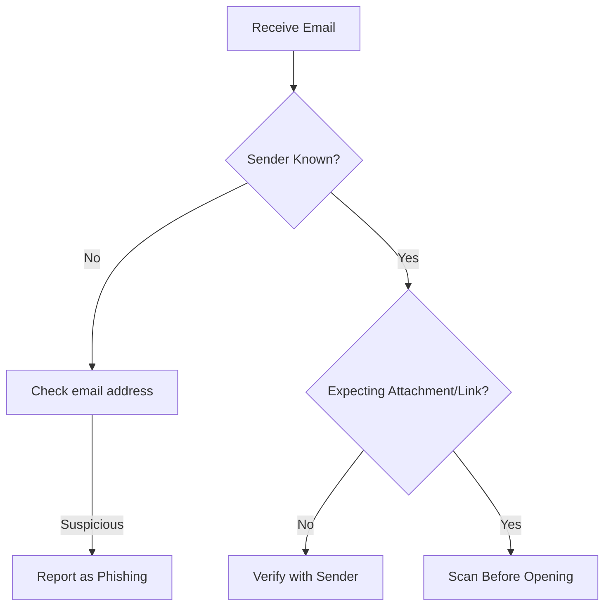

# 🔐 Security Compliance Quick Reference

## Table of Contents

### 1. Daily Security Checklist
- [1.1 Start of Day](#11-start-of-day)
- [1.2 Password Management](#12-password-management)
- [1.3 Data Handling](#13-data-handling)

### 2. Common Security Scenarios
- [2.1 Suspicious Email](#21-suspicious-email)
- [2.2 Lost/Stolen Device](#22-loststolen-device)

### 3. Secure Communication
- [3.1 Email Best Practices](#31-email-best-practices)
- [3.2 Video Conferencing](#32-video-conferencing)

### 4. Physical Security
- [4.1 Workspace](#41-workspace)
- [4.2 Visitor Procedures](#42-visitor-procedures)

### 5. Reporting Requirements
- [5.1 Security Incidents](#51-security-incidents)
- [5.2 Response Times](#52-response-times)

### 6. Mobile Security
- [6.1 Device Requirements](#61-device-requirements)
- [6.2 Public Wi-Fi](#62-public-wi-fi)

### 7. Quick Reference
- [7.1 Security Contacts](#71-security-contacts)
- [7.2 Keyboard Shortcuts](#72-keyboard-shortcuts)

### 8. Compliance Reminders
- [8.1 Data Classification](#81-data-classification)
- [8.2 Clean Desk Policy](#82-clean-desk-policy)

### 9. Security Awareness
- [9.1 Phishing Red Flags](#91-phishing-red-flags)
- [9.2 Social Engineering](#92-social-engineering)

### 10. Remote Work Security
- [10.1 Home Office](#101-home-office)
- [10.2 Travel Security](#102-travel-security)

### 11. Password Guidelines
- [11.1 Creating Strong Passwords](#111-creating-strong-passwords)
- [11.2 Example Passphrases](#112-example-passphrases)

### 12. Incident Response
- [12.1 Suspected Breach](#121-suspected-breach)
- [12.2 Ransomware Response](#122-ransomware-response)

---

## 1. Daily Security Checklist

### 1.1 Start of Day
- [ ] Verify secure connection (🔒 padlock icon in browser)
- [ ] Check for system/security updates
- [ ] Review security alerts
- [ ] Verify backup status

### 1.2 Password Management
- [ ] Use unique, complex passwords
- [ ] Never share credentials
- [ ] Use approved password manager
- [ ] Report any suspicious login attempts

### 1.3 Data Handling
- [ ] Store files in approved locations
- [ ] Verify recipient before sharing
- [ ] Use encryption for sensitive data
- [ ] Lock workstation when away

## 2. Common Security Scenarios

### 2.1 Suspicious Email

### 2.2 Lost/Stolen Device
1. Immediately report to IT Security
2. Remote wipe if enabled
3. Change all passwords
4. File incident report

## 3. Secure Communication

### 3.1 Email Best Practices
- Encrypt sensitive attachments
- Verify recipient addresses
- Use clear subject lines
- Avoid sending credentials via email

### 3.2 Video Conferencing
- Use waiting rooms
- Require meeting passwords
- Disable join before host
- Lock meeting once started

## 4. Physical Security

### 4.1 Workspace
- Lock screens when away (Win + L)
- Secure printed documents
- Use privacy screens
- No unauthorized devices

### 4.2 Visitor Procedures
- Escort visitors at all times
- Badge must be visible
- Report unescorted visitors
- No tailgating

## 5. Reporting Requirements

### 5.1 Security Incidents
- What to report:
  - Lost/stolen devices
  - Suspected breaches
  - Phishing attempts
  - Policy violations
- How to report:
  - Email: security@company.com
  - Phone: [Emergency Contact]
  - Online: [Incident Portal]

### 5.2 Response Times
| Incident Type | Report Within |
|---------------|---------------|
| Data Breach | Immediately |
| Lost Device | 15 minutes |
| Malware | 30 minutes |
| Policy Violation | 4 hours |

## 6. Mobile Security

### 6.1 Device Requirements
- Auto-lock: 5 minutes
- Encryption: Enabled
- OS: Latest version
- Remote wipe: Enabled

### 6.2 Public Wi-Fi
- Use company VPN
- Avoid sensitive transactions
- Disable auto-connect
- Forget network after use

## 7. Quick Reference

### 7.1 Security Contacts
| Purpose | Contact | Hours |
|---------|---------|-------|
| Security Helpdesk | x5000 | 24/7 |
| Phishing Reports | phish@company.com | 24/7 |
| Security Officer | security@company.com | 9-5 |
| Emergency | [Emergency #] | 24/7 |

### 7.2 Keyboard Shortcuts
| Action | Windows | Mac |
|--------|---------|-----|
| Lock Workstation | Win + L | Cmd + Ctrl + Q |
| Switch User | Win + L | Cmd + Shift + Q |
| Screenshot | Win + Shift + S | Cmd + Shift + 4 |
| Task Manager | Ctrl + Shift + Esc | Cmd + Option + Esc |

## 8. Compliance Reminders

### 8.1 Data Classification
| Level | Examples | Handling |
|-------|----------|----------|
| Public | Website content | Standard |
| Internal | Policies | Company only |
| Confidential | Financials | Need-to-know |
| Restricted | PII, PHI | Special handling |

### 8.2 Clean Desk Policy
- Clear desk at end of day
- Lock confidential documents
- Secure portable devices
- Use shred bins for disposal

## 9. Security Awareness

### 9.1 Phishing Red Flags
- Urgent/Threatening language
- Mismatched sender addresses
- Suspicious attachments
- Requests for credentials
- Poor grammar/spelling

### 9.2 Social Engineering
- Verify caller identity
- Don't share credentials
- Be wary of urgency
- Report suspicious requests

## 10. Remote Work Security

### 10.1 Home Office
- Secure Wi-Fi (WPA3)
- Separate work/personal devices
- Lock screens when away
- Secure physical documents

### 10.2 Travel Security
- Use VPN on public networks
- Enable device tracking
- Keep devices with you
- Be aware of surroundings

## 11. Password Guidelines

### 11.1 Creating Strong Passwords
- Minimum 12 characters
- Mix of character types
- No dictionary words
- No personal information
- Use passphrases

### 11.2 Example Passphrases
✅ `Coffee@8amKeepsDocAway!`  
✅ `Mount@inView2025#Secure`  
✅ `Pineapple!Pizza?BestMeal^`

## 12. Incident Response

### 12.1 Suspected Breach
1. Disconnect from network
2. Call security hotline
3. Do not turn off device
4. Document all actions

### 12.2 Ransomware Response
- Disconnect immediately
- Report to security team
- Do not pay ransom
- Follow IR procedures

---
*Document Version: 1.0  
Last Updated: 2025-09-20*
