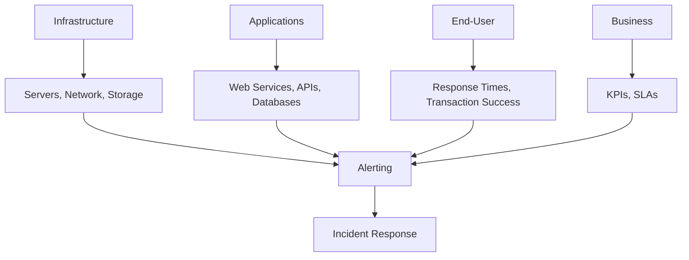
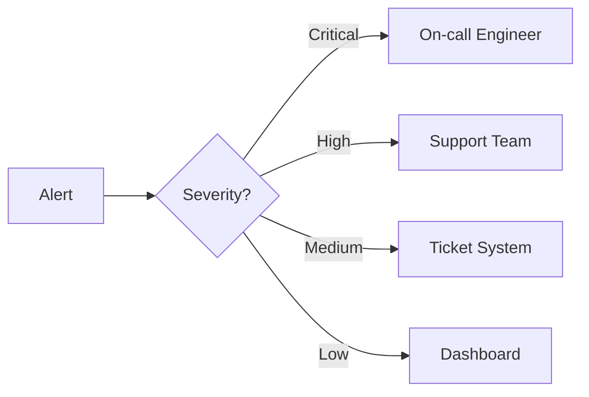
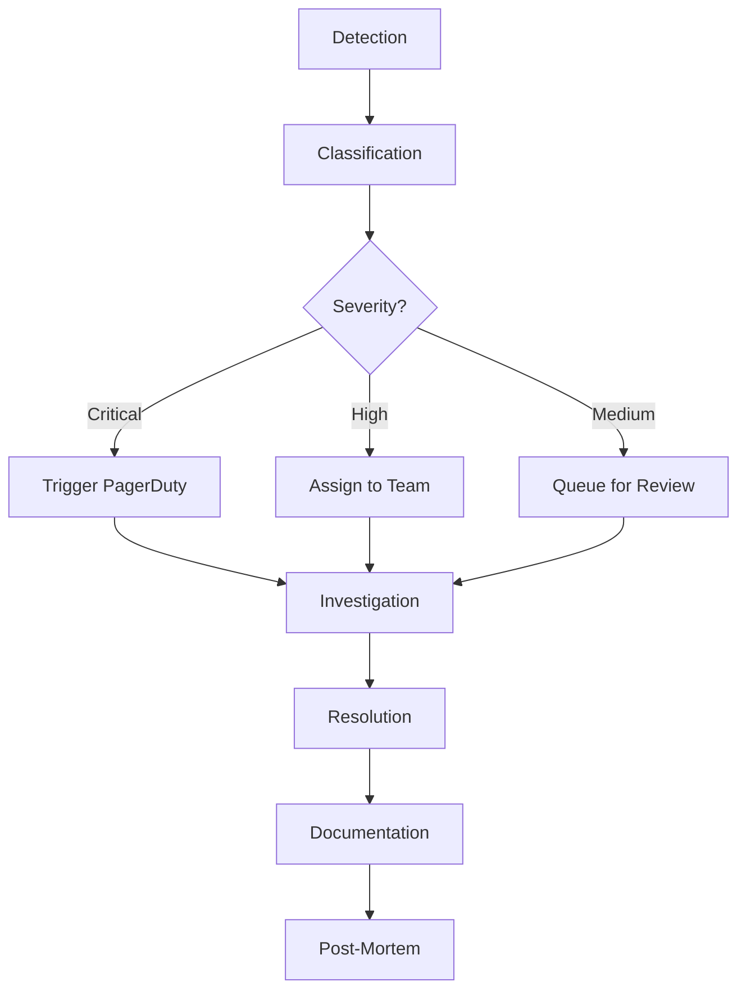

# 📊 Service Monitoring & Event Management Guide

## Table of Contents

### 1. Monitoring Framework
   - 1.1 Monitoring Tiers
   - 1.2 Key Performance Indicators (KPIs)

### 2. Monitoring Tools
   - 2.1 Core Monitoring Stack
   - 2.2 Network Monitoring Commands

### 3. Event Management
   - 3.1 Event Classification
   - 3.2 Event Correlation Rules

### 4. Alerting & Notification
   - 4.1 Alert Routing
   - 4.2 Notification Channels

### 5. System Health Checks
   - 5.1 Automated Health Check Script

### 6. Log Management
   - 6.1 Key Log Files
   - 6.2 Log Analysis Commands

### 7. Incident Response
   - 7.1 Incident Workflow
   - 7.2 Post-Incident Report Template

### 8. Performance Tuning
   - 8.1 Database Optimization
   - 8.2 Application Performance
   - 8.3 Network Optimization

### 9. Security Monitoring
   - 9.1 Intrusion Detection
   - 9.2 Security Auditing
   - 9.3 Compliance Checks

### 10. Documentation & Reporting
   - 10.1 Runbooks
   - 10.2 Performance Reports
   - 10.3 Capacity Planning

### 11. Best Practices
   - 11.1 Monitoring Strategy
   - 11.2 Alert Management
   - 11.3 Continuous Improvement

### 12. Tools & Integrations
   - 12.1 Open Source Solutions
   - 12.2 Commercial Solutions
   - 12.3 Custom Integrations

### 13. Training & Knowledge Sharing
   - 13.1 Team Training
   - 13.2 Documentation Standards
   - 13.3 Knowledge Base

### 14. Appendix
   - 14.1 Glossary
   - 14.2 References
   - 14.3 Additional Resources

---

## 1. Monitoring Framework

## 1. Monitoring Framework

### 1.1 Monitoring Tiers


### 1.2 Key Performance Indicators (KPIs)
- **System Health**: CPU, Memory, Disk, Network
- **Application Performance**: Response Time, Error Rates
- **Service Availability**: Uptime %, MTTR (Mean Time To Resolve)
- **Capacity Planning**: Trend Analysis, Forecasting

## 2. Monitoring Tools

### 2.1 Core Monitoring Stack
| Tool | Purpose | Key Features |
|------|---------|-------------|
| **Zabbix** | Infrastructure | Server monitoring, Network monitoring |
| **Prometheus** | Metrics | Time-series data, Alerting |
| **Grafana** | Visualization | Dashboards, Analytics |
| **ELK Stack** | Logs | Log analysis, Searching |
| **Nagios** | Service Monitoring | Plugin architecture, Alerting |

### 2.2 Network Monitoring Commands
```bash
# Basic Connectivity
ping -c 4 example.com

# Network Path
traceroute example.com

# Port Availability
nc -zv example.com 80

# Bandwidth Monitoring
iftop -i eth0
```

## 3. Event Management

### 3.1 Event Classification
| Level | Description | Response Time | Example |
|-------|-------------|---------------|---------|
| **Critical** | Service Down | 15 min | Server offline |
| **High** | Performance Degradation | 1 hour | High CPU usage |
| **Medium** | Non-critical Failure | 4 hours | Backup failed |
| **Low** | Informational | 24 hours | Software update available |

### 3.2 Event Correlation Rules
```yaml
# Example correlation rule in Prometheus Alertmanager
- alert: HighErrorRate
  expr: rate(http_requests_total{status=~"5.."}[5m]) > 0.1
  for: 10m
  labels:
    severity: critical
  annotations:
    summary: "High error rate on {{ $labels.instance }}"
    description: "{{ $value }}% of requests are failing"
```

## 4. Alerting & Notification

### 4.1 Alert Routing


### 4.2 Notification Channels
- **PagerDuty**: Critical alerts
- **Email**: Non-urgent notifications
- **Slack/Microsoft Teams**: Team communications
- **SMS**: After-hours critical alerts

## 5. System Health Checks

### 5.1 Automated Health Check Script
```bash
#!/bin/bash
# health_check.sh

# Check CPU Load
cpu_load=$(uptime | awk -F'[a-z]:' '{ print $2}' | awk -F', ' '{print $1}' | cut -d. -f1)
if [ $cpu_load -gt 5 ]; then
    echo "CRITICAL: High CPU load: $cpu_load"
    exit 2
fi

# Check Memory Usage
mem_usage=$(free | grep Mem | awk '{print $3/$2 * 100.0}' | cut -d. -f1)
if [ $mem_usage -gt 90 ]; then
    echo "CRITICAL: High memory usage: $mem_usage%"
    exit 2
fi

# Check Disk Space
disk_usage=$(df -h / | awk 'NR==2 {print $5}' | tr -d '%')
if [ $disk_usage -gt 90 ]; then
    echo "CRITICAL: Disk space low: $disk_usage%"
    exit 2
fi

echo "OK: System health normal"
exit 0
```

## 6. Log Management

### 6.1 Key Log Files
| System | Log Location | Purpose |
|--------|--------------|---------|
| Linux | /var/log/syslog | System logs |
| Windows | Event Viewer | System events |
| Apache | /var/log/apache2/ | Web server logs |
| MySQL | /var/log/mysql/ | Database logs |

### 6.2 Log Analysis Commands
```bash
# Find errors in logs
grep -i "error\|fail\|critical" /var/log/syslog

# Monitor log in real-time
tail -f /var/log/nginx/access.log

# Count occurrences of error
cat /var/log/app.log | grep "ERROR" | wc -l
```

## 7. Incident Response

### 7.1 Incident Workflow


### 7.2 Post-Incident Report Template
```markdown
# Post-Incident Review: [Incident ID]

## Incident Details
- **Start Time**: [Timestamp]
- **Detection Time**: [Timestamp]
- **Resolution Time**: [Timestamp]
- **Duration**: [HH:MM]
- **Impact**: [Affected Services/Users]

## Timeline
| Time | Event | Action Taken |
|------|-------|--------------|
| 00:00 | First alert received | Initial assessment |
| 00:15 | Team notified | Investigation started |
| 01:30 | Root cause identified | Mitigation in progress |

## Root Cause
[Detailed explanation of the cause]

## Resolution
[Steps taken to resolve]

## Preventive Measures
1. [Action Item 1]
   - Owner: [Name]
   - Due Date: [Date]
2. [Action Item 2]
   - Owner: [Name]
   - Due Date: [Date]

## Lessons Learned
- What went well
- What could be improved
- Action items for process improvement
```

## 8. Performance Baselines

### 8.1 Establishing Baselines
```bash
# CPU Baseline (Linux)
sar -u 60 1440 -f /var/log/sa/sa$(date +%d -d "yesterday") | grep -v "^$" | grep -v "%"

# Memory Baseline (Linux)
free -m

# Disk I/O Baseline
iostat -dx 5 12
```

### 8.2 Thresholds
| Metric | Warning | Critical |
|--------|---------|----------|
| CPU Usage | 70% | 90% |
| Memory Usage | 80% | 90% |
| Disk Space | 85% | 95% |
| Response Time | >1s | >5s |
| Error Rate | 1% | 5% |

## 9. Automation & Scripting

### 9.1 Automated Response Script
```python
#!/usr/bin/env python3
# auto_responder.py

import requests
import smtplib
from datetime import datetime

def check_service(url):
    try:
        response = requests.get(url, timeout=10)
        return response.status_code == 200
    except:
        return False

def send_alert(service, status):
    subject = f"ALERT: {service} is {status}"
    message = f"Service {service} is {status} at {datetime.now()}"
    
    # Configure email settings
    sender = 'monitoring@example.com'
    receivers = ['team@example.com']
    
    try:
        smtpObj = smtplib.SMTP('smtp.example.com')
        smtpObj.sendmail(sender, receivers, f"Subject: {subject}\n\n{message}")
        print("Alert sent successfully")
    except Exception as e:
        print(f"Failed to send alert: {e}")

# List of services to monitor
services = {
    'Web Server': 'https://example.com',
    'API': 'https://api.example.com/health',
    'Database': 'https://db.example.com/ping'
}

# Check each service
for name, url in services.items():
    if not check_service(url):
        send_alert(name, "DOWN")
    else:
        print(f"{name} is UP")
```

## 10. Documentation & Reporting

### 10.1 Daily Check Template
```markdown
# Daily System Health Check - $(date +%Y-%m-%d)

## System Status
- [ ] All critical services running
- [ ] Backup verification passed
- [ ] No security alerts
- [ ] Capacity within thresholds

## Issues Found
1. [Issue 1]
   - Status: [Open/In Progress/Resolved]
   - Assigned To: [Name]
   - ETA: [Date]

## Actions Taken
- [Action 1]
- [Action 2]

## Pending Tasks
- [ ] Task 1
- [ ] Task 2
```

### 10.2 Weekly Report Metrics
- Uptime percentage
- Number of incidents
- Mean Time To Resolve (MTTR)
- Top recurring issues
- Capacity trends

---
*Document Version: 1.0  
Last Updated: 2025-09-20*
