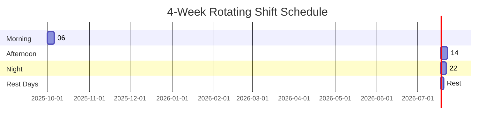
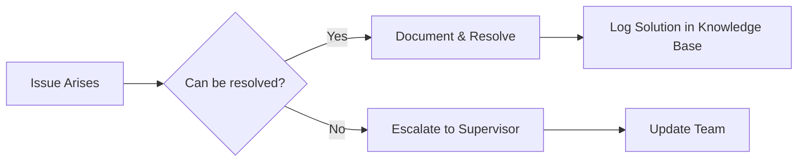

# 🌙 Shift Work Survival Guide

## Table of Contents
- [1. Shift Planning & Scheduling](#1-shift-planning--scheduling)
  - [1.1 Shift Rotation Patterns](#11-shift-rotation-patterns)
  - [1.2 Shift Handover Template](#12-shift-handover-template)
- [2. Health & Wellbeing](#2-health--wellbeing)
  - [2.1 Sleep Management](#21-sleep-management)
  - [2.2 Nutrition Guide](#22-nutrition-guide)
- [3. Productivity Strategies](#3-productivity-strategies)
  - [3.1 Energy Management](#31-energy-management)
  - [3.2 Quick Energy Boosters](#32-quick-energy-boosters)
- [4. Team Coordination](#4-team-coordination)
  - [4.1 Communication Protocol](#41-communication-protocol)
  - [4.2 Team Availability Matrix](#42-team-availability-matrix)
- [5. Emergency Procedures](#5-emergency-procedures)
  - [5.1 Shift Emergency Contacts](#51-shift-emergency-contacts)
  - [5.2 Critical System Checks](#52-critical-system-checks)
- [6. Mental Health & Support](#6-mental-health--support)
  - [6.1 Coping Strategies](#61-coping-strategies)
  - [6.2 Wellness Resources](#62-wellness-resources)
- [7. Technology & Tools](#7-technology--tools)
  - [7.1 Essential Software](#71-essential-software)
  - [7.2 Mobile Apps for Shift Workers](#72-mobile-apps-for-shift-workers)
- [8. Legal & Compliance](#8-legal--compliance)
  - [8.1 Break Entitlements](#81-break-entitlements)
  - [8.2 Overtime Policy](#82-overtime-policy)
- [9. Performance Tracking](#9-performance-tracking)
  - [9.1 Shift Report Card](#91-shift-report-card)

---

# 🌙 Shift Work Survival Guide

## 1. Shift Planning & Scheduling

### 1.1 Shift Rotation Patterns


### 1.2 Shift Handover Template
```markdown
# Shift Handover: [Date]
**Shift**: [Morning/Afternoon/Night]  
**From**: [Your Name]  
**To**: [Incoming Colleague]  

## Critical Issues
- [ ] [Issue] - [Status] - [Action Required]

## Ongoing Tasks
| Task | Status | Next Steps | Owner |
|------|--------|------------|-------|
| [Task] | [%] | [Action] | [Name] |

## Pending Items
- [ ] [Item] - [Priority] - [Deadline]

## Notes for Next Shift
- [Note 1]
- [Note 2]

**Handover Complete**: [Time]  
**Received By**: [Name/Signature]  
```

## 2. Health & Wellbeing

### 2.1 Sleep Management
**Before Day Shifts**
- Maintain consistent wake-up time
- Avoid caffeine 6 hours before bed
- Use blackout curtains
- Keep bedroom temperature at 18-20°C (65-68°F)

**Before Night Shifts**
- Take a 90-minute nap before shift
- Use blue light blocking glasses
- Keep sleep environment dark and quiet
- Consider melatonin supplements (consult doctor)

### 2.2 Nutrition Guide
```markdown
## Shift Work Meal Plan

### Night Shift Example
22:00 - Light meal (protein + complex carbs)  
02:00 - Healthy snack (nuts, yogurt, fruit)  
05:00 - Light breakfast (avoid heavy foods)  

### Foods to Avoid
- Heavy, greasy foods
- Excessive caffeine
- Sugary snacks
- Large meals before sleep

### Hydration
- 250ml water/hour during shift
- Limit caffeine to first half of shift
- Herbal teas for hydration
```

## 3. Productivity Strategies

### 3.1 Energy Management
| Time        | Activity                      | Energy Level |
|-------------|-------------------------------|--------------|
| 22:00-00:00 | Complex tasks                 | High         |
| 00:00-02:00 | Routine tasks                 | Medium       |
| 02:00-04:00 | Break + Light activity        | Low          |
| 04:00-06:00 | Administrative tasks          | Medium       |

### 3.2 Quick Energy Boosters
- 5-minute stretch break
- Short walk
- Cold water splash
- Deep breathing exercises

## 4. Team Coordination

### 4.1 Communication Protocol


### 4.2 Team Availability Matrix
```markdown
| Name       | Shift       | Contact     | Backup     |
|------------|-------------|-------------|------------|
| John Doe   | 06:00-14:00 | 555-0101    | Jane Smith |
| Jane Smith | 14:00-22:00 | 555-0102    | Mike Brown |
| Mike Brown | 22:00-06:00 | 555-0103    | John Doe   |
```

## 5. Emergency Procedures

### 5.1 Shift Emergency Contacts
| Role                  | Day Contact   | Night Contact  |
|-----------------------|---------------|----------------|
| IT Support Manager    | 555-1001      | 555-1002       |
| Facilities           | 555-2001      | 555-2002       |
| Security             | 555-3001      | 555-3001       |
| HR Emergency         | 555-4001      | 555-4002       |

### 5.2 Critical System Checks
```bash
# System Health Check Script
@echo off
echo === System Health Check ===
echo %DATE% %TIME%
echo.
echo 1. Disk Space:
wmic logicaldisk get size,freespace,caption
echo.
echo 2. Running Services:
sc query | findstr "RUNNING"
echo.
echo 3. Critical Processes:
tasklist | findstr /i "sql server|oracle|iis"
echo.
pause
```

## 6. Mental Health & Support

### 6.1 Coping Strategies
- Practice mindfulness (5-minute meditation)
- Maintain social connections
- Set clear work-life boundaries
- Seek professional support if needed

### 6.2 Wellness Resources
- Employee Assistance Program (EAP)
- 24/7 Crisis Hotline: 1-800-XXX-XXXX
- Virtual counseling services
- Peer support groups

## 7. Technology & Tools

### 7.1 Essential Software
| Tool | Purpose | Shift Notes |
|------|---------|-------------|
| [TeamViewer](https://www.teamviewer.com) | Remote Support | Log all sessions |
| [ShiftNote](https://www.shiftnote.com) | Handover Documentation | Update EOD |
| [f.lux](https://justgetflux.com) | Blue Light Filter | Enable night mode |
| [RescueTime](https://www.rescuetime.com) | Productivity Tracking | Review weekly |

### 7.2 Mobile Apps for Shift Workers
- **Sleep Cycle**: Track sleep patterns
- **MyFitnessPal**: Monitor nutrition
- **Headspace**: Guided meditation
- **Shift Calendar**: Schedule management

## 8. Legal & Compliance

### 8.1 Break Entitlements
| Shift Duration | Paid Breaks | Meal Break |
|----------------|-------------|------------|
| < 6 hours     | 10 min      | No         |
| 6-10 hours    | 2 x 10 min  | 30 min     |
| > 10 hours    | 3 x 10 min  | 2 x 30 min |

### 8.2 Overtime Policy
- Pre-approval required for >40 hours/week
- 1.5x pay for hours 41-50
- 2x pay for hours 51+
- Mandatory 8-hour break between shifts

## 9. Performance Tracking

### 9.1 Shift Report Card
```markdown
# Shift Performance: [Date]
**Employee**: [Name]  
**Shift**: [Time]  

## Metrics
- Tickets Resolved: [Number]
- Response Time: [Time]
- Customer Satisfaction: [Rating]
- System Uptime: [%]

## Achievements
1. [Accomplishment 1]
2. [Accomplishment 2]

## Areas for Improvement
1. [Area 1]
2. [Area 2]

**Supervisor Notes**: [Comments]
```

## 10. Long-Term Health Management

### 10.1 Medical Check-Up Schedule
| Check-Up | Frequency | Tests Included |
|----------|-----------|----------------|
| Full Physical | Annual | Blood work, vitals |
| Vision Test | Biennial | Eye exam |
| Hearing Test | Every 3 years | Audiometry |
| Dental Check | Bi-annual | Cleaning, exam |

### 10.2 Vitamin & Supplement Guide
| Supplement | Benefit | Recommended Time |
|------------|---------|------------------|
| Vitamin D  | Bone health, immunity | Morning |
| Magnesium  | Sleep quality, muscle function | Before bed |
| Melatonin  | Sleep regulation | 30 min before sleep |
| B Complex  | Energy metabolism | With breakfast |

---
*Document Version: 1.0  
Last Updated: 2025-09-20*
