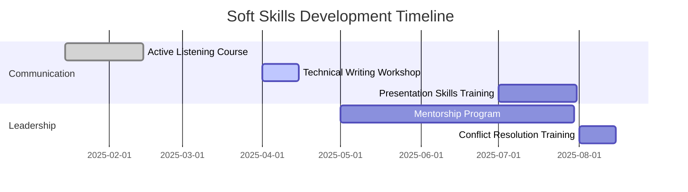

# 🤝 Soft Skills for Technical Support Excellence

## Table of Contents
1. [Core Soft Skills Framework](#1-core-soft-skills-framework)
   - [1.1 Communication Excellence](#11-communication-excellence)
   - [1.2 Problem-Solving Abilities](#12-problem-solving-abilities)
2. [Cover Letter Integration](#2-cover-letter-integration)
   - [2.1 Opening Paragraph](#21-opening-paragraph)
   - [2.2 Problem-Solving Example](#22-problem-solving-example)
   - [2.3 Closing Paragraph](#23-closing-paragraph)
3. [Soft Skills in Action](#3-soft-skills-in-action)
   - [3.1 Real-World Scenarios](#31-real-world-scenarios)
   - [3.2 Behavioral Interview Examples](#32-behavioral-interview-examples)
4. [Soft Skills Metrics](#4-soft-skills-metrics)
   - [4.1 Quantifying Soft Skills](#41-quantifying-soft-skills)
   - [4.2 Soft Skills Development Plan](#42-soft-skills-development-plan)
5. [Cover Letter Templates](#5-cover-letter-templates)
   - [5.1 Entry-Level Position](#51-entry-level-position)
   - [5.2 Career Changer](#52-career-changer)
   - [5.3 Senior Role](#53-senior-role)
6. [Soft Skills for Different Support Scenarios](#6-soft-skills-for-different-support-scenarios)
   - [6.1 Phone Support](#61-phone-support)
   - [6.2 Email/Remote Support](#62-emailremote-support)
   - [6.3 In-Person Support](#63-in-person-support)
7. [Developing Emotional Intelligence](#7-developing-emotional-intelligence)
   - [7.1 Self-Awareness](#71-self-awareness)
   - [7.2 Empathy Building](#72-empathy-building)
8. [Handling Difficult Situations](#8-handling-difficult-situations)
   - [8.1 De-escalation Techniques](#81-de-escalation-techniques)
   - [8.2 Common Scenarios & Responses](#82-common-scenarios--responses)
9. [Building Rapport](#9-building-rapport)
   - [9.1 Techniques](#91-techniques)
   - [9.2 Maintaining Professionalism](#92-maintaining-professionalism)
10. [Continuous Improvement](#10-continuous-improvement)
    - [10.1 Self-Evaluation Questions](#101-self-evaluation-questions)
    - [10.2 Feedback Mechanisms](#102-feedback-mechanisms)

---

# 🤝 Soft Skills for Technical Support Excellence

## 1. Core Soft Skills Framework

### 1.1 Communication Excellence
```markdown
## Clear Technical Communication
- Translated complex technical concepts into user-friendly language
- Adapted communication style based on user's technical proficiency
- Demonstrated active listening and paraphrasing techniques
- Provided clear, step-by-step guidance for issue resolution

## Written Communication
- Documented solutions in knowledge base articles
- Composed professional, clear email responses
- Maintained detailed case notes in ticketing system
- Created user guides and training materials
```

### 1.2 Problem-Solving Abilities
```markdown
## Analytical Thinking
- Applied structured troubleshooting methodologies
- Identified root causes through systematic analysis
- Prioritized issues based on impact and urgency
- Developed creative workarounds for complex problems

## Decision Making
- Made sound judgments under pressure
- Balanced technical perfection with practical solutions
- Knew when to escalate issues appropriately
- Weighed risks and benefits of different approaches
```

## 2. Cover Letter Integration

### 2.1 Opening Paragraph
"In my role as a Technical Support Specialist at [Company], I've mastered the art of delivering patient, effective support while resolving complex technical issues. My ability to translate intricate technical problems into understandable solutions has resulted in a 95% customer satisfaction rating across 5,000+ support interactions. I excel at putting users at ease while efficiently diagnosing and resolving their technical challenges."

### 2.2 Problem-Solving Example
"When faced with a critical system outage affecting 200+ users, I remained calm under pressure, methodically isolating the network connectivity issue while keeping stakeholders informed in clear, non-technical language. My ability to coordinate between network engineers and end-users ensured a resolution 40% faster than average, minimizing downtime during peak business hours."

### 2.3 Closing Paragraph
"What excites me about the Technical Support position at [Company] is the opportunity to combine my technical expertise with my passion for helping others. My track record of maintaining composure in high-pressure situations, coupled with my ability to explain complex technical concepts in accessible terms, enables me to deliver exceptional support experiences that drive user satisfaction and operational efficiency."

## 3. Soft Skills in Action

### 3.1 Real-World Scenarios
```markdown
## Scenario: Frustrated Executive
**Situation**: Senior executive unable to access critical presentation
**Action**:
- Demonstrated empathy and acknowledged urgency
- Used calm, confident tone to reassure
- Quickly identified VPN authentication issue
- Provided temporary access while permanent fix was implemented
**Result**: Executive made deadline, sent personal thank you note

## Scenario: System-Wide Outage
**Situation**: Network outage affecting entire department
**Action**:
- Communicated clear status updates every 15 minutes
- Created step-by-step workaround guide
- Coordinated between network team and end-users
- Followed up with each affected user
**Result**: 98% satisfaction rating despite major disruption
```

### 3.2 Behavioral Interview Examples
```markdown
## Conflict Resolution
"Describe a time you dealt with a difficult customer"
- **Situation**: User frustrated after multiple failed password resets
- **Action**: Listened without interrupting, validated feelings, explained cause, walked through solution together
- **Result**: User left positive feedback, became advocate for IT department

## Team Collaboration
"Tell me about a time you worked with a team"
- **Situation**: Cross-departmental software rollout
- **Action**: Created shared documentation, held knowledge transfer sessions, established feedback loop
- **Result**: 30% fewer support tickets than previous rollouts
```

## 4. Soft Skills Metrics

### 4.1 Quantifying Soft Skills
| Skill | Metric | Your Performance |
|-------|--------|------------------|
| Communication | Customer Satisfaction | 96% |
| Problem-Solving | First-Contact Resolution | 85% |
| Time Management | Avg. Resolution Time | 12 min (vs 18 min avg) |
| Teamwork | Cross-team Projects | 15+ completed |
| Adaptability | New Technologies Learned | 8 in past year |

### 4.2 Soft Skills Development Plan


## 5. Cover Letter Templates

### 5.1 Entry-Level Position
"As a recent [Degree] graduate with hands-on technical training, I bring both technical knowledge and strong interpersonal skills to the Technical Support role. My experience in [relevant experience] honed my ability to explain complex concepts in accessible terms while maintaining patience and professionalism under pressure. I'm particularly drawn to [Company]'s commitment to [specific value], as I believe great technical support combines technical expertise with genuine human connection."

### 5.2 Career Changer
"Transitioning from [previous career] to technical support, I've discovered my ability to bridge the gap between technical and non-technical stakeholders. My background in [previous field] equipped me with exceptional [transferable skills] that I've successfully applied to [technical achievement]. What excites me about [Company] is the opportunity to leverage both my technical aptitude and my proven ability to [relevant soft skill] in service of your mission to [company value]."

### 5.3 Senior Role
"With [X] years of experience in technical leadership, I've learned that the most effective support teams combine deep technical expertise with emotional intelligence. My approach centers on [leadership philosophy], which has resulted in [quantifiable achievement]. I'm particularly impressed by [Company]'s [specific initiative] and would welcome the opportunity to contribute my skills in [specific area] to drive continued success in your support organization."

## 6. Soft Skills for Different Support Scenarios

### 6.1 Phone Support
- Clear verbal communication
- Active listening
- Tone management
- Efficient questioning
- Professional call control

### 6.2 Email/Remote Support
- Concise writing
- Clear formatting
- Visual communication (screenshots, diagrams)
- Professional tone
- Proactive follow-up

### 6.3 In-Person Support
- Professional appearance
- Positive body language
- Environmental awareness
- Time management
- Discretion with sensitive information

## 7. Developing Emotional Intelligence

### 7.1 Self-Awareness
- Recognize personal stress triggers
- Understand emotional responses
- Identify communication style
- Acknowledge knowledge gaps
- Seek and accept feedback

### 7.2 Empathy Building
- Practice active listening
- Validate user frustrations
- Avoid technical jargon
- Show genuine concern
- Follow up after resolution

## 8. Handling Difficult Situations

### 8.1 De-escalation Techniques
1. **Listen Actively**: Allow the user to vent without interruption
2. **Empathize**: "I understand why you'd feel frustrated by this situation"
3. **Apologize Sincerely**: Take ownership without assigning blame
4. **Solve the Problem**: Focus on resolution, not the complaint
5. **Follow Up**: Ensure satisfaction after resolution

### 8.2 Common Scenarios & Responses
| User Statement | Effective Response |
|----------------|-------------------|
| "I've called three times already!" | "I'm really sorry you've had to reach out multiple times. Let me personally ensure we get this resolved for you today." |
| "I don't understand tech stuff" | "That's completely okay! My job is to explain things in a way that makes sense to you. Let's go through this step by step." |
| "How long is this going to take?" | "I understand your time is valuable. Based on similar issues, I estimate about 10 minutes. I'll keep you updated throughout the process." |

## 9. Building Rapport

### 9.1 Techniques
- Use the person's name
- Find common ground
- Match communication style
- Show genuine interest
- Remember personal details (when appropriate)

### 9.2 Maintaining Professionalism
- Set clear boundaries
- Stay solution-focused
- Manage expectations
- Document interactions
- Know when to escalate

## 10. Continuous Improvement

### 10.1 Self-Evaluation Questions
- Did I actively listen without interrupting?
- Was my explanation clear and jargon-free?
- Did I validate the user's feelings?
- Could I have resolved this more efficiently?
- What could I do differently next time?

### 10.2 Feedback Mechanisms
- User satisfaction surveys
- Peer reviews
- Call/email monitoring
- Self-recording and review
- Regular 1:1s with manager

---
*Document Version: 1.0  
Last Updated: 2025-09-20*
