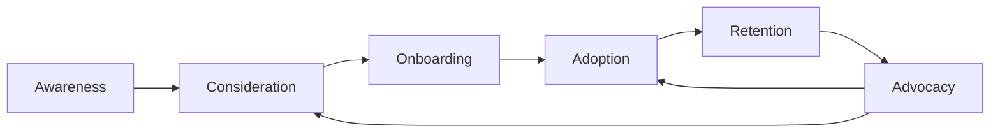
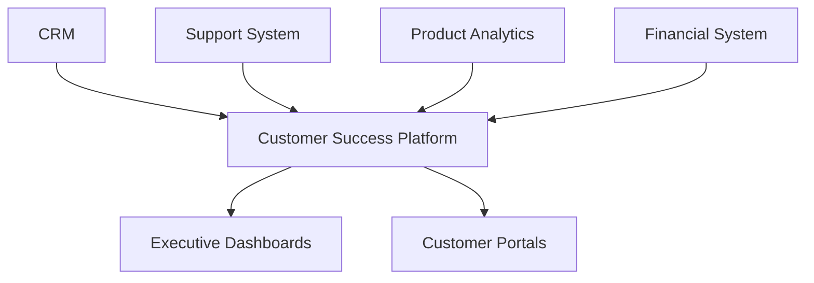

# 🎯 Strategic Customer Management Framework

## Table of Contents
1. [Customer Lifecycle Management](#1-customer-lifecycle-management)
   - [1.1 Journey Mapping](#11-journey-mapping)
   - [1.2 Key Touchpoints](#12-key-touchpoints)
2. [Customer Health Scoring](#2-customer-health-scoring)
   - [2.1 Health Indicators](#21-health-indicators)
   - [2.2 Health Matrix](#22-health-matrix)
3. [Executive Engagement Program](#3-executive-engagement-program)
   - [3.1 Engagement Framework](#31-engagement-framework)
   - [3.2 Executive Briefing Template](#32-executive-briefing-template)
4. [Customer Success Playbooks](#4-customer-success-playbooks)
   - [4.1 Onboarding Playbook](#41-onboarding-playbook)
   - [4.2 Risk Mitigation Playbook](#42-risk-mitigation-playbook)
5. [Customer Advisory Board (CAB)](#5-customer-advisory-board-cab)
   - [5.1 CAB Structure](#51-cab-structure)
   - [5.2 Meeting Agenda](#52-meeting-agenda)
6. [Customer Marketing & Advocacy](#6-customer-marketing--advocacy)
   - [6.1 Advocacy Programs](#61-advocacy-programs)
   - [6.2 ROI Calculator](#62-roi-calculator)
7. [Customer Feedback Analysis](#7-customer-feedback-analysis)
   - [7.1 Data Collection](#71-data-collection)
   - [7.2 Analysis Framework](#72-analysis-framework)

---

# 🎯 Strategic Customer Management Framework

## 1. Customer Lifecycle Management

### 1.1 Journey Mapping


### 1.2 Key Touchpoints
| Stage | Touchpoint | Owner | Success Metric |
|-------|------------|-------|----------------|
| Pre-Sales | Product Demo | Sales | Demo-to-Trial % |
| Onboarding | Welcome Kit | CSM | Time-to-Value |
 | Adoption | Training Session | Success | Feature Adoption % |
| Retention | QBR | Account Mgr | NRR/GRR |
| Growth | Upsell Meeting | Sales | Expansion Revenue |

## 2. Customer Health Scoring

### 2.1 Health Indicators
**Product Usage**
- Login frequency
- Feature adoption
- Usage trends

**Support Engagement**
- Ticket volume/severity
- Response/resolution times
- CSAT scores

**Business Value**
- ROI achieved
- Goals met
- Executive sponsorship

### 2.2 Health Matrix
```python
def calculate_health_score(customer):
    # Weights can be adjusted based on business priorities
    weights = {
        'product_usage': 0.4,
        'support_engagement': 0.3,
        'business_value': 0.3
    }
    
    score = (
        customer.product_usage * weights['product_usage'] +
        customer.support_engagement * weights['support_engagement'] +
        customer.business_value * weights['business_value']
    )
    
    if score >= 80:
        return 'Healthy'
    elif score >= 50:
        return 'Needs Attention'
    else:
        return 'At Risk'
```

## 3. Executive Engagement Program

### 3.1 Engagement Framework
**Quarterly Business Reviews (QBRs)**
1. **Preparation**
   - Usage reports
   - ROI analysis
   - Success metrics

2. **Discussion Points**
   - Achievements
   - Challenges
   - Roadmap alignment
   - Strategic initiatives

3. **Outcomes**
   - Documented action items
   - Shared success metrics
   - Follow-up schedule

### 3.2 Executive Briefing Template
```markdown
# Executive Brief: [Customer Name]

## Health Status
- **Score**: [0-100]
- **Trend**: [↑→↓]
- **Risk Factors**: [List]

## Key Metrics
| Metric | Current | Target | Variance |
|--------|---------|--------|----------|
| Product Usage | 75% | 85% | -10% |
| Support Tickets | 12 | <5 | +7 |
| NPS | 45 | 60 | -15 |

## Strategic Recommendations
1. [Initiative 1]
   - Impact: [High/Medium/Low]
   - Resources Required: [Details]
   - Expected Outcome: [Description]

## Action Items
- [ ] Task 1 (Owner: [Name], Due: [Date])
- [ ] Task 2 (Owner: [Name], Due: [Date])
```

## 4. Customer Success Playbooks

### 4.1 Onboarding Playbook
**First 30 Days**:
1. **Week 1**: Kickoff & Setup
   - Account configuration
   - Admin training
   - Success plan

2. **Week 2**: Training
   - Role-based sessions
   - Best practices
   - Resource sharing

3. **Week 3**: Adoption
   - Usage monitoring
   - Early wins celebration
   - Feedback collection

4. **Week 4**: Review
   - Progress check
   - Q&A session
   - Next steps

### 4.2 Risk Mitigation Playbook
**Early Warning Signs**:
- Declining usage
- Multiple support escalations
- Missed QBRs
- Executive turnover

**Intervention Steps**:
1. Immediate outreach
2. Root cause analysis
3. Customized recovery plan
4. Executive sponsorship alignment
5. Regular check-ins

## 5. Customer Advisory Board (CAB)

### 5.1 CAB Structure
**Membership**:
- 8-12 strategic customers
- Mix of industries/sizes
- Balanced representation

**Meetings**:
- Quarterly virtual sessions
- Annual in-person summit
- Topic-specific working groups

### 5.2 Meeting Agenda
1. **Industry Trends** (30 min)
2. **Product Roadmap Preview** (45 min)
3. **Roundtable Discussion** (60 min)
4. **Action Items** (15 min)

## 6. Customer Marketing & Advocacy

### 6.1 Advocacy Programs
1. **Reference Customers**
   - Case studies
   - Testimonials
   - Sales references

2. **User Groups**
   - Local meetups
   - Special interest groups
   - Online community

3. **Co-Marketing**
   - Webinars
   - Co-branded content
   - Conference speaking

### 6.2 ROI Calculator
```javascript
function calculateROI(customer) {
    const savings = customer.yearlyCost * 0.3; // 30% estimated savings
    const productivityGains = customer.employees * 50 * 2080 * 0.1; // 10% time savings
    return {
        totalROI: ((savings + productivityGains) / customer.yearlyCost) * 100,
        paybackPeriod: customer.yearlyCost / (savings + productivityGains) * 12
    };
}
```

## 7. Customer Experience (CX) Optimization

### 7.1 Journey Mapping
**Phase 1: Discovery**
- Customer interviews
- Process mapping
- Pain point identification

**Phase 2: Design**
- Future-state mapping
- Service blueprinting
- Prototype development

**Phase 3: Implementation**
- Process changes
- Training
- Communication plan

### 7.2 Voice of Customer (VoC) Program
**Data Sources**:
- Surveys (NPS, CSAT, CES)
- Support interactions
- Social media
- User behavior analytics

**Analysis Framework**:
1. **Collect**
2. **Analyze**
3. **Act**
4. **Close the Loop**

## 8. Technology Stack

### 8.1 Recommended Tools
| Category | Tools |
|----------|-------|
| CRM | Salesforce, HubSpot |
| Customer Success | Gainsight, Totango |
| Analytics | Tableau, Power BI |
| Feedback | Qualtrics, Medallia |
| Communication | Slack, Microsoft Teams |

### 8.2 Integration Architecture


## 9. Performance Metrics

### 9.1 Key Metrics
| Metric | Formula | Target |
|--------|---------|--------|
| Net Revenue Retention | (Starting MRR + Expansion - Churn) / Starting MRR | >100% |
| Customer Health Score | Weighted average of health indicators | >80 |
| Customer Effort Score | Survey response (1-7) | <2 |
| Time to Value | First meaningful use to value realization | <30 days |

### 9.2 Reporting Cadence
| Report | Frequency | Audience |
|--------|-----------|----------|
| Customer Health | Weekly | CS Team |
| Executive Summary | Monthly | Leadership |
| QBR Pack | Quarterly | Customers |
| Annual Review | Yearly | Board |

## 10. Continuous Improvement

### 10.1 Post-Engagement Reviews
**Questions to Answer**:
1. What went well?
2. What could be improved?
3. What surprised us?
4. What should we do differently next time?

### 10.2 Improvement Framework
1. **Assess** current state
2. **Benchmark** against best practices
3. **Prioritize** opportunities
4. **Implement** changes
5. **Measure** impact
6. **Standardize** successes

---
*Document Version: 1.0  
Last Updated: 2025-09-20*
