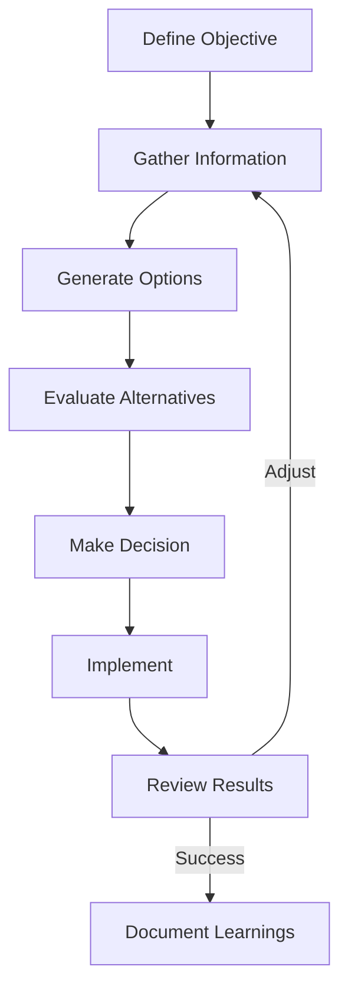
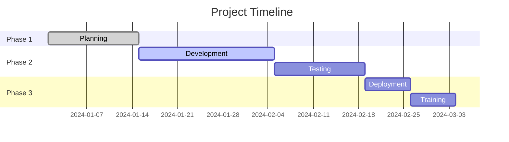
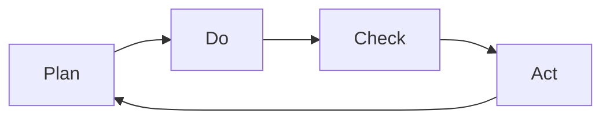

# 🎯 Strategic Execution Framework

## Table of Contents

### 1. Goal Setting Methodology
- [1.1 SMART-ER Goals](#11-smart-er-goals)
- [1.2 OKR Framework](#12-okr-framework)

### 2. Planning Process
- [2.1 Strategic Planning Matrix](#21-strategic-planning-matrix)
- [2.2 Decision Matrix](#22-decision-matrix)

### 3. Execution Framework
- [3.1 RACI Matrix](#31-raci-matrix)
- [3.2 Project Timeline Template](#32-project-timeline-template)

### 4. Performance Tracking
- [4.1 KPI Dashboard](#41-kpi-dashboard)
- [4.2 Progress Review Template](#42-progress-review-template)

### 5. Risk Management
- [5.1 Risk Assessment Matrix](#51-risk-assessment-matrix)
- [5.2 Contingency Planning](#52-contingency-planning)

### 6. Resource Allocation
- [6.1 Resource Planning Template](#61-resource-planning-template)
- [6.2 Workload Balancing](#62-workload-balancing)

### 7. Decision Making Framework
- [7.1 Decision Journal Template](#71-decision-journal-template)
- [7.2 Eisenhower Matrix](#72-eisenhower-matrix)

### 8. Communication Plan
- [8.1 Stakeholder Analysis](#81-stakeholder-analysis)
- [8.2 Communication Matrix](#82-communication-matrix)

---

# 🎯 Strategic Execution Framework

## 1. Goal Setting Methodology

### 1.1 SMART-ER Goals
```markdown
- **S**pecific: Clearly defined outcome
- **M**easurable: Quantifiable success criteria
- **A**chievable: Realistic with available resources
- **R**elevant: Aligns with organizational objectives
- **T**ime-bound: Defined deadline
- **E**valuated: Regular progress reviews
- **R**ewarded: Recognition of achievement
```

### 1.2 OKR Framework
**Objective**: Qualitative goal (e.g., "Enhance system reliability")

**Key Results**:
1. Reduce critical incidents by 40%
2. Achieve 99.9% uptime
3. Deploy automated monitoring for 100% of critical systems

## 2. Planning Process

### 2.1 Strategic Planning Matrix
| Initiative | Objective | Success Metrics | Owner | Timeline | Dependencies |
|------------|-----------|-----------------|-------|-----------|--------------|
| Cloud Migration | Modernize infrastructure | 100% migration, 30% cost reduction | Tech Ops | Q2 2024 | Vendor selection |
| Security Hardening | Reduce vulnerabilities | Zero critical CVEs, 100% MFA adoption | Security Team | Q1 2024 | Budget approval |

### 2.2 Decision Matrix


## 3. Execution Framework

### 3.1 RACI Matrix
| Task | Responsible | Accountable | Consulted | Informed |
|------|-------------|-------------|-----------|----------|
| System Upgrade | IT Team | CTO | Security | All Staff |
| Training | HR | Department Heads | IT | Employees |
| Budget Planning | Finance | CFO | Department Heads | Exec Team |

### 3.2 Project Timeline Template


## 4. Performance Tracking

### 4.1 KPI Dashboard
| Metric | Current | Target | Trend | Owner |
|--------|---------|--------|-------|-------|
| System Uptime | 99.5% | 99.9% | ↑ | Ops |
| Ticket Resolution | 85% < 24h | 95% | → | Support |
| Project On-Time | 70% | 90% | ↑ | PMO |
| Budget Variance | +5% | ±2% | ↓ | Finance |

### 4.2 Progress Review Template
```markdown
# Progress Review: [Project/Initiative]
**Date**: [YYYY-MM-DD]
**Period**: [Reporting Period]

## Key Achievements
1. [Accomplishment 1]
2. [Accomplishment 2]

## Challenges Faced
- [Challenge 1]
- [Challenge 2]

## Metrics Update
| KPI | Target | Actual | Variance |
|-----|--------|--------|----------|
| [Metric 1] | [Target] | [Actual] | [Variance] |

## Next Steps
1. [Action Item] (Owner: [Name], Due: [Date])
2. [Action Item] (Owner: [Name], Due: [Date])
```

## 5. Risk Management

### 5.1 Risk Assessment Matrix
| Risk | Probability | Impact | Mitigation Strategy | Owner |
|------|-------------|--------|---------------------|-------|
| Vendor Delays | Medium | High | Identify backup vendors | Procurement |
| Security Breach | Low | Critical | Regular audits, incident response plan | Security |
| Budget Cuts | High | Medium | Prioritize critical projects | Finance |

### 5.2 Contingency Planning
1. **Identify Critical Paths**
2. **Develop Fallback Options**
3. **Establish Trigger Points**
4. **Document Response Procedures**

## 6. Resource Allocation

### 6.1 Resource Planning Template
| Resource | Type | Allocation % | Projects | Availability |
|----------|------|--------------|-----------|--------------|
| John D. | Developer | 70% | Project A (50%), B (20%) | 30% Buffer |
| Server Cluster | Infrastructure | 85% | Production (60%), Staging (25%) | 15% Headroom |

### 6.2 Workload Balancing
```python
def calculate_workload(team_members):
    workload_report = {}
    for member in team_members:
        utilization = sum([p.allocation for p in member.projects])
        workload_report[member.name] = {
            'utilization': utilization,
            'status': 'Overloaded' if utilization > 100 else 
                     'Optimal' if utilization >= 80 else
                     'Underutilized'
        }
    return workload_report
```

## 7. Decision Making Framework

### 7.1 Decision Journal Template
```markdown
## Decision: [Brief Description]
**Date**: [YYYY-MM-DD]
**Decision Maker**: [Name]

### Context
[Background information]

### Options Considered
1. [Option 1]
   - Pros: 
   - Cons:
2. [Option 2]
   - Pros:
   - Cons:

### Chosen Option
[Selected Option]

### Rationale
[Explanation of decision]

### Expected Outcome
[Anticipated results]

### Review Date
[Date for follow-up]
```

### 7.2 Eisenhower Matrix
```
| Urgent & Important | Important, Not Urgent |
|--------------------|----------------------|
| - Critical issues  | - Strategic planning |
| - Deadlines        | - Relationship building |
| - Crises          | - Professional development |

| Urgent, Not Important | Not Urgent, Not Important |
|----------------------|--------------------------|
| - Some meetings      | - Trivial tasks          |
| - Interruptions      | - Time wasters           |
| - Most emails        | - Excessive social media |
```

## 8. Communication Plan

### 8.1 Stakeholder Analysis
| Stakeholder | Interest | Influence | Communication Needs |
|-------------|----------|-----------|---------------------|
| Executives | High | High | High-level updates, ROI |
| Team Members | High | Medium | Detailed instructions, feedback channels |
| End Users | Medium | Low | Change notifications, training |

### 8.2 Communication Matrix
| Type | Audience | Frequency | Channel | Owner |
|------|----------|-----------|---------|-------|
| Project Update | All Staff | Bi-weekly | Email/Newsletter | PM |
| Team Sync | Project Team | Weekly | Video Call | Team Lead |
| Executive Brief | Leadership | Monthly | Presentation | Sponsor |

## 9. Continuous Improvement

### 9.1 Retrospective Template
```markdown
# Retrospective: [Project/Iteration]
**Date**: [YYYY-MM-DD]
**Facilitator**: [Name]

## What Went Well
1. [Positive Outcome 1]
2. [Positive Outcome 2]

## What Could Be Improved
1. [Area for Improvement 1]
2. [Area for Improvement 2]

## Action Items
| Task | Owner | Due Date | Status |
|------|-------|----------|--------|
| [Task 1] | [Owner] | [Date] | [Status] |
```

### 9.2 PDCA Cycle


## 10. Personal Productivity

### 10.1 Time Blocking Template
```
8:00-9:00   Deep Work (Strategic Tasks)
9:00-9:30   Email/Communication
9:30-10:30  Meetings
10:30-12:00 Project Work
12:00-13:00 Lunch Break
13:00-14:00 Collaborative Work
14:00-15:00 Administrative Tasks
15:00-16:00 Planning/Review
16:00-17:00 Open Office Hours
```

### 10.2 Priority Management
1. **Daily Top 3**
   - Most important tasks for the day
   - Must be completed before other work

2. **Weekly Focus**
   - Key objectives for the week
   - Aligned with monthly goals

---
*Document Version: 1.0  
Last Updated: 2025-09-20*
