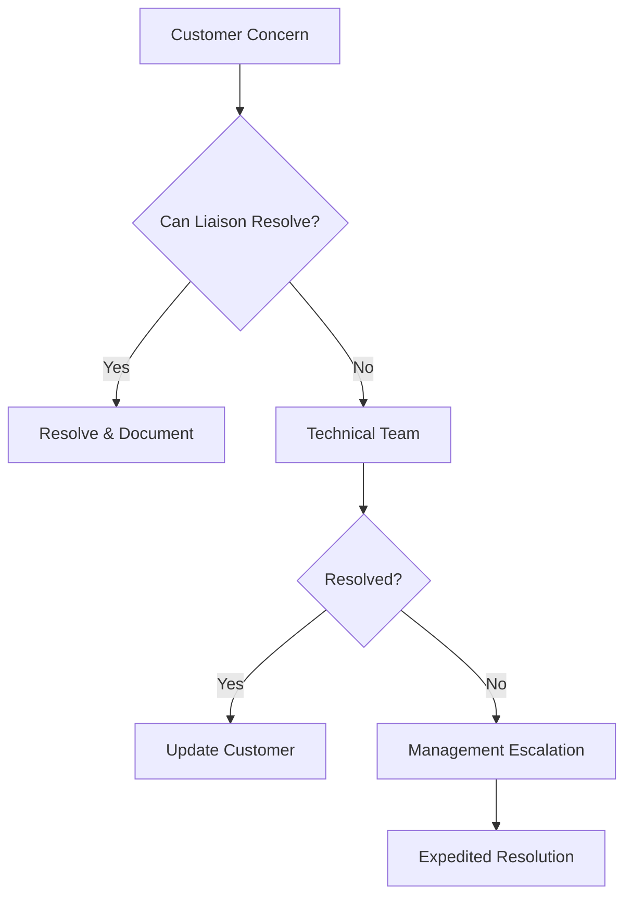

# 🤝 Technical Liaison Playbook

## Table of Contents
- [1. Role Definition](#1-role-definition)
  - [1.1 Core Responsibilities](#11-core-responsibilities)
  - [1.2 Key Skills](#12-key-skills)
- [2. Communication Framework](#2-communication-framework)
  - [2.1 Message Translation Guide](#21-message-translation-guide)
  - [2.2 Communication Channels](#22-communication-channels)
- [3. Customer Interaction Protocol](#3-customer-interaction-protocol)
  - [3.1 Initial Contact](#31-initial-contact)
  - [3.2 Technical Handoff Template](#32-technical-handoff-template)
- [4. Internal Coordination](#4-internal-coordination)
  - [4.1 Technical Team Briefing](#41-technical-team-briefing)
  - [4.2 Status Update Template](#42-status-update-template)
- [5. Escalation Management](#5-escalation-management)
  - [5.1 Escalation Path](#51-escalation-path)
  - [5.2 Escalation Criteria](#52-escalation-criteria)
- [6. Documentation Standards](#6-documentation-standards)
  - [6.1 Customer Interaction Log](#61-customer-interaction-log)
  - [6.2 Technical Glossary](#62-technical-glossary)
- [7. Common Scenarios](#7-common-scenarios)
  - [7.1 When Technical Team Says "It's Not a Bug"](#71-when-technical-team-says-its-not-a-bug)
  - [7.2 When Customer is Frustrated](#72-when-customer-is-frustrated)

---

## 1. Role Definition

### 1.1 Core Responsibilities
- **Technical Translation**: Convert technical jargon into business language and vice versa
- **Relationship Management**: Build trust between customers and technical teams
- **Expectation Setting**: Manage and align expectations on both sides
- **Issue Triage**: Assess and prioritize technical issues effectively

### 1.2 Key Skills
- Technical aptitude
- Active listening
- Clear communication
- Problem-solving
- Emotional intelligence

## 2. Communication Framework

### 2.1 Message Translation Guide
| Technical Term | Business Translation |
|----------------|----------------------|
| "We need to patch the system" | "We'll perform scheduled maintenance to enhance security" |
| "There's a bug in the API" | "We've identified an issue we're actively resolving" |
| "The server is down" | "We're experiencing a service interruption" |
| "User error" | "Let me help clarify the correct process" |

### 2.2 Communication Channels
| Purpose | Channel | Response Time |
|---------|---------|---------------|
| Critical Issues | Phone → Follow-up Email | Immediate |
| General Inquiries | Email/Ticket | 4 business hours |
| Status Updates | Status Page → Email | 30 min (critical) |
| Technical Discussions | Video Call + Shared Docs | Scheduled |

## 3. Customer Interaction Protocol

### 3.1 Initial Contact
1. **Listen Actively**
   - Take notes
   - Ask clarifying questions
   - Repeat back understanding

2. **Gather Information**
   ```markdown
   - What is the specific issue?
   - When did it start occurring?
   - What's the business impact?
   - Steps to reproduce
   - Error messages (screenshots if possible)
   ```

3. **Set Expectations**
   - Acknowledge receipt
   - Provide timeline for next steps
   - Confirm communication plan

### 3.2 Technical Handoff Template
```markdown
## Technical Brief: [Customer Name/Issue]

### Customer Information
- **Company**: [Name]
- **Contact**: [Name/Title]
- **Priority**: [P1-P4]
- **Business Impact**: [Description]

### Issue Details
- **Description**: 
- **Environment**: [OS/Browser/Version]
- **Steps to Reproduce**:
  1. [Step 1]
  2. [Step 2]
- **Expected vs Actual**:
  - Expected: [Expected behavior]
  - Actual: [Observed behavior]

### Communication History
- [Date] [Time] - [Summary of interaction]

### Customer's Technical Level
[ ] Novice  [ ] Intermediate  [ ] Advanced

### Attachments
- [Screenshots/logs/error messages]
```

## 4. Internal Coordination

### 4.1 Technical Team Briefing
1. **Pre-Meeting**
   - Gather all customer context
   - Prepare specific questions
   - Review previous interactions

2. **During Meeting**
   - Present customer perspective
   - Clarify technical constraints
   - Document action items

3. **Post-Meeting**
   - Send summary to all stakeholders
   - Update customer on outcomes
   - Schedule follow-up

### 4.2 Status Update Template
```markdown
# Status Update: [Customer/Issue]
**Date**: [Date]
**Current Status**: [In Progress/Resolved/Blocked]
**Last Updated**: [Date/Time]

## What's Been Done
- [Action Item 1] (Completed [Date])
- [Action Item 2] (In Progress)

## Current Focus
- [Priority Task 1]
- [Priority Task 2]

## Next Steps
1. [Next Action] (Owner: [Name], Due: [Date])
2. [Next Action] (Owner: [Name], Due: [Date])

## Blockers
- [Blocking Issue] (Resolution: [Plan])

## Customer Communication
- Last Update Sent: [Date/Time]
- Next Update: [Date/Time]
```

## 5. Escalation Management

### 5.1 Escalation Path


### 5.2 Escalation Criteria
| Level | Criteria | Response Time |
|-------|----------|---------------|
| **Tier 1** | Basic support issues | 4 hours |
| **Tier 2** | Technical issues requiring specialist | 2 hours |
| **Tier 3** | Critical business impact | 30 minutes |
| **Executive** | Strategic/critical impact | Immediate |

## 6. Documentation Standards

### 6.1 Customer Interaction Log
```markdown
## [Customer Name] - [Date]

### Contact Information
- **Name**:
- **Role**:
- **Preferred Contact**: [Email/Phone]
- **Availability**: [Time Zone/Hours]

### Interaction History
| Date | Type | Summary | Action Items |
|------|------|---------|--------------|
| 2024-09-20 | Call | Discussed API integration issue | Schedule technical deep-dive |
| 2024-09-19 | Email | Provided status update | Awaiting feedback |
```

### 6.2 Technical Glossary
```markdown
- **API**: Application Programming Interface - Allows software to communicate
- **SLA**: Service Level Agreement - Defines expected service standards
- **UAT**: User Acceptance Testing - Final testing before production
- **E2E**: End-to-End - Complete process testing
```

## 7. Common Scenarios

### 7.1 When Technical Team Says "It's Not a Bug"
1. **Clarify the Expectation**
   - What was the expected behavior?
   - Is this documented?

2. **Gather Evidence**
   - Screenshots
   - Logs
   - Configuration details

3. **Facilitate Discussion**
   - Schedule a joint session
   - Focus on business impact
   - Document agreed resolution

### 7.2 When Customer is Frustrated
1. **Acknowledge**
   - "I understand this is frustrating..."
   - "You're right to expect better..."

2. **Empathize**
   - "I can see how this impacts your work..."
   - "I'd be concerned too in your position..."

3. **Take Ownership**
   - "Here's what I'll do to help..."
   - "I'll personally follow up on..."

## 8. Tools & Resources

### 8.1 Essential Tools
| Purpose | Tool | Usage Tips |
|---------|------|------------|
| Screen Sharing | Zoom/Teams | Record sessions with permission |
| Documentation | Confluence | Keep customer-specific pages |
| Issue Tracking | Jira | Link customer tickets to technical tasks |
| Communication | Slack | Create dedicated customer channels |

### 8.2 Quick Reference Scripts
**Gathering Technical Details**
```
"To help our team investigate, could you please share:
1. The exact error message you're seeing
2. What you were doing when the issue occurred
3. Whether this happens consistently or intermittently"
```

**Setting Realistic Expectations**
```
"Based on similar issues, I estimate resolution within [timeframe]. 
We'll provide updates every [frequency], starting with the next one at [time]. 
Does this work for your timeline?"
```

## 9. Performance Metrics

### 9.1 KPIs to Track
- **First Response Time**: Time to initial response
- **Resolution Time**: Time to resolve issue
- **Customer Satisfaction**: Post-resolution surveys
- **Escalation Rate**: % of issues requiring escalation
- **Knowledge Base Usage**: Deflection rate to self-service

### 9.2 Self-Evaluation Questions
1. Did I fully understand the customer's need?
2. Did I set clear expectations?
3. Did I follow up as promised?
4. Did I document everything accurately?
5. What could I improve next time?

## 10. Continuous Improvement

### 10.1 Feedback Loop
1. **Gather** feedback from both sides
2. **Analyze** patterns and pain points
3. **Implement** process improvements
4. **Measure** impact of changes

### 10.2 Professional Development
- Shadow technical team sessions
- Attend customer meetings with sales
- Regular training on new products/features
- Industry certification (e.g., ITIL, PMP)

---
*Document Version: 1.0  
Last Updated: 2025-09-20*
