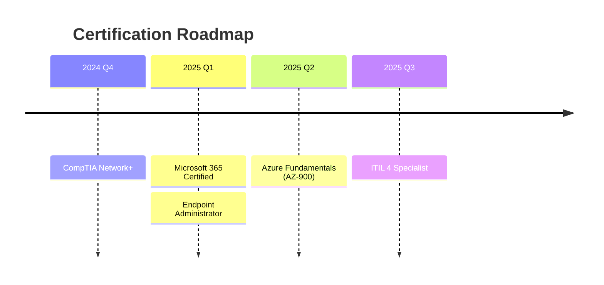

# 💻 Technical Skills Optimization for ATS

## Table of Contents

### 1. Core Technical Skills Framework
- 1.1 Operating Systems
  - Windows Environment
  - macOS Support
  - Linux/Unix
- 1.2 Enterprise Applications
  - Microsoft 365 Suite
  - Productivity Software
  - Security Solutions

### 2. Technical Skills in Action
- 2.1 Resume Bullet Points
  - Windows/Active Directory
  - Microsoft 365
  - Network Support
- 2.2 Project Experience
  - Windows 10 Deployment Project
  - MFA Implementation

### 3. ATS Optimization Strategies
- 3.1 Skills Categorization
  - Technical Skills Matrix
  - ATS Keywords by Role
- 3.2 Application Materials
  - Resume Optimization
  - Cover Letter Integration
  - LinkedIn Profile

### 4. Interview Preparation
- 4.1 Technical Questions
- 4.2 Troubleshooting Scenarios
- 4.3 STAR Method Responses

### 5. Career Development
- 5.1 Certification Paths
- 5.2 Learning Resources
- 5.3 Professional Networking

### 6. Action Items
- 6.1 Resume Review Checklist
- 6.2 30/60/90-Day Plan
- 6.3 Continuous Improvement

---

# 💻 Technical Skills Optimization for ATS

## 1. Core Technical Skills Framework

### 1.1 Operating Systems
```markdown
## Windows Environment
- Windows 10/11 Enterprise deployment and troubleshooting
- Active Directory (AD) user/group management
- Group Policy Objects (GPO) implementation
- Windows Server 2016/2019/2022 administration
- PowerShell scripting for automation (PowerShell 5.1, 7.x)

## macOS Support
- macOS Monterey/Ventura administration
- Mobile Device Management (MDM) solutions
- Jamf Pro administration and package deployment
- Bash/zsh terminal commands and scripting
- FileVault encryption management

## Linux/Unix
- Ubuntu/Debian/CentOS command line
- Basic shell scripting (Bash)
- Package management (apt, yum)
- File system navigation and permissions
- SSH and remote administration
```

### 1.2 Enterprise Applications
```markdown
## Microsoft 365 Suite
- Exchange Online administration
- SharePoint Online collaboration
- Teams deployment and troubleshooting
- OneDrive for Business synchronization
- Azure AD Connect and SSO configuration

## Productivity Software
- Microsoft Office 2019/2021/O365
- Google Workspace administration
- Adobe Creative Cloud deployment
- Project management tools (Jira, Asana)
- CRM platforms (Salesforce, Dynamics 365)

## Security Solutions
- Endpoint protection (Defender ATP, CrowdStrike)
- Multi-factor authentication (MFA)
- VPN technologies (Cisco AnyConnect, GlobalProtect)
- Email security (Proofpoint, Mimecast)
- Mobile Device Management (Intune, Workspace ONE)
```

## 2. ATS-Optimized Skill Statements

### 2.1 Infrastructure Support
```markdown
## Network Infrastructure
- Resolved TCP/IP, DNS, DHCP, and VPN connectivity issues
- Configured and troubleshot Cisco/Meraki network equipment
- Monitored network performance using SolarWinds and PRTG
- Implemented and supported VoIP phone systems (Cisco CUCM, RingCentral)

## Cloud Services
- Managed Azure AD user provisioning and access control
- Deployed and supported AWS Workspaces and VDI solutions
- Troubleshot Google Workspace collaboration tools
- Administered SaaS application integrations (Okta, OneLogin)
```

### 2.2 Hardware & Peripherals
```markdown
## Endpoint Devices
- Deployed and imaged Dell/HP/Lenovo workstations
- Troubleshooted hardware components (RAM, HDD/SSD, peripherals)
- Managed mobile devices (iOS/Android) via MDM
- Supported BYOD (Bring Your Own Device) implementations

## Print & Peripheral Management
- Administered network printers (HP, Xerox, Canon)
- Configured print servers and driver deployment
- Troubleshooted MFD (Multi-Function Device) issues
- Managed peripheral device configurations (scanners, docks, etc.)
```

## 3. Technical Achievement Examples

### 3.1 Resume Bullet Points
```markdown
## Windows/Active Directory
- Managed 1,000+ user accounts in Active Directory across multiple OUs
- Automated user provisioning with PowerShell, reducing onboarding time by 75%
- Implemented Group Policy Objects (GPOs) to enforce security baselines

## Microsoft 365
- Migrated 500+ mailboxes from on-premises Exchange to Exchange Online
- Resolved complex Outlook connectivity and synchronization issues
- Deployed Microsoft Teams with QoS policies for optimal performance

## Network Support
- Troubleshot and resolved VPN connectivity issues for 200+ remote users
- Configured and maintained Cisco ASA firewalls and Meraki access points
- Reduced network-related tickets by 40% through proactive monitoring
```

### 3.2 Project Experience
```markdown
## Windows 10 Deployment Project
- Led migration of 1,200+ devices from Windows 7 to Windows 10
- Created standardized deployment image using Microsoft Deployment Toolkit (MDT)
- Reduced deployment time from 4 hours to 45 minutes per device
- Documented process resulting in 98% first-attempt success rate

## MFA Implementation
- Deployed Microsoft Authenticator for 2,000+ users
- Reduced security incidents by 65% through MFA enforcement
- Created user guides and conducted training sessions
- Maintained 99.9% authentication success rate
```

## 4. Skills Categorization for ATS

### 4.1 Technical Skills Matrix
| Category | Specific Skills | Tools/Technologies |
|----------|-----------------|-------------------|
| **Operating Systems** | Windows 10/11, Server 2019, macOS, Linux | AD, GPO, PowerShell, Bash |
| **Networking** | TCP/IP, DNS, DHCP, VPN, WiFi | Cisco, Meraki, Wireshark |
| **Cloud Services** | Azure AD, Microsoft 365, AWS | Intune, Exchange Online |
| **Security** | MFA, Encryption, MDM | Okta, BitLocker, Jamf |
| **Hardware** | Desktops, Laptops, Mobile | Dell, HP, Lenovo, Apple |

### 4.2 ATS Keywords by Role
```markdown
## Help Desk Technician
- Technical Support, Troubleshooting, Customer Service
- Active Directory, Password Resets, Account Management
- Windows 10, Office 365, Remote Desktop
- Ticketing Systems, SLA Management

## Desktop Support Analyst
- Hardware Deployment, Imaging, Configuration
- Group Policy, PowerShell Scripting
- Network Troubleshooting, VPN, Print Services
- Mobile Device Management, Security Compliance

## IT Support Specialist
- System Administration, Server Maintenance
- Cloud Services, Azure AD, Intune
- ITIL Processes, Change Management
- Documentation, Knowledge Base Management
```

## 5. Cover Letter Integration

### 5.1 Technical Skills Paragraph
"With 4+ years of experience in technical support, I've developed expertise in managing complex IT environments including Windows Server administration, Microsoft 365 deployment, and enterprise networking. My proficiency in PowerShell automation has enabled me to streamline processes, such as reducing user onboarding time by 70% through automated account provisioning scripts in Active Directory. I've successfully supported 1,500+ users across multiple locations, maintaining 99% system uptime for critical business applications."

### 5.2 Project Highlight
"In my previous role, I led the migration from on-premises Exchange to Microsoft 365, successfully transitioning 2,000+ mailboxes with zero data loss. This included configuring Azure AD Connect for hybrid identity management, implementing security and compliance policies, and training the help desk team on the new environment. The project was completed 3 weeks ahead of schedule and resulted in a 40% reduction in email-related support tickets."

## 6. LinkedIn Profile Optimization

### 6.1 Skills & Endorsements
**Top Technical Skills:**
- Active Directory Administration ⭐⭐⭐⭐⭐
- Microsoft 365 ⭐⭐⭐⭐⭐
- PowerShell Scripting ⭐⭐⭐⭐
- Network Troubleshooting ⭐⭐⭐⭐
- ITIL Framework ⭐⭐⭐⭐

### 6.2 Featured Section
**Technical Certifications:**
- Microsoft 365 Certified: Modern Desktop Administrator Associate
- CompTIA A+ and Network+
- ITIL 4 Foundation
- Cisco CCNA (In Progress)

**Technical Proficiencies:**
- **Operating Systems**: Windows 10/11, Windows Server, macOS, Linux
- **Networking**: TCP/IP, DNS, DHCP, VPN, VLANs, Wireshark
- **Cloud Services**: Microsoft 365, Azure AD, Intune, AWS
- **Security**: MFA, BitLocker, Endpoint Protection, MDM
- **Scripting**: PowerShell, Bash, Python (Basic)

## 7. Interview Preparation

### 7.1 Technical Questions
**Q: Describe your experience with Active Directory.**
"I've managed Active Directory environments with 5,000+ user objects across multiple domains. My responsibilities included:
- Creating and managing user/computer accounts and security groups
- Implementing Group Policy Objects for security and user environment management
- Troubleshooting authentication and permission issues
- Automating routine tasks with PowerShell scripts
- Managing trust relationships between domains
- Implementing and maintaining Active Directory Federation Services (ADFS)"

### 7.2 Troubleshooting Scenarios
**Q: A user can't access network resources. How do you troubleshoot?**
"I would follow this systematic approach:
1. Verify network connectivity (ipconfig, ping gateway)
2. Check Active Directory authentication (can they log in to another machine?)
3. Review Group Policy application (gpresult)
4. Check network shares and permissions
5. Verify DNS resolution (nslookup)
6. Check for account lockouts or expired passwords
7. Review event logs for related errors
8. Test with different user credentials if possible"

## 8. Skills Development Roadmap

### 8.1 Certification Path


### 8.2 Technical Learning Resources
- **Microsoft Learn**: https://learn.microsoft.com
- **Pluralsight**: Technical courses and learning paths
- **Udemy**: In-depth technical training
- **TryHackMe**: Hands-on security training
- **PowerShell.org**: Scripting resources

## 9. Technical Glossary for Resumes

### 9.1 Action Verbs
| Category | Verbs |
|----------|-------|
| **Implementation** | Deployed, Configured, Implemented, Integrated |
| **Troubleshooting** | Diagnosed, Resolved, Debugged, Repaired |
| **Security** | Hardened, Encrypted, Enforced, Audited |
| **Automation** | Scripted, Automated, Streamlined, Optimized |

### 9.2 Technology Keywords
- **Operating Systems**: Windows Server, Linux, macOS, iOS, Android
- **Networking**: TCP/IP, DNS, DHCP, VLAN, VPN, SD-WAN
- **Cloud**: Azure, AWS, Google Cloud, IaaS, PaaS, SaaS
- **Security**: MFA, SSO, DLP, SIEM, EDR, Zero Trust
- **Virtualization**: Hyper-V, VMware, Citrix, VDI

## 10. ATS Optimization Checklist

### 10.1 Resume Optimization
- [ ] Include specific technologies (Windows 10, not just "Windows")
- [ ] List versions (Office 365, not just "Microsoft Office")
- [ ] Use industry-standard terminology
- [ ] Include relevant certifications
- [ ] Add measurable achievements with metrics

### 10.2 Application Tips
- Customize skills section for each job posting
- Mirror the language used in the job description
- Include both acronyms and full terms (e.g., "Active Directory (AD)")
- Prioritize technical skills relevant to the role
- Keep formatting simple and ATS-friendly

---
*Document Version: 1.0  
Last Updated: 2025-09-20*
