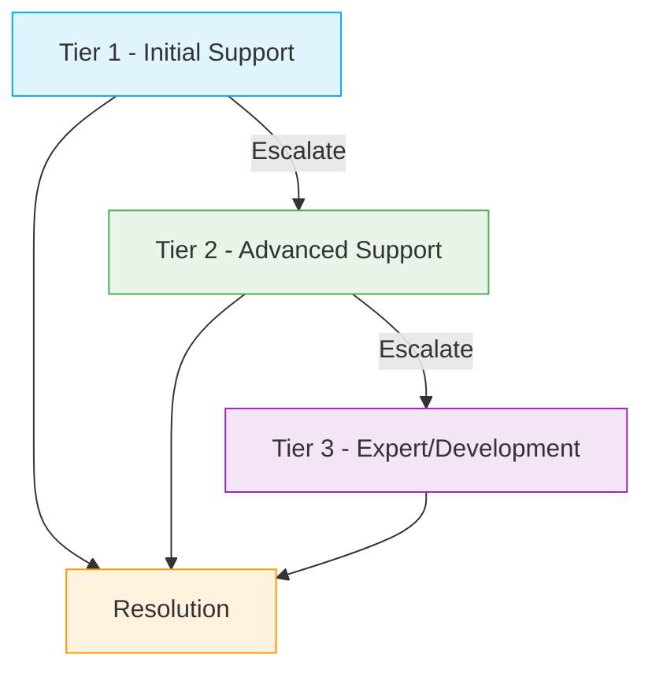
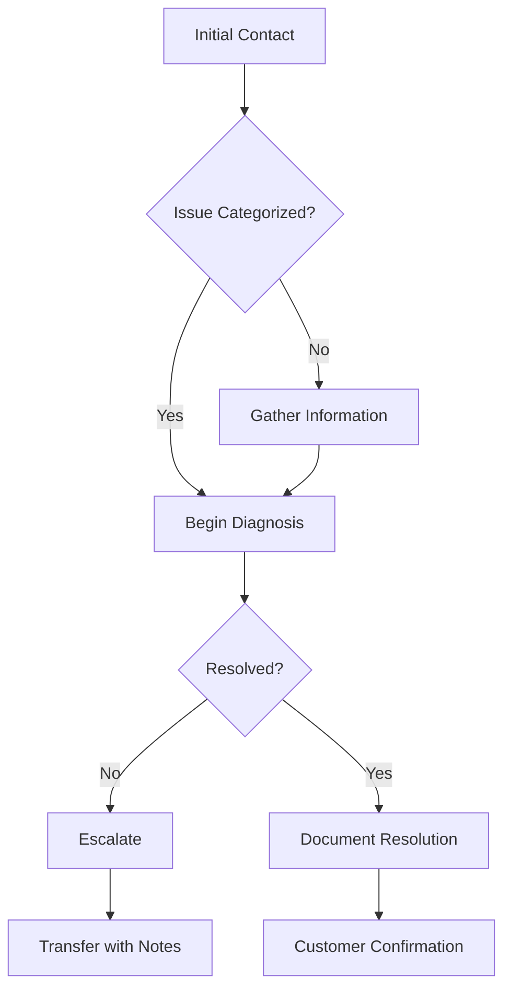
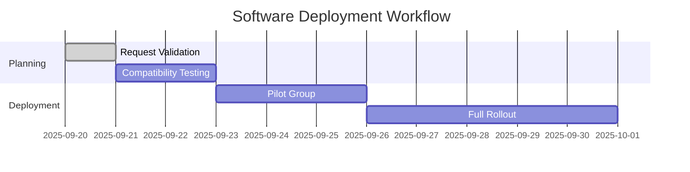
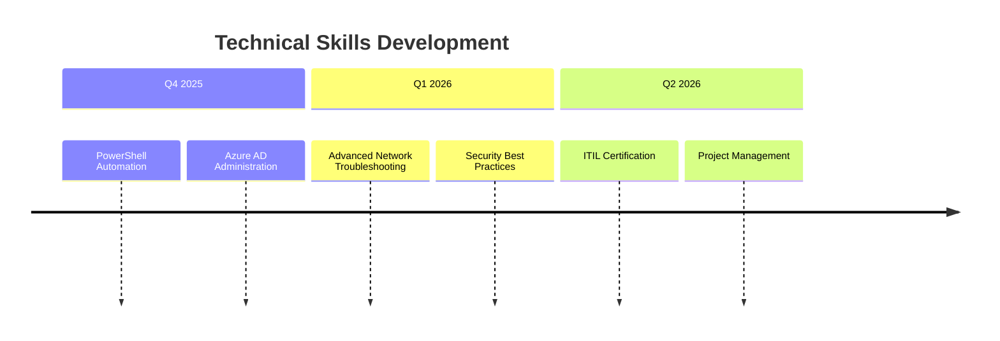

# 🖥️ Technical Support Excellence Playbook

## Table of Contents

### 1. Technical Support Framework
- [1.1 Support Tiers Overview](#11-support-tiers-overview)
- [1.2 Service Level Agreements (SLAs)](#12-service-level-agreements-slas)

### 2. Core Technical Competencies
- [2.1 Hardware Support](#21-hardware-support)
  - Common Issues & Solutions
- [2.2 Software Support](#22-software-support)
  - MS Office Suite
  - Remote Access Tools
  - Email Clients

### 3. Remote Support Procedures
- [3.1 Remote Troubleshooting Workflow](#31-remote-troubleshooting-workflow)
- [3.2 Remote Support Tools](#32-remote-support-tools)

### 4. Account Management
- [4.1 Standard Procedures](#41-standard-procedures)
  - Password Reset Process
- [4.2 Common Account Issues](#42-common-account-issues)

### 5. Documentation & Knowledge Base
- [5.1 Article Template](#51-article-template)
- [5.2 Troubleshooting Guides](#52-troubleshooting-guides)

### 6. Customer Service Excellence
- [6.1 Communication Protocols](#61-communication-protocols)
- [6.2 Handling Difficult Situations](#62-handling-difficult-situations)

### 7. Security Protocols
- [7.1 Data Protection](#71-data-protection)
- [7.2 Incident Response](#72-incident-response)

### 8. Performance Metrics
- [8.1 KPIs](#81-kpis)
- [8.2 Reporting](#82-reporting)

### 9. Training & Development
- [9.1 Onboarding](#91-onboarding)
- [9.2 Continuous Learning](#92-continuous-learning)

### 10. Tools & Resources
- [10.1 Software](#101-software)
- [10.2 Hardware](#102-hardware)
- [10.3 Documentation](#103-documentation)

---

# 🖥️ Technical Support Excellence Playbook

## 1. Technical Support Framework

### 1.1 Support Tiers Overview


### 1.2 Service Level Agreements (SLAs)
| Priority | Response Time | Resolution Time | Escalation Path |
|----------|---------------|------------------|-----------------|
| P1 - Critical | 15 minutes | 4 hours | Immediate to Tier 3 |
| P2 - High | 1 hour | 8 hours | Tier 2 → Tier 3 |
| P3 - Medium | 4 hours | 24 hours | Tier 1 → Tier 2 |
| P4 - Low | 8 hours | 72 hours | Tier 1 |

## 2. Core Technical Competencies

### 2.1 Hardware Support
**Common Issues & Solutions**
| Symptom | Troubleshooting Steps | Tools Required |
|---------|----------------------|----------------|
| No power | 1. Check power connections<br>2. Test power outlet<br>3. Verify PSU | Multimeter, PSU tester |
| Blue Screen | 1. Note error code<br>2. Boot in safe mode<br>3. Check system logs | Windows Recovery, BlueScreenView |
| Slow performance | 1. Check task manager<br>2. Verify disk space<br>3. Scan for malware | Task Manager, CCleaner, Malwarebytes |

### 2.2 Software Support
**Common Applications**
```markdown
## MS Office Suite
- **Outlook Issues**:
  - OST/PST repair
  - Profile recreation
  - Send/Receive errors

## Remote Access Tools
- VPN connectivity
- RDP configuration
- 2FA setup

## Email Clients
- SMTP/IMAP setup
- Signature configuration
- Spam filtering
```

## 3. Remote Support Procedures

### 3.1 Remote Troubleshooting Workflow


### 3.2 Remote Support Tools
| Tool | Purpose | Command/Notes |
|------|---------|---------------|
| Quick Assist | Remote Control | `msra.exe /offerra` |
| TeamViewer | Remote Support | Custom ID/password |
| RDP | Remote Desktop | `mstsc /v:hostname` |
| PowerShell | Remote Cmd | `Enter-PSSession -ComputerName X` |

## 4. Account Management

### 4.1 Standard Procedures
**Password Reset Process**
1. Verify identity (security questions/ID)
2. Reset password in AD/Identity Management
3. Enforce password change on next login
4. Verify MFA setup
5. Document the reset

### 4.2 Common Account Issues
| Issue | Resolution | Required Permissions |
|-------|------------|----------------------|
| Account Lockout | Unlock in AD, check security logs | Help Desk Operator |
| MFA Reset | Reset MFA registration | Authentication Admin |
| Access Denied | Verify group memberships | Help Desk Operator |
| License Issues | Reassign licenses in Admin Portal | License Admin |

## 5. Software Deployment

### 5.1 Standard Deployment Process


### 5.2 Common Deployments
| Software | Silent Install Command | Notes |
|----------|------------------------|-------|
| Chrome | `msiexec /i googlechromestandaloneenterprise64.msi /qn` | Enterprise version |
| Adobe Reader | `msiexec /i AcroRdrDCxxxxx_mui.exe /qn` | Disable updates |
| 7-Zip | `msiexec /i 7zxxxx-x64.msi /qn` |  |
| Zoom | `msiexec /i ZoomInstallerFull.msi /qn` | Configure with GPO |

## 6. Documentation & Knowledge Base

### 6.1 Ticket Documentation Standards
```markdown
# Ticket #[Number]: [Brief Description]

## Customer Information
- **Name**: 
- **Department**: 
- **Contact**: 
- **Location**: 

## Issue Details
- **Reported**: [Date/Time]
- **Category**: [Hardware/Software/Network]
- **Priority**: [P1-P4]
- **Description**: 

## Troubleshooting Steps
1. [Step 1]
   - Action taken
   - Result

## Resolution
- Root cause:
- Solution implemented:
- Time to resolve:

## Follow-up
- [ ] Customer notified
- [ ] Knowledge base updated
- [ ] Preventive measures:
```

### 6.2 Knowledge Base Article Template
```markdown
# [Problem/Solution Name]
**Last Updated**: [Date]  
**Applicable To**: [User Groups/Devices]  
**Difficulty**: [Beginner/Intermediate/Advanced]

## Symptoms
- [Symptom 1]
- [Symptom 2]

## Resolution
### Prerequisites
- [ ] Access to [system/tool]
- [ ] Required permissions

### Step-by-Step Guide
1. [Step 1]
   
2. [Step 2]

## Related Articles
- [Related Article 1]
- [Related Article 2]
```

## 7. Performance Metrics & Reporting

### 7.1 Key Performance Indicators
| Metric | Target | Measurement Period |
|--------|--------|--------------------|
| First Call Resolution | ≥70% | Weekly |
| Average Handle Time | <15 minutes | Monthly |
| Customer Satisfaction | ≥90% | Per ticket |
| Resolution SLA | ≥95% | Weekly |

### 7.2 Performance Dashboard
```python
# Sample Python code for generating performance metrics
import pandas as pd
import matplotlib.pyplot as plt

# Sample data
data = {
    'Week': ['W1', 'W2', 'W3', 'W4'],
    'Tickets_Resolved': [45, 52, 48, 55],
    'Avg_Resolution_Time': [25, 22, 20, 18],
    'CSAT_Score': [88, 92, 90, 94]
}

df = pd.DataFrame(data)

# Generate plot
plt.figure(figsize=(10, 6))
plt.plot(df['Week'], df['CSAT_Score'], marker='o')
plt.title('Weekly Customer Satisfaction Score')
plt.ylim(0, 100)
plt.grid(True)
plt.savefig('weekly_csat.png')
```

## 8. Continuous Improvement

### 8.1 Skills Development Roadmap


### 8.2 Feedback Implementation Process
1. **Collect**
   - Customer surveys
   - Team retrospectives
   - Performance metrics

2. **Analyze**
   - Identify patterns
   - Root cause analysis
   - Impact assessment

3. **Implement**
   - Process improvements
   - Training programs
   - Tool enhancements

4. **Review**
   - Measure impact
   - Adjust as needed
   - Document changes

## 9. Emergency Response

### 9.1 Critical Incident Response
```markdown
## Incident: [Brief Description]
**Reported**: [Date/Time]  
**Reported By**: [Name]  
**Impact**: [High/Medium/Low]  
**Status**: [Investigating/Identified/Monitoring/Resolved]

### Timeline
- [Time] Issue reported
- [Time] Initial response
- [Time] Root cause identified
- [Time] Resolution implemented

### Communication Plan
| Time | Audience | Channel | Message |
|------|----------|---------|---------|
| T+0  | IT Team  | Slack   | Initial alert |
| T+15 | Managers | Email   | Status update |
| T+1h | All Staff| Portal  | Service impact notice |
```

### 9.2 Disaster Recovery Checklist
- [ ] Identify critical systems affected
- [ ] Activate backup systems
- [ ] Notify stakeholders
- [ ] Document all actions
- [ ] Begin recovery procedures
- [ ] Verify data integrity
- [ ] Restore services
- [ ] Post-mortem analysis

## 10. Professional Development

### 10.1 Certification Path
| Certification | Provider | Target Date | Status |
|---------------|----------|-------------|--------|
| CompTIA A+   | CompTIA  | 2025-Q4     | [ ]    |
| Microsoft 365 Certified: Modern Desktop Administrator | Microsoft | 2026-Q1 | [ ] |
| ITIL Foundation | AXELOS | 2026-Q2 | [ ] |

### 10.2 Learning Resources
- **Platforms**:
  - Microsoft Learn
  - Pluralsight
  - LinkedIn Learning
- **Communities**:
  - Spiceworks
  - TechNet Forums
  - Reddit r/sysadmin
- **Newsletters**:
  - The Hacker News
  - Krebs on Security
  - Windows IT Pro

---
*Document Version: 1.0  
Last Updated: 2025-09-20*
