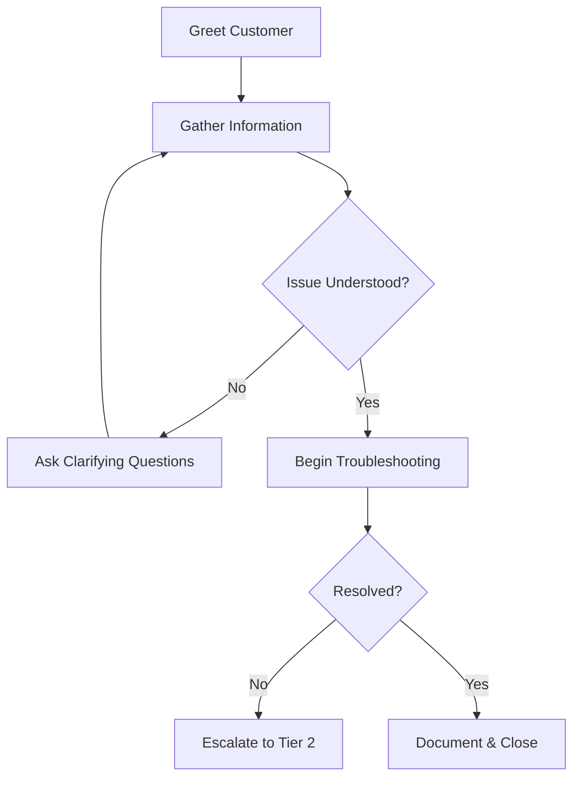

# 🛠️ Tier-1 Technical Support Handbook

## Table of Contents

### 1. First Contact Protocol
   - 1.1 Initial Response Framework
   - 1.2 Information Gathering Template

### 2. Common Issues & Resolutions
   - 2.1 Password Resets
   - 2.2 Network Connectivity
   - 2.3 Application Issues

### 3. Documentation Standards
   - 3.1 Ticket Documentation
   - 3.2 Knowledge Base Updates

### 4. Escalation Procedures
   - 4.1 When to Escalate
   - 4.2 Escalation Template

### 5. Customer Service Excellence
   - 5.1 Communication Tips
   - 5.2 Call Handling Script

### 6. Quick Reference Guides
   - 6.1 Common Commands
   - 6.2 Common Issues Cheat Sheet

### 7. Performance Metrics
   - 7.1 Key Metrics to Track
   - 7.2 Self-Improvement

### 8. Security Awareness
   - 8.1 Red Flags
   - 8.2 Reporting Security Incidents

### 9. Tools & Resources
   - 9.1 Essential Software
   - 9.2 Keyboard Shortcuts

### 10. Continuous Learning
   - 10.1 Recommended Certifications
   - 10.2 Learning Resources

---


## 1. First Contact Protocol

### 1.1 Initial Response Framework


### 1.2 Information Gathering Template
```markdown
## Customer Information
- **Name**: 
- **Department**: 
- **Contact**: 
- **Location/Office**: 

## Issue Details
- **Reported**: [Date/Time]
- **Device Type**: [Desktop/Laptop/Mobile]
- **Operating System**: [Version]
- **Application**: [Name & Version]
- **Error Message**: [If any]

## Troubleshooting Steps Taken
1. [Step 1]
2. [Step 2]
3. [Step 3]
```

## 2. Common Issues & Resolutions

### 2.1 Password Resets
**Process Flow**:
1. Verify identity (Security Questions/Manager Approval)
2. Reset password following policy:
   - Minimum 12 characters
   - Complexity requirements
   - Password history
3. Enforce password change on next login
4. Verify MFA setup

**Common Commands**:
```powershell
# Active Directory
Reset-ADAccountPassword -Identity username -Reset -NewPassword (ConvertTo-SecureString "TempP@ss123" -AsPlainText -Force)
Set-ADUser -Identity username -ChangePasswordAtLogon $true

# Office 365
Connect-MsolService
Set-MsolUserPassword -UserPrincipalName user@domain.com -NewPassword "TempP@ss123" -ForceChangePassword $true
```

### 2.2 Network Connectivity
**Troubleshooting Steps**:
1. Verify physical connections
2. Check IP configuration:
   ```batch
   ipconfig /all
   ping 8.8.8.8
   tracert google.com
   nslookup google.com
   ```
3. Reset network stack:
   ```batch
   netsh winsock reset
   netsh int ip reset
   ipconfig /release
   ipconfig /renew
   ipconfig /flushdns
   ```

### 2.3 Application Issues
**Common Fixes**:
1. Restart the application
2. Clear application cache
3. Repair installation:
   ```powershell
   # Office 365
   cd "C:\Program Files\Common Files\Microsoft Shared\ClickToRun"
   OfficeC2RClient.exe /update user updatetoversion=16.0.xxxxx.xxxx
   ```
4. Check for updates
5. Reinstall if necessary

## 3. Documentation Standards

### 3.1 Ticket Documentation
```markdown
## Issue Description
[Detailed description of the problem]

## Troubleshooting Steps
1. [Step 1] - [Result]
2. [Step 2] - [Result]
3. [Step 3] - [Result]

## Resolution
[Detailed solution implemented]

## Customer Communication
[Summary of communication with customer]

## Time Spent
[Start Time] - [End Time] = [Total Time]
```

### 3.2 Knowledge Base Updates
When documenting new solutions:
1. Use clear, concise language
2. Include screenshots when helpful
3. List prerequisites
4. Provide step-by-step instructions
5. Add related articles

## 4. Escalation Procedures

### 4.1 When to Escalate
- Issue exceeds 15-minute troubleshooting
- Root cause requires higher permissions
- Multiple users affected
- Potential security incident

### 4.2 Escalation Template
```markdown
## Escalation Request
**Ticket #**: [Number]  
**Customer**: [Name]  
**Issue**: [Brief description]  
**Troubleshooting Done**:  
1. [Step 1]  
2. [Step 2]  
3. [Step 3]  

**Requested Action**:  
[What you need from the next tier]

**Urgency**: [High/Medium/Low]  
**Business Impact**: [Description]  
```

## 5. Customer Service Excellence

### 5.1 Communication Tips
- Use positive language
- Avoid technical jargon
- Set clear expectations
- Confirm understanding
- Express empathy

### 5.2 Call Handling Script
```
"Thank you for calling [Company] IT Helpdesk. This is [Your Name]. How can I assist you today?"

[After customer explains]

"I understand you're experiencing [repeat issue]. Let me help you with that."
[If needed] "To better assist you, may I ask a few questions?"

[After resolution]
"Is there anything else I can help you with today?"
"Thank you for contacting [Company] IT Helpdesk. Have a great day!"
```

## 6. Quick Reference Guides

### 6.1 Common Commands
| Purpose | Command |
|---------|---------|
| Check disk space | `wmic logicaldisk get size,freespace,caption` |
| List running processes | `tasklist` |
| Check service status | `sc query "service name"` |
| Remote desktop | `mstsc /v:computername` |
| Check open ports | `netstat -ano` |

### 6.2 Common Issues Cheat Sheet
| Symptom | First Steps |
|---------|-------------|
| Can't log in | Verify caps lock, check account status |
| No internet | Check network cables, restart router |
| Printer not working | Check connections, restart print spooler |
| Slow computer | Check task manager, restart if needed |
| Blue screen | Note error code, check system logs |

## 7. Performance Metrics

### 7.1 Key Metrics to Track
- **First Call Resolution Rate**
- **Average Handle Time**
- **Customer Satisfaction Score**
- **Ticket Volume by Category**
- **Resolution Time**

### 7.2 Self-Improvement
```markdown
## Weekly Self-Review
**Week**: [Date Range]  
**Tickets Handled**: [Number]  
**Areas of Strength**:  
- [Strength 1]  
- [Strength 2]  

**Areas for Improvement**:  
- [Area 1]  
- [Area 2]  

**Goals for Next Week**:  
1. [Goal 1]  
2. [Goal 2]  
```

## 8. Security Awareness

### 8.1 Red Flags
- Requests for password resets without verification
- Unusual remote access requests
- Multiple failed login attempts
- Suspicious email attachments
- Unauthorized software installation

### 8.2 Reporting Security Incidents
1. Document all details
2. Preserve evidence (screenshots, logs)
3. Notify security team immediately
4. Follow company incident response plan

## 9. Tools & Resources

### 9.1 Essential Software
- Remote Support: TeamViewer, AnyDesk
- System Utilities: ADUC, PowerShell, CMD
- Monitoring: PRTG, SolarWinds
- Documentation: IT Glue, Confluence

### 9.2 Keyboard Shortcuts
| Action | Windows | Mac |
|--------|---------|-----|
| Lock PC | Win + L | Cmd + Ctrl + Q |
| Task Manager | Ctrl + Shift + Esc | Cmd + Option + Esc |
| Switch Apps | Alt + Tab | Cmd + Tab |
| Screenshot | Win + Shift + S | Cmd + Shift + 4 |

## 10. Continuous Learning

### 10.1 Recommended Certifications
- CompTIA A+
- Microsoft 365 Fundamentals
- ITIL Foundation
- HDI Desktop Support Technician

### 10.2 Learning Resources
- **Microsoft Learn**: https://learn.microsoft.com
- **Professor Messer**: https://www.professormesser.com
- **Udemy IT Courses**: https://www.udemy.com
- **TechNet Forums**: https://social.technet.microsoft.com/Forums

---
*Document Version: 1.0  
Last Updated: 2025-09-20*
