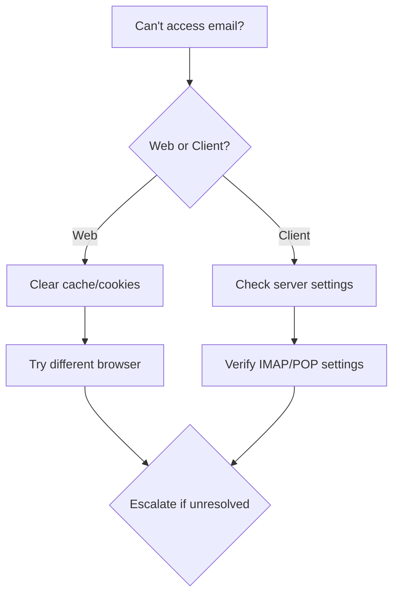

# ☎️ University Telephone Support Guide

## Table of Contents
- [1. Call Handling Protocol](#1-call-handling-protocol)
  - [Initial Greeting (Script)](#initial-greeting-script)
  - [Information Gathering](#information-gathering)
- [2. Common University Systems](#2-common-university-systems)
  - [Learning Management System (LMS)](#a-learning-management-system-lms)
  - [University Email](#b-university-email)
- [3. Authentication Issues](#3-authentication-issues)
  - [Password Reset Flow](#password-reset-flow)
- [4. Academic Software Support](#4-academic-software-support)
  - [Common Applications](#common-applications)
- [5. Research Computing](#5-research-computing)
  - [High-Performance Computing (HPC)](#high-performance-computing-hpc)

---

# ☎️ University Telephone Support Guide

## 1. Call Handling Protocol

### Initial Greeting (Script)
```markdown
"Thank you for calling [University Name] IT Support. 
My name is [Your Name]. May I have your name and department, please?"

[After user responds]

"How can I assist you today?"
```

### Information Gathering
- **Required Details**:
  - Full name
  - University ID
  - Department/College
  - Contact number
  - Location (if on-campus)
  - Device being used
  - Error messages (verbatim)

## 2. Common University Systems

### A. Learning Management System (LMS)
#### Common Issues:
1. **Login Problems**
   - Verify username format (e.g., jsmith@univ.edu)
   - Check password reset portal
   - Verify account activation status

2. **Course Access**
   - Confirm enrollment in student information system
   - Check term activation dates
   - Verify browser compatibility

#### Verification Command:
```sql
-- Example: Check course enrollment
SELECT * FROM course_enrollments 
WHERE user_id = '[ID]' 
AND term = '[TERM]';
```

### B. University Email
#### Troubleshooting Flow:


## 3. Authentication Issues

### Password Reset Flow
1. Verify identity (security questions/ID)
2. Guide through self-service portal:
   ```
   https://password.university.edu/reset
   ```
3. Set temporary password with requirements:
   - 12+ characters
   - Upper/lower case
   - Numbers & special characters
   - No dictionary words

## 4. Academic Software Support

### Common Applications
| Software | Support Contact | Common Fixes |
|----------|-----------------|-------------|
| MATLAB   | 24/7 Support | License renewal, Toolbox access |
| SPSS     | M-F 8-5       | Installation, License codes |
| ArcGIS   | Dept. Support | Extension activation |
| Zoom     | 24/7 Support | Audio/Video issues, Recording access |

## 5. Research Computing

### High-Performance Computing (HPC)
```markdown
# Common HPC Issues
1. Login failures
   - Verify SSH key setup
   - Check VPN connection
   
2. Job failures
   - Check job logs in ~/slurm-
   - Verify resource requests
   
3. Storage issues
   - Check quota: `lfs quota -h /home/userid`
   - Clean up old files
```

## 6. Classroom Technology

### Emergency Support Numbers
| System | Contact | Hours |
|--------|---------|-------|
| Projectors | AV Services x4357 | 7am-10pm |
| Lecture Capture | Media Services x2100 | 8am-5pm |
| Computer Labs | Lab Support x3301 | 24/7 |

## 7. Documentation & Ticketing

### Call Logging Template
```markdown
## [Ticket #] - [Brief Description]

### Caller Information
- Name: 
- Department: 
- Contact: 
- Location: 

### Issue Details
- System: [LMS/Email/Network/etc.]
- Error Message: 
- Steps to Reproduce: 

### Troubleshooting Performed
1. [Action] - [Result]
2. [Action] - [Result]

### Resolution
- [ ] First-call resolution
- [ ] Escalated to [Team]
- [ ] Callback required

### Notes:
[Additional information]
```

## 8. Escalation Matrix

### Technical Teams
| System | Level 1 | Level 2 | Level 3 |
|--------|---------|---------|---------|
| Network | Help Desk | Network Ops | Network Engineering |
| LMS | Help Desk | Academic Tech | Vendor Support |
| Email | Help Desk | Messaging Team | Enterprise Systems |

### After-Hours Support
1. Call University Police (x911)
2. Request IT on-call technician
3. Provide ticket number and issue details

## 9. Training Resources

### Quick Reference Guides
1. [WiFi Setup Guide](https://it.university.edu/wifi)
2. [Two-Factor Authentication](https://it.university.edu/2fa)
3. [Software Downloads](https://it.university.edu/software)

## 10. Call Closing Protocol

### Before Ending Call:
1. Summarize resolution
2. Verify issue is resolved
3. Provide ticket number
4. Offer additional assistance

### Closing Script:
```markdown
"Is there anything else I can assist you with today?"
[If no]
"Thank you for contacting [University] IT Support. 
Your ticket number is [###]. Have a great day!"
```

---
*Document Version: 1.0  
Last Updated: 2025-09-20*
